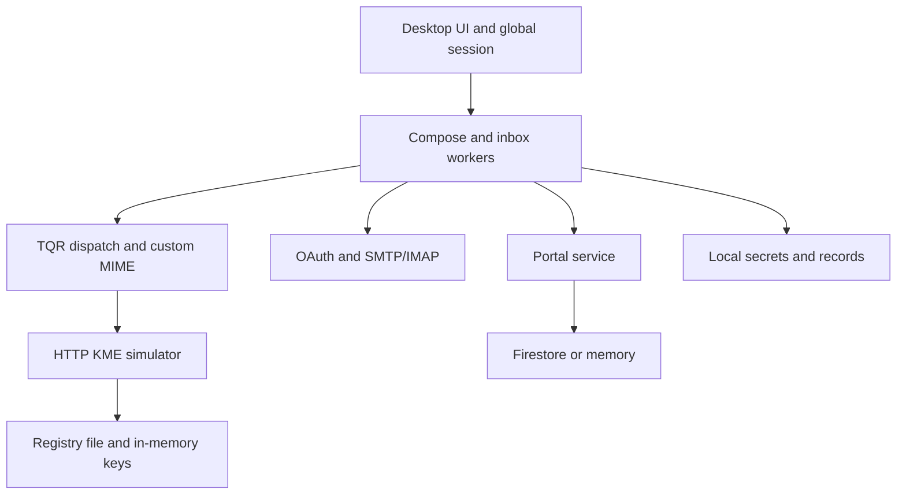
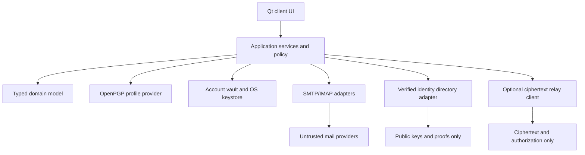
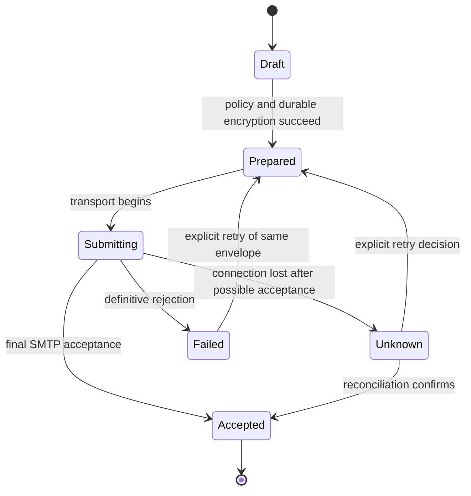

# QuMail 1.0 — Complete Research, Security Audit & Reengineering Specification

**Status:** research and proposed specification; implementation has not begun.  
**Evidence cutoff:** 3 October 2026 UTC; repository and executable baseline collected 2 October, final reference checks completed 3 October. This is an early-October assessment, not a prediction of developments later in October.  
**Repository:** [uzx-02/QuMail](https://github.com/uzx-02/QuMail), `main`, commit `7079cf16cb2623172a329fd045045227f7eb65b4` (16 May 2026).  
**Target:** the first proper **QuMail 1.0** release. References to “v2” in existing documentation are historical, not the target of this report.

This report distinguishes **CONFIRMED** (source or observed behavior), **LIKELY** (strong inference), **POSSIBLE** (conditional scenario), **UNKNOWN**, and **REQUIRES VALIDATION**. A confirmed unsafe behavior is not proof that an attacker has exploited a deployed installation. Severity reflects the stated scenario, not an invented CVSS score. “MUST” below is a proposed QuMail release requirement unless explicitly attributed to a standard.

Repository links are pinned to the audited commit. External sources are numbered in §60. Appendix A inventories all tracked files; Appendix B records executable evidence; Appendix C records the search and review coverage. No source code was changed, no pull request was created, and no production service was attacked. Temporary dependency installations, source snapshots, and fixture-based probes were used for this assessment.


<details>
<summary>Contents: 60 sections, evidence appendices and implementation readiness</summary>

1. [Executive Summary](#1-executive-summary)
2. [Current QuMail Definition](#2-current-qumail-definition)
3. [Repository Forensic Analysis](#3-repository-forensic-analysis)
4. [Current Architecture](#4-current-architecture)
5. [Current Data Flows](#5-current-data-flows)
6. [Current Cryptographic Flows](#6-current-cryptographic-flows)
7. [Current Key Lifecycle](#7-current-key-lifecycle)
8. [Current Identity Model](#8-current-identity-model)
9. [Current Email Architecture](#9-current-email-architecture)
10. [Current QKD Architecture](#10-current-qkd-architecture)
11. [Current Portal Architecture](#11-current-portal-architecture)
12. [Current Storage Architecture](#12-current-storage-architecture)
13. [Current Testing](#13-current-testing)
14. [Security Claim Audit](#14-security-claim-audit)
15. [Security Audit](#15-security-audit)
16. [Cryptographic Audit](#16-cryptographic-audit)
17. [Dependency Audit](#17-dependency-audit)
18. [Code Quality Audit](#18-code-quality-audit)
19. [2026 State-of-the-Art Research](#19-2026-state-of-the-art-research)
20. [PQC Landscape](#20-pqc-landscape)
21. [QKD Landscape](#21-qkd-landscape)
22. [Secure Email Landscape](#22-secure-email-landscape)
23. [HPKE/Hybrid Cryptography Landscape](#23-hpkehybrid-cryptography-landscape)
24. [Crypto Agility Landscape](#24-crypto-agility-landscape)
25. [Standards Review](#25-standards-review)
26. [RFC Review](#26-rfc-review)
27. [Academic Research Review](#27-academic-research-review)
28. [Existing Implementations](#28-existing-implementations)
29. [State-of-the-Art Comparison](#29-state-of-the-art-comparison)
30. [2026 Minimum Expectations](#30-2026-minimum-expectations)
31. [QuMail Gap Analysis](#31-qumail-gap-analysis)
32. [What Should Be Preserved](#32-what-should-be-preserved)
33. [What Should Be Refactored](#33-what-should-be-refactored)
34. [What Should Be Removed](#34-what-should-be-removed)
35. [QuMail 1.0 Requirements](#35-qumail-10-requirements)
36. [QuMail 1.0 Threat Model](#36-qumail-10-threat-model)
37. [QuMail 1.0 Security Model](#37-qumail-10-security-model)
38. [QuMail 1.0 System Architecture](#38-qumail-10-system-architecture)
39. [QuMail 1.0 Identity Architecture](#39-qumail-10-identity-architecture)
40. [QuMail 1.0 Key Management](#40-qumail-10-key-management)
41. [QuMail 1.0 Cryptographic Architecture](#41-qumail-10-cryptographic-architecture)
42. [QuMail 1.0 Message Protocol](#42-qumail-10-message-protocol)
43. [QuMail 1.0 Email Architecture](#43-qumail-10-email-architecture)
44. [QuMail 1.0 QKD Integration](#44-qumail-10-qkd-integration)
45. [QuMail 1.0 Portal Architecture](#45-qumail-10-portal-architecture)
46. [QuMail 1.0 Storage Architecture](#46-qumail-10-storage-architecture)
47. [QuMail 1.0 API Architecture](#47-qumail-10-api-architecture)
48. [QuMail 1.0 Deployment Architecture](#48-qumail-10-deployment-architecture)
49. [Crypto Agility](#49-crypto-agility)
50. [Failure and Recovery](#50-failure-and-recovery)
51. [Testing Strategy](#51-testing-strategy)
52. [Security Validation](#52-security-validation)
53. [Repository Architecture](#53-repository-architecture)
54. [Implementation Roadmap](#54-implementation-roadmap)
55. [Migration Strategy](#55-migration-strategy)
56. [Research Opportunities](#56-research-opportunities)
57. [Limitations](#57-limitations)
58. [Open Questions](#58-open-questions)
59. [Architecture Decision Record](#59-architecture-decision-record)
60. [Complete Bibliography](#60-complete-bibliography)

[File inventory](#appendix-a-complete-tracked-file-inventory) · [Executable evidence](#appendix-b-executable-evidence-and-reproduction-notes) · [Review coverage](#appendix-c-review-coverage-and-deferred-work-disposition) · [Implementation readiness](#qu-mail-10--implementation-readiness)

</details>

## 1. Executive Summary

QuMail is a Python/PyQt secure-email **prototype**, with Gmail/Yahoo OAuth and SMTP/IMAP adapters, three custom encryption modes, a simulated key-management service, and an optional server-decrypting portal. It is not yet a defensible production end-to-end secure-email system.

The most consequential defects are protocol and key-management defects, not evidence that AES-GCM or ML-KEM has been broken:

1. **Level 3 generates the recipient decryption key at the sender.** There is no verified recipient public-key discovery path. Saving that private key on the sender fixes local reopening, not delivery to an independent recipient.
2. **The portal possesses both ciphertext and its private decryption key and returns plaintext.** Its operator or a sufficiently privileged database compromise can read messages. This contradicts an endpoint-only confidentiality claim.
3. **The simulated KME has no caller authentication or per-key authorization.** Any caller that can reach it can register an email, issue keys for an arbitrary SAE identifier, and retrieve a key by its identifier. Loopback binding limits default exposure; it does not make the API a safe remote KME.
4. **Level 1 is unauthenticated XOR using CSPRNG material.** It is malleable, lacks demonstrated one-time use, and does not establish information-theoretic security. Unauthenticated dispatch metadata also permits acceptance through the wrong decryption mode.
5. **There is no cryptographic sender identity.** OAuth mailbox access, an email string, a registry entry, and an unsigned PDF “certificate” do not provide a message signature or verified identity-key binding.
6. **SMTP occurs before durable completion of key/portal preparation.** Later failures can report “not sent” after SMTP acceptance and can leave the recipient unable to decrypt.
7. **The declared environment is not reproducible as retrieved.** `liboqs-python==0.14.1` was unavailable from both the configured package index and the official PyPI version endpoint. Current advisories also affect the pinned `cryptography` version, although relevant vulnerable API reachability differs by advisory.

Preserve the desktop product, transport code that correctly verifies TLS, header-first inbox retrieval, useful exception boundaries, and the portal's atomic consumption gate and defensive response headers as reusable ideas. Refactor orchestration, storage, identity and policy. Replace the custom outbound crypto/MIME protocol. Retain legacy decoding only in an isolated migration reader with honest warnings.

**Recommended product:** a desktop email client that signs and encrypts standards-based messages locally, uses verified recipient keys, integrates existing SMTP/IMAP mailboxes, and explains identity and delivery status accurately. The preferred PQ profile is RFC 9580 + RFC 9980 OpenPGP in RFC 3156 PGP/MIME, with RFC 9788 header protection where interoperable. This is a design selection, not a claim that an arbitrary current library implements the entire profile. Provider selection and independent interoperability are mandatory early gates. [S04][S05][S06][S08]

**QKD's exact role:** optional managed-network link protection and a separately packaged ETSI integration laboratory. It does not supply mailbox identity, replace endpoint encryption, or become a prerequisite for ordinary email. No production OTP mode and no bespoke QKD/PQC combiner are proposed for 1.0.

**Portal's exact role:** optional ciphertext relay for enrolled recipients. The core release works without it. An unenrolled browser-recipient mode is deferred until its key-delivery and active-web-server trust model pass review; the existing server-decrypting implementation is not a release fallback.

The specification is sufficiently developed to start a bounded reproducibility and characterization milestone. It is **not authorization to release**, nor evidence of a completed independent cryptographic audit. Protocol-provider interoperability, identity enrollment, platform secret storage, and license decisions remain explicit release gates.

## 2. Current QuMail Definition

The program is a single-user desktop application with a global session object. It starts a local Flask KME simulator, offers email sign-in through Settings, composes a text body, chooses a numeric “TQR” mode, wraps ciphertext in a custom MIME structure, and sends through the user's mail provider. Inbox loading retrieves headers first and fetches a full message when selected. An external-recipient path can store a portal session and expose a retrieval URL.

The code contains one desktop application, one development KME service, and two entry points to the same portal service (local and Cloud Run). Firestore is an optional portal store. It does not contain a deployed QKD device integration, authenticated recipient key directory, message signature system, certificate authority, independently verified multi-device system, durable outbox, or complete release pipeline.

Product limitations visible in code include text-only composition, provider detection by email-domain heuristics, shared provider token caches, no conventional attachment workflow, and no general-purpose standards-compatible encrypted-email reader. An ordinary mailbox and an independent QuMail installation are not sufficient for successful remote Level 3 decryption under the current design.

## 3. Repository Forensic Analysis

The audited tree contains **52 tracked files**. The evidence includes all source modules, six test modules, five main Markdown documents, requirements, pytest configuration, ignore rules, and the portal Dockerfile. No tracked CI workflow, infrastructure-as-code definition, lockfile with transitive hashes, packaging specification, or license file was found. GitHub returned no Actions workflows and no releases; `main` was reported unprotected at inspection time. These are observed repository settings, not proof about private infrastructure outside the repository.

`README.md` and `ARCHITECTURE.md` refer to `INSTRUCTIONS.md`, but that file is ignored and absent from the audited tree. Consequently, its purported setup/deployment instructions cannot be treated as audited evidence. There is no basis to infer real GCP IAM policies, secret distribution, production TLS configuration, or successful Windows/Yahoo end-to-end tests from a descriptive document alone.

| Area | Files and actual responsibility | Review result |
|---|---|---|
| Startup/configuration | `main.py`, `core/config.py`, `core/session.py` | Local services, environment-backed settings, mutable process-wide session |
| Cryptography | `crypto/level1_otp.py`, `level2_aes.py`, `level3_mlkem.py`, `tqr.py` | XOR, AES-GCM, sender-generated ML-KEM KEM/DEM, dispatch |
| KME | `kme/key_models.py`, `kme_client.py`, `virtual_node.py` | Data classes, unauthenticated HTTP client/server, CSPRNG simulator |
| MIME | `mime/encapsulator.py`, `decapsulator.py` | Custom multipart envelope and permissive parser |
| Transport | Five transport modules | OAuth, provider lookup, SMTP, IMAP |
| Portal | Server, crypto adapter, cloud entry point, template, Dockerfile | Server-side decryption; memory/Firestore store; bearer retrieval |
| UI | Six UI modules | Settings, workers, compose, inbox, key status, main window |
| Records | `certificates/cert_generator.py`, `pdf_export.py` | Unsigned JSON/PDF send records |
| Tests | Six `test_*.py` modules | Thirteen test methods; narrow happy-path and error coverage |

All tracked files were inventoried; security-relevant logic and execution paths were read. UI styling was structurally inspected but is not security evidence. This was not exhaustive symbolic execution, complete historical Git secret scanning, a deployed penetration test, or a proof of absence of other defects.

## 4. Current Architecture



This is not a cleanly isolated cryptographic service. UI worker code coordinates encryption, sending, records, portal state and key persistence. `crypto/tqr.py` imports the KME singleton; portal crypto calls the same dispatcher. Module globals and process-local state cross what would otherwise be independent component boundaries.

**Current trust boundaries:** user ↔ desktop; desktop ↔ operating-system files; desktop ↔ OAuth provider; desktop ↔ mail provider; desktop ↔ configured KME; desktop ↔ Firestore; recipient browser ↔ portal. Firestore contains sufficient secret material for portal decryption. A KME can supply or reveal Level 1/2 keys. Mail transport TLS protects a network hop, not against the mail provider itself. The local OAuth wrapping key shares the same general filesystem trust boundary as the wrapped tokens.

## 5. Current Data Flows

Each row gives input → processing/cryptography → persistence → network → output. Function references identify actual code, rather than inferred architecture.

| Flow | Actual chain and boundaries |
|---|---|
| Startup | `main` → daemon `_start_kme_server` → Flask on loopback → fixed startup delay → QApplication/MainWindow. No automatic successful account enrollment is established. [main.py](https://github.com/uzx-02/QuMail/blob/7079cf16cb2623172a329fd045045227f7eb65b4/main.py#L1) |
| Gmail sign-in | Settings worker → `get_access_token` → cached credentials/refresh or InstalledAppFlow browser callback → Fernet token file → Google OAuth → token. Typed email is separately installed into the session. [transport/oauth2_gmail.py:112](https://github.com/uzx-02/QuMail/blob/7079cf16cb2623172a329fd045045227f7eb65b4/transport/oauth2_gmail.py#L112)[ui/settings_window.py](https://github.com/uzx-02/QuMail/blob/7079cf16cb2623172a329fd045045227f7eb65b4/ui/settings_window.py#L1) |
| Yahoo sign-in | Settings worker → PKCE pair/browser flow → localhost callback → token exchange/refresh → Fernet token cache → Yahoo → access token. No explicit OAuth `state` parameter is present. [transport/oauth2_yahoo.py:150](https://github.com/uzx-02/QuMail/blob/7079cf16cb2623172a329fd045045227f7eb65b4/transport/oauth2_yahoo.py#L150) |
| “Identity” creation | Typed email → session assignment → KME `register_sae` → JSON registry file → caller receives SAE UUID. No mailbox-ownership verification or public-key proof of possession. [kme/virtual_node.py:178](https://github.com/uzx-02/QuMail/blob/7079cf16cb2623172a329fd045045227f7eb65b4/kme/virtual_node.py#L178) |
| Recipient discovery | Compose email → `check_recipient` → KME email lookup → `(registered, sae_id)` → UI selects ordinary or portal workflow. Lookup errors become non-QuMail status; UI asks about the fallback. [transport/recipient_check.py:49](https://github.com/uzx-02/QuMail/blob/7079cf16cb2623172a329fd045045227f7eb65b4/transport/recipient_check.py#L49) |
| KME key creation | SAE string + bit count → requests POST → simulator CSPRNG → `_issued_keys` dictionary → key bytes/ID returned. Registration is not required for issuance. [kme/virtual_node.py:120](https://github.com/uzx-02/QuMail/blob/7079cf16cb2623172a329fd045045227f7eb65b4/kme/virtual_node.py#L120) |
| KME key retrieval | Key ID from metadata → unauthenticated GET → dictionary lookup → raw key returned to any reachable caller. [kme/kme_client.py:67](https://github.com/uzx-02/QuMail/blob/7079cf16cb2623172a329fd045045227f7eb65b4/kme/kme_client.py#L67) |
| Level 1 send | Body bytes → pad to at least 16 bytes → equal-length key request → XOR → ciphertext + unauthenticated padding metadata → MIME/SMTP. [crypto/tqr.py:144](https://github.com/uzx-02/QuMail/blob/7079cf16cb2623172a329fd045045227f7eb65b4/crypto/tqr.py#L144) |
| Level 2 send | Body bytes → request 256-bit KME key → AES-GCM with random 12-byte nonce and no AAD → split tag/metadata → MIME/SMTP. [crypto/level2_aes.py:55](https://github.com/uzx-02/QuMail/blob/7079cf16cb2623172a329fd045045227f7eb65b4/crypto/level2_aes.py#L55) |
| Level 3 send | Body bytes → sender generates ML-KEM-768 pair → encapsulates to generated public key → AES-GCM under shared secret → private key separated from metadata → later sender disk/portal persistence. [crypto/level3_mlkem.py:52](https://github.com/uzx-02/QuMail/blob/7079cf16cb2623172a329fd045045227f7eb65b4/crypto/level3_mlkem.py#L52)[crypto/tqr.py:144](https://github.com/uzx-02/QuMail/blob/7079cf16cb2623172a329fd045045227f7eb65b4/crypto/tqr.py#L144) |
| Composition | Recipient + stripped body + subject + requested level → discovery and UI confirmation → worker. No attachment input is wired into this body path. [ui/compose_window.py](https://github.com/uzx-02/QuMail/blob/7079cf16cb2623172a329fd045045227f7eb65b4/ui/compose_window.py#L1) |
| MIME construction | Ciphertext + metadata + visible headers → custom control JSON and base64 payload → `multipart/encrypted; protocol=application/qumail-pgp`. [mime/encapsulator.py:90](https://github.com/uzx-02/QuMail/blob/7079cf16cb2623172a329fd045045227f7eb65b4/mime/encapsulator.py#L90) |
| Transmission | Worker → encrypt → encapsulate → `send_email` → STARTTLS/XOAUTH2 → SMTP acceptance → generate JSON/PDF → portal session → sender private-key save → success UI. Ordering is unsafe on partial failure. [ui/compose_window.py](https://github.com/uzx-02/QuMail/blob/7079cf16cb2623172a329fd045045227f7eb65b4/ui/compose_window.py#L1)[transport/smtp_sender.py:121](https://github.com/uzx-02/QuMail/blob/7079cf16cb2623172a329fd045045227f7eb65b4/transport/smtp_sender.py#L121) |
| Inbox list | Account → OAuth → verified IMAPS → readonly mailbox → batched header PEEK for recent messages → UI rows. No plaintext body is necessary for the initial list. [transport/imap_receiver.py:228](https://github.com/uzx-02/QuMail/blob/7079cf16cb2623172a329fd045045227f7eb65b4/transport/imap_receiver.py#L228) |
| Inbox opening | UID → full RFC822 fetch → decapsulate → load local send key by metadata ID → TQR decrypt → UTF-8 replacement decoding → QLabel. Remote-recipient Level 3 key acquisition is absent. [ui/inbox_view.py](https://github.com/uzx-02/QuMail/blob/7079cf16cb2623172a329fd045045227f7eb65b4/ui/inbox_view.py#L1)[crypto/tqr.py:222](https://github.com/uzx-02/QuMail/blob/7079cf16cb2623172a329fd045045227f7eb65b4/crypto/tqr.py#L222) |
| Signing | No message-signing call chain exists. JSON/PDF creation is a record-export operation, not cryptographic authentication. [certificates/cert_generator.py:155](https://github.com/uzx-02/QuMail/blob/7079cf16cb2623172a329fd045045227f7eb65b4/certificates/cert_generator.py#L155) |
| Portal creation | Ciphertext + metadata + private key → UUID session + one-hour expiry → Firestore or memory → link displayed to sender for separate sharing. The generated SMTP message does not itself include the final portal link. [portal/portal_server.py:172](https://github.com/uzx-02/QuMail/blob/7079cf16cb2623172a329fd045045227f7eb65b4/portal/portal_server.py#L172)[ui/compose_window.py](https://github.com/uzx-02/QuMail/blob/7079cf16cb2623172a329fd045045227f7eb65b4/ui/compose_window.py#L1) |
| Portal retrieval | Browser GET template → POST retrieve → expiry/rate checks → server decrypts → atomic consumed gate → base64 plaintext JSON → browser textContent. [portal/portal_server.py:454](https://github.com/uzx-02/QuMail/blob/7079cf16cb2623172a329fd045045227f7eb65b4/portal/portal_server.py#L454)[portal/templates/portal.html](https://github.com/uzx-02/QuMail/blob/7079cf16cb2623172a329fd045045227f7eb65b4/portal/templates/portal.html#L1) |
| Consumption/deletion | Mark consumed via lock/Firestore transaction → deny later successful consumption → retain stored key and ciphertext. This is logical consumption, not secure erasure. [portal/portal_server.py:290](https://github.com/uzx-02/QuMail/blob/7079cf16cb2623172a329fd045045227f7eb65b4/portal/portal_server.py#L290) |
| Secrets | Token files + shared raw wrapping key; Level 3 private-key files encrypted with the same local facility; portal raw private key inside backend document. Permission-setting and some saves swallow exceptions. [transport/oauth2_gmail.py:76](https://github.com/uzx-02/QuMail/blob/7079cf16cb2623172a329fd045045227f7eb65b4/transport/oauth2_gmail.py#L76)[ui/compose_window.py](https://github.com/uzx-02/QuMail/blob/7079cf16cb2623172a329fd045045227f7eb65b4/ui/compose_window.py#L1) |
| Errors/logging | Typed exceptions often reach worker signals/dialogs, while some persistence errors are ignored; IMAP prints diagnostics; portal logs session identifiers. No unified redaction or durable operation-status model. [transport/imap_receiver.py](https://github.com/uzx-02/QuMail/blob/7079cf16cb2623172a329fd045045227f7eb65b4/transport/imap_receiver.py#L1)[portal/portal_server.py](https://github.com/uzx-02/QuMail/blob/7079cf16cb2623172a329fd045045227f7eb65b4/portal/portal_server.py#L1) |

## 6. Current Cryptographic Flows

| Mode | Construction | What is supported by evidence | What is missing |
|---|---|---|---|
| 1 | `C = P XOR K`, equal byte lengths | Reversible transformation; CSPRNG key generation in simulator | Authentication, enforced one-use accounting, true random QKD provenance, secure distribution, authenticated padding |
| 2 | AES-256-GCM; 96-bit random nonce; 128-bit tag | Library AEAD detects ciphertext/tag tampering under the same selected mode and key | Identity authentication; metadata binding; authenticated dispatch; KME authorization |
| 3 | ML-KEM-768 → 32-byte shared secret → AES-256-GCM | Intended PQ KEM/DEM construction; ciphertext integrity from GCM if keys/mode are correct | Recipient-owned key; authenticated sender; PQ/traditional composite; lifecycle; tested pinned binding |

No signatures, HKDF-based context schedule, transcript binding, key-confirmation protocol, ratchet or replay store exists. Use of a KEM plus symmetric encryption is “hybrid encryption” in the KEM/DEM sense; it is **not** a traditional/PQ hybrid KEM. Direct use of a suitable uniformly pseudorandom 32-byte KEM secret is not by itself evidence of an AES break. The protocol still needs specified context and key separation; adding HKDF alone would not fix identity or key delivery.

The numeric modes do not form an increasing, comparable security scale. Level 1 has weaker integrity than Level 2. Level 3 changes trust and key distribution, rather than simply increasing a quantum-security score.

## 7. Current Key Lifecycle

| Material | Creation/distribution | Storage/use | Rotation, revocation, destruction, recovery |
|---|---|---|---|
| KME symmetric key | `os.urandom`; HTTP response; arbitrary SAE label | Memory dictionary; retrieve by UUID; Level 1/2 | No explicit expiry, consumption or deletion; process restart loses keys; no durable recovery |
| ML-KEM pair | Sender-generated per send; public key used locally | Private key later saved by sender and optionally portal | No recipient enrollment/rotation/revocation; sender file is not recipient recovery |
| GCM nonce | `os.urandom(12)` per encryption | Metadata alongside ciphertext | No reuse observed; no system-level key-use accounting or RNG-failure policy |
| OAuth token/refresh token | Provider OAuth | Fernet cache per provider | Refresh exists; revocation request failure is swallowed before local deletion; no verified remote revocation outcome |
| Local Fernet key | Generated on first use | Raw file beside secret data, best-effort restrictive permissions | No atomic bootstrap/rotation/OS-keystore integration; backup exposure not controlled |
| Portal session capability | UUIDv4 | URL, logs, database identifier, clipboard/history when shared | Expiry check and consumed flag; key/ciphertext retained; UUIDv4 has 122 random bits, not 128 |
| Local TLS private key | Generated RSA key for self-signed portal certificate | Temporary directory | Cleanup not actually demonstrated; SAN/URL mismatch described in F14 |

No recovery protocol can promise to restore historical Level 1/2 mail after the volatile KME loses the only keys. Conversely, retaining all Level 3 private keys indefinitely increases compromise exposure. These are incompatible failure modes hidden by a single “secure mail” label.

## 8. Current Identity Model

The current model conflates user-entered email, provider authentication, SAE registration, and recipient capability. `_AuthWorker` returns the typed email after obtaining an access token; no inspected path verifies that email against the authenticated subject. A provider may reject mismatched SMTP/IMAP credentials, but that is not application identity verification and does not authenticate KME registration.

`Session.active_account` emits its change signal before related provider/token fields are completely updated. Workers do not consistently carry an immutable account generation and selection ID through completion. Stale cross-account or cross-message UI results are **POSSIBLE**, requiring deterministic UI concurrency tests.

There is no device identity, recipient key fingerprint verification, transparency check, revocation record, cryptographic address binding, signing-key enrollment, or separate account-root identity. A UUID SAE identifier is a routing/registry value, not a verified person.

## 9. Current Email Architecture

SMTP uses STARTTLS on port 587 with a default validating TLS context and XOAUTH2; IMAP uses validating TLS on port 993. These are useful existing controls. No plaintext SMTP fallback was found. The IMAP authentication callback's encoding is consistent with imaplib's contract; this review does not claim a double-base64 bug.

The custom MIME protocol is not RFC 3156 PGP/MIME: it advertises `application/qumail-pgp`, places JSON in a custom control part, and carries non-OpenPGP ciphertext. Standard mail servers can transport it, but standard encrypted-mail clients cannot thereby decrypt or verify it. Outer From, To and Subject remain visible. The decoder accepts the first matching control/payload and does not enforce a complete versioned schema or reject every duplicate/extra part. [S06]

The application initially fetches message headers, then fetches the full selected message. This contradicts descriptions implying that it necessarily decrypts all inbox bodies on refresh. Inbox rows are nevertheless marked as QuMail in the current UI path without a reliable security classification from those headers.

Email replay is possible by retransmitting an old envelope. There is no cryptographic message identifier/replay state or signature-based sender check. There is no demonstrated full workflow for attachments, replies, forwarding, threading, drafts, sent-copy reconciliation, Bcc, multiple recipient devices, or mailbox UIDVALIDITY changes.

## 10. Current QKD Architecture

The “Virtual Node” obtains bytes from the operating-system CSPRNG. No photon source, quantum channel, authenticated classical QKD channel, error correction/privacy amplification pipeline, device SDK, or synchronized remote peer KME exists in this repository.

The API is custom: POST `/api/v1/keys`, GET `/api/v1/keys/{key_id}`, email registration/lookup, and global status. ETSI GS QKD 014 instead specifies authenticated key-delivery interactions oriented around peer SAE identifiers, including status, `enc_keys` and `dec_keys` operations. A similar URL prefix is not conformance. Current key material is hex-encoded; the standardized containers and peer semantics differ. [S17]

Two desktops each starting an independent localhost simulator do not share `_issued_keys`; local round trips cannot validate a distributed QKD-key delivery workflow. “QKD Online” currently means an HTTP status check succeeded, not that a quantum link is healthy, peers are authenticated, or a usable key pool exists.

Key requests accept 128–524,288 bits. The upper bound is 64 KiB of key material; OTP consumes one key byte per padded plaintext byte. There is no evidence for a universal production QKD throughput such as the 1–10 Mbps figure in `DEFERRED.md`; actual rate depends on device, distance, loss, topology and finite-key operation. [kme/virtual_node.py](https://github.com/uzx-02/QuMail/blob/7079cf16cb2623172a329fd045045227f7eb65b4/kme/virtual_node.py#L1)[S18]

## 11. Current Portal Architecture

`store_session` places ciphertext, metadata, raw Level 3 private key, expiration and consumed status in the same session document. `_PortalHandler.do_POST` calls server-side decryption before sending plaintext to the browser. Thus a portal operator, relevant service credential holder, or document reader can obtain the decryption material; HTTPS does not change this trust relationship.

The consumption implementation has a useful property: the memory lock or Firestore transaction rechecks `consumed`, and a losing request does not receive plaintext. A 100-attempt in-memory concurrency probe produced one winner and 99 rejections. This does not validate the live Firestore transaction, and decrypting before the gate still wastes resources on losing requests. Expiration is not rechecked inside the final consumption transaction, leaving a boundary race to validate.

Marking consumed does not delete the document's private key or ciphertext. `retrieve_private_key` also does not reject consumed status; it is an internal function, not an exposed HTTP key-download route. Claims about read-once data disappearance are therefore false even though repeat successful HTTP consumption is guarded.

Firestore initialization failures silently select memory fallback, including the cloud configuration path. A cloud instance can consequently lose sessions or disagree with another instance rather than fail readiness. Direct desktop access to Firestore requires cloud credentials or ambient identity; actual production IAM scope is UNKNOWN.

Positive controls include no-store/no-cache responses, nosniff, frame denial, no-referrer, and browser `textContent` rendering. Limitations include bearer-token URLs/logs, no CSP, missing demonstrated production request budgets, per-session rate-limit key creation before valid-session confirmation, and a basic single-threaded HTTP server. Local self-signed TLS is a development convenience, not remotely trusted browser deployment.

## 12. Current Storage Architecture

| Store | Sensitivity | Failure/privacy boundary |
|---|---|---|
| `secrets/sae_registry.json` | Email ↔ SAE associations | Plain local JSON; writes not demonstrably atomic/serialized |
| `_issued_keys` | Level 1/2 content keys | Process memory; no durable history or per-caller authorization |
| Provider token caches | Mailbox access/refresh credentials | Encrypted, but local wrapping key stored nearby; one cache per provider |
| Sender key files | Historical Level 3 private keys | Local Fernet wrapper; persistence exceptions may be ignored |
| JSON/PDF records | Sender, recipient hash, key ID, time, algorithm | Not encrypted/authenticated as a tamper-evident audit trail |
| Firestore session documents | Ciphertext and private keys | Backend/database compromise can reveal plaintext |
| Portal memory store | Same session secrets | Restart loss and process-local consumption/rate state |
| Temporary TLS files | Local server private key | Lifecycle/cleanup not established |

Hashing a recipient email without a secret does not anonymize it: plausible addresses can be enumerated. Backups, crash dumps, indexing, antivirus uploads, browser history and OS swap policies are not controlled or established by the repository. These are explicit operational unknowns, not claims of observed leakage.

## 13. Current Testing

The repository has 13 test methods across six modules. In an isolated Python 3.12 environment with the available pinned application dependencies, the suite yielded **10 passed, 1 failed, 2 skipped**. The failure was `test_register_lookup_and_issue_key`: the earlier rate-limit test polluted module-global limiter state, causing a 429. The same registration test passed when run alone. The two ML-KEM-dependent tests were skipped because the declared binding could not be installed. Test order/isolation is a confirmed defect; a skipped crypto test is not success.

The first run in a minimally provisioned environment had missing-dependency errors and skips; the later result above is the meaningful application-dependency run. A native `liboqs` 0.15.0 build succeeded independently, but that did **not** validate the unavailable Python binding, full QuMail Level 3 path, platform bundles, or production cryptographic provider.

External probes confirmed OTP malleability, unbound AES metadata, wrong-mode acceptance, unauthenticated KME operations, cloud-to-memory fallback, duplicate MIME-control acceptance, retained consumed secrets, and SMTP-before-prerequisite ordering. All used local fixtures/mocks; none accessed a production mailbox, GCP project or KME. Appendix B records the results and limitations.

There are no demonstrated independent-recipient E2E tests, protocol conformance vectors, real QKD tests, OAuth provider ownership tests, authenticated directory tests, fuzzing, failure-injection suite, cross-platform packaging validation or continuous release security gate.

## 14. Security Claim Audit

Repeated claims are consolidated by technical meaning; locations below include representative source, UI and documentation instances. Appendix C gives a reproducible search for additional instances. “Demonstrated” applies to the actual claim, not merely the presence of an algorithm name.

| Claim | Location | Technical meaning and required assumptions | Demonstrated? / evidence |
|---|---|---|---|
| Quantum-secure mail | README, MIME preamble, UI mode labels | Requires an explicit adversary, authenticated endpoints, keys and complete protocol | **No** blanket guarantee; F01–F05 |
| QKD-generated keys / QKD online | KME docs, key-status UI | Real quantum link, authenticated SAE/KME, synchronized peer material | **No**; simulator CSPRNG/HTTP health only |
| OTP / information-theoretic security | Level 1 docs/comments | Truly uniform secret pad, one-time use, equal length, authenticated delivery; integrity needs separate mechanism | **No**; no one-use enforcement, CSPRNG, unauthenticated XOR |
| AES-256-GCM | Level 2 implementation | Correct key/nonce/tag use within a bound authenticated protocol | **Partly**; primitive call is correct; metadata/identity not bound |
| ML-KEM-768 / FIPS 203 | Level 3 | Correct standardized algorithm/provider and actual recipient key ownership | **Intent confirmed; full implementation validation incomplete**; pinned binding unavailable |
| ML-KEM-768 category 2; 1024 category 3 | DEFERRED | NIST parameter categorization | **Incorrect**: categories 3 and 5 respectively [S01] |
| Hybrid protection | Descriptions of Level 3 | Ambiguous: KEM/DEM vs traditional/PQ hybrid | KEM/DEM only; no traditional/PQ composite |
| End-to-end encryption | Portal and high-level descriptions | Infrastructure lacks decryption secrets; verified recipient owns key | **No** for portal, and remote Level 3 delivery is incomplete |
| Client-side portal decryption | Documentation/comments | Browser receives ciphertext and decrypts locally | **Incorrect**; portal server returns plaintext |
| Single-use / self-destruct | Portal template/docs | At-most-one retrieval authorization versus irreversible copy deletion | Atomic consumed gate exists; no erasure or prevention of recipient copying |
| Private key never written to disk | Level 3 comments/docs | No persistent private key outside allowed endpoint store | **Incorrect**; sender key persistence exists and portal stores it |
| Authenticated user / recipient | OAuth/SAE descriptions | Verified account subject and authenticated identity-key binding | Provider token exists; typed email and SAE are not equivalently verified |
| Security certificate | JSON/PDF naming | Signed evidence bound to ciphertext, identity and verification policy | **No**; unsigned local record; recipient hash is guessable |
| Metadata/identity protection | Recipient hashing and encryption descriptions | Routing and content metadata separation, minimized correlation | Body only; headers and several identifiers visible |
| Forward secrecy / post-compromise security | Any inferred benefit of ephemeral sender KEM | Historical secrecy after long-term key compromise / recovery after compromise ends | **Not established**; retained decryption keys, no ratchet |
| ETSI-compatible KME | KME design descriptions | Standard routes, schemas, peer semantics and authentication | **No** conformance demonstrated; custom API |
| Cloud persistence / fail closed | Portal architecture | Backend failure cannot silently become process-local storage | **Incorrect** under forced Firestore initialization failure |
| Portal link included in mail | README | Recipient receives final retrieval URL in SMTP payload | **Not in current send path**; dialog asks separate sharing |
| Complete/100% working Yahoo/Windows | ARCHITECTURE vs README/DEFERRED | Reproducible provider/platform E2E test evidence | **UNKNOWN**; documents conflict; not validated here |
| Archived OAuth library means no patches | DEFERRED | Project maintenance ended | **Incorrect inference**; project moved; official PyPI 1.5.0 released 29 Sep 2026 [S37] |
| OWASP hardening / production ready | Documentation narrative | Defined controls, tested deployment and residual risks | Cannot be established from assertions; audit contradicts readiness |
| Uniqueness, civilian-only positioning, quantum break-time predictions, policy mandates | README/DEFERRED contextual assertions | Survey evidence, explicit hardware assumptions, authoritative legal text | **Unverified**; remove absolute claims; India's roadmap report is not by itself proof of a binding mandate [S19] |

## 15. Security Audit

The following register is the actionable current-code audit. Severity is conditional on the named exposure. “High” may include a release-blocking availability defect; it is not always a remotely exploitable confidentiality defect.

### F01 — Sender owns the purported recipient's Level 3 key

**High; CONFIRMED.** Component: `tqr.encrypt`, Level 3, compose/inbox key persistence. Scenario: Alice sends to independently installed Bob; the key needed by Bob was generated and retained by Alice. Root cause: no recipient public-key lookup/ownership model. Consequence: Bob cannot decrypt through the normal code path; sharing the private key later adds an unspecified secret channel. Exploitability: deterministic architectural failure, not a claim of a cryptanalytic attack. Evidence: [crypto/tqr.py:144](https://github.com/uzx-02/QuMail/blob/7079cf16cb2623172a329fd045045227f7eb65b4/crypto/tqr.py#L144)[ui/inbox_view.py](https://github.com/uzx-02/QuMail/blob/7079cf16cb2623172a329fd045045227f7eb65b4/ui/inbox_view.py#L1). Remediation: recipient-owned certified encryption subkeys; sender only encapsulates to verified public keys. Validation: two fresh machines/accounts, no shared filesystem/server private key, positive delivery and substituted-key rejection (T03/T04).

### F02 — Portal/backend can decrypt messages

**High; CONFIRMED.** Scenario: operator or attacker with session-document read access obtains both ciphertext and key. Root cause: `store_session` co-locates secrets; server decrypts. Consequence: no confidentiality from portal/backend. Exploitability: requires backend/service/database access, not just knowing a random document exists. Evidence: [portal/portal_server.py:172](https://github.com/uzx-02/QuMail/blob/7079cf16cb2623172a329fd045045227f7eb65b4/portal/portal_server.py#L172)[portal/portal_crypto.py:28](https://github.com/uzx-02/QuMail/blob/7079cf16cb2623172a329fd045045227f7eb65b4/portal/portal_crypto.py#L28). Remediation: disable this production path; ciphertext-only relay, endpoint keys. Validation: inspect every server write and a backend snapshot; no material sufficient to decrypt; hostile-backend tests (T10).

### F03 — KME authentication and authorization absent

**High if remotely reachable; Medium under strict single-user loopback; CONFIRMED.** Scenario: reachable caller reads the key ID from a mail envelope and retrieves the content key, or registers another email. Root cause: no authenticated SAE principal or per-key ACL. Consequence: Level 1/2 confidentiality and identity labels collapse. Evidence: [kme/virtual_node.py:158](https://github.com/uzx-02/QuMail/blob/7079cf16cb2623172a329fd045045227f7eb65b4/kme/virtual_node.py#L158)[kme/virtual_node.py:178](https://github.com/uzx-02/QuMail/blob/7079cf16cb2623172a329fd045045227f7eb65b4/kme/virtual_node.py#L178); fixture HTTP 200/201 results. Remediation: keep simulator explicitly development-only; real authenticated ETSI adapter with peer binding and deployment isolation. Validation: unauthorized/cross-SAE requests denied; two-KME interoperability (T11).

### F04 — OTP integrity failure

**High; CONFIRMED.** Scenario: malicious mail infrastructure flips ciphertext bits; receiver accepts changed bytes. Root cause: XOR without a MAC/AEAD; unprotected padding information. Consequence: undetected content modification, no sender authenticity. Exploitability: simple modification under Level 1; exact semantic change requires plaintext knowledge/structure. Evidence: [crypto/level1_otp.py:89](https://github.com/uzx-02/QuMail/blob/7079cf16cb2623172a329fd045045227f7eb65b4/crypto/level1_otp.py#L89); probe accepted alteration. Remediation: no Level 1 outbound production support; isolated legacy reader visibly unauthenticated. Validation: policy rejects new Level 1 sends; legacy warning cannot be suppressed (T01/T05).

### F05 — Unauthenticated dispatch and metadata

**High; CONFIRMED.** Scenario: attacker changes mode/identity metadata. Root cause: `tqr.decrypt` trusts level metadata; GCM AAD is `None`; no signature. Consequence: metadata substitution and wrong-mode acceptance. A 32-byte Level 2 ciphertext relabeled Level 1 can return XOR output without tag verification; this is acceptance of unauthenticated garbage, not proof that changing a level reveals original plaintext. Evidence: [crypto/tqr.py:222](https://github.com/uzx-02/QuMail/blob/7079cf16cb2623172a329fd045045227f7eb65b4/crypto/tqr.py#L222)[crypto/level2_aes.py](https://github.com/uzx-02/QuMail/blob/7079cf16cb2623172a329fd045045227f7eb65b4/crypto/level2_aes.py#L1); two probes. Remediation: standardized authenticated envelope, strict parser/policy, identity-bound signatures. Validation: mutate every field and dispatch path; no “verified” output (T01/T02).

### F06 — No authenticated sender or recipient key binding

**High; CONFIRMED.** Scenario: attacker supplies forged visible From/registry data or substitutes a future unauthenticated key directory response. Root cause: no message signature or verified key binding; OAuth/SAE conflation. Consequence: encryption cannot prove who authored content or who controls the receiving key. Evidence: [transport/recipient_check.py](https://github.com/uzx-02/QuMail/blob/7079cf16cb2623172a329fd045045227f7eb65b4/transport/recipient_check.py#L1)[certificates/cert_generator.py](https://github.com/uzx-02/QuMail/blob/7079cf16cb2623172a329fd045045227f7eb65b4/certificates/cert_generator.py#L1). Remediation: explicit trust states, signed messages, root/device key verification. Validation: forged From, untrusted signer, first-contact and changed-key tests (T03/T04).

### F07 — SMTP side effect before durable prerequisites

**High; CONFIRMED.** Scenario: SMTP succeeds, certificate/PDF/portal/key persistence fails, UI reports failure and user retries. Root cause: orchestration order and no durable outbox/status reconciliation. Consequence: undecryptable mail, lost key, duplicates and misleading status. Evidence: [ui/compose_window.py](https://github.com/uzx-02/QuMail/blob/7079cf16cb2623172a329fd045045227f7eb65b4/ui/compose_window.py#L1); injected failure observed `smtp-sent` then `certificate-failed`, no portal call. Remediation: finalize/persist encrypted operation before SMTP; separate delivery from optional record export; represent ambiguous acceptance. Validation: fault at every boundary, process kill/restart, retry without fresh encryption or duplicate auto-send (T07).

### F08 — Local wrapping key and credential lifecycle weaknesses

**Medium; CONFIRMED design limitation.** Scenario: attacker or backup operator reads both secret directory and wrapping key. Root cause: file-based key next to ciphertext, shared provider caches, non-atomic key/cache creation, best-effort permissions. Consequence: token/private-key compromise and account confusion; not protection against same-user malware. Evidence: [transport/oauth2_gmail.py:76](https://github.com/uzx-02/QuMail/blob/7079cf16cb2623172a329fd045045227f7eb65b4/transport/oauth2_gmail.py#L76)[transport/oauth2_yahoo.py:110](https://github.com/uzx-02/QuMail/blob/7079cf16cb2623172a329fd045045227f7eb65b4/transport/oauth2_yahoo.py#L110). Remediation: OS-keystore-held vault key, account-scoped records, transactional writes and fail-safe permission handling. Validation: concurrency, crash, multi-account, backup and platform ACL tests (T06/T08).

### F09 — OAuth identity/transaction binding incomplete

**Medium; CONFIRMED missing controls; exploit requires validation.** Scenario: typed email differs from authenticated subject, or a callback terminates/mixes the Yahoo login transaction. Root cause: no checked subject binding; Yahoo callback lacks explicit `state` and exact-path validation. PKCE S256 is present and may prevent foreign-code redemption when the provider enforces it; lack of `state` alone does not prove a complete account takeover. Evidence: [ui/settings_window.py](https://github.com/uzx-02/QuMail/blob/7079cf16cb2623172a329fd045045227f7eb65b4/ui/settings_window.py#L1)[transport/oauth2_yahoo.py:150](https://github.com/uzx-02/QuMail/blob/7079cf16cb2623172a329fd045045227f7eb65b4/transport/oauth2_yahoo.py#L150). Remediation: maintained native OAuth flow, issuer/subject/address verification, explicit transaction binding and callback validation. Validation: wrong-state/code/issuer/account and unsolicited callback tests; real provider sandbox flow (T06). [S14][S15]

### F10 — Cloud backend failure silently changes persistence model

**High availability/consistency risk; CONFIRMED.** Scenario: Firestore credentials, import or initialization fail on one instance. Root cause: broad fallback cached in `_firestore_available`. Consequence: lost/inconsistent sessions and misleading cloud readiness. Evidence: [portal/portal_server.py:108](https://github.com/uzx-02/QuMail/blob/7079cf16cb2623172a329fd045045227f7eb65b4/portal/portal_server.py#L108); failure-injection probe. Remediation: explicit development memory backend only; production startup/readiness fails closed. Validation: invalid credentials, permissions and outage across two instances (T09/T10).

### F11 — Consumption is not destruction; expiry race

**Medium; retention CONFIRMED, expiry race REQUIRES VALIDATION.** Scenario: privileged reader reads consumed document, or slow retrieval crosses expiration before final commit. Root cause: retained private key/ciphertext; consumption transaction rechecks consumption but not expiry. Consequence: residual decryption capability and possible after-expiry authorization. Evidence: [portal/portal_server.py:290](https://github.com/uzx-02/QuMail/blob/7079cf16cb2623172a329fd045045227f7eb65b4/portal/portal_server.py#L290)[portal/portal_server.py:219](https://github.com/uzx-02/QuMail/blob/7079cf16cb2623172a329fd045045227f7eb65b4/portal/portal_server.py#L219). Remediation: ciphertext-only relay, expiry in atomic authorization, bounded lifecycle deletion with truthful backup policy. Validation: boundary-clock race, backend retention and transaction tests. Do not claim an observed double-consumption bug (T10).

### F12 — Bearer capabilities exposed to logs and clients

**Medium; CONFIRMED identifiers logged; exploitation conditional.** Scenario: log reader or shared clipboard/history recipient obtains an unexpired portal URL before consumption. Root cause: session ID doubles as capability and log correlation identifier. Consequence: unauthorized retrieval/race. Evidence: [portal/portal_server.py](https://github.com/uzx-02/QuMail/blob/7079cf16cb2623172a329fd045045227f7eb65b4/portal/portal_server.py#L1). Remediation: secret token hashing, redacted correlation IDs, short TTL, explicit recipient authorization for relay. Validation: scan logs/telemetry/URLs/referrers, replay tokens after expiry/consumption (T10/T14).

### F13 — Resource exhaustion controls incomplete

**Medium; CONFIRMED controls missing, load impact REQUIRES VALIDATION.** Scenario: reachable KME accumulates keys; portal requests create many rate-limit buckets or occupy the single server; oversized/complex MIME exhausts client resources. Root cause: unbounded retained state, incomplete global budgets and parser limits, limited HTTP server model. Consequence: memory/cost/availability failures. Evidence: [kme/virtual_node.py](https://github.com/uzx-02/QuMail/blob/7079cf16cb2623172a329fd045045227f7eb65b4/kme/virtual_node.py#L1)[portal/portal_server.py:329](https://github.com/uzx-02/QuMail/blob/7079cf16cb2623172a329fd045045227f7eb65b4/portal/portal_server.py#L329)[mime/decapsulator.py](https://github.com/uzx-02/QuMail/blob/7079cf16cb2623172a329fd045045227f7eb65b4/mime/decapsulator.py#L1). Remediation: request/object/rate/storage caps, authenticated creation, parser budgets, production server. Validation: bounded load/oversize/decompression/rate-key-cardinality tests, not uncontrolled public load (T02/T09/T10).

### F14 — Endpoint and local TLS validation defects

**Medium; CONFIRMED checks, impact conditional.** Scenario: configured URL contains “localhost” in an attacker-controlled hostname/path; local portal URL uses 127.0.0.1 with certificate SAN localhost. Root cause: substring endpoint validation and inconsistent certificate identity. Consequence: false assurance about locality or certificate warnings. No remote configuration-injection path was established. Evidence: [ui/settings_window.py](https://github.com/uzx-02/QuMail/blob/7079cf16cb2623172a329fd045045227f7eb65b4/ui/settings_window.py#L1)[portal/portal_server.py:388](https://github.com/uzx-02/QuMail/blob/7079cf16cb2623172a329fd045045227f7eb65b4/portal/portal_server.py#L388). Remediation: parse scheme/hostname/IP; exact policy; no browser warning bypass; local portal disabled in release. Validation: deceptive hostname/path/userinfo/IP cases and certificate identity tests (T06/T11).

### F15 — MIME ambiguity and untrusted display state

**Medium; parser acceptance CONFIRMED; rendering exploit POSSIBLE.** Scenario: duplicate control parts, malformed metadata, rich-text-looking decrypted body or stale worker result misleads the user. Root cause: permissive schema/part selection, QLabel auto-format, missing generation guard, blanket QuMail row classification. Consequence: parser disagreement, content spoofing or wrong-message display. No Qt remote-code or exfiltration exploit was demonstrated. Evidence: [mime/decapsulator.py:82](https://github.com/uzx-02/QuMail/blob/7079cf16cb2623172a329fd045045227f7eb65b4/mime/decapsulator.py#L82)[ui/inbox_view.py](https://github.com/uzx-02/QuMail/blob/7079cf16cb2623172a329fd045045227f7eb65b4/ui/inbox_view.py#L1). Remediation: strict bounded parser, plain-text default, safe attachment policy, immutable worker context, accurate badges. Validation: fuzz/differential parser, hostile HTML and account-switch tests (T02/T12).

### F16 — Metadata privacy and unsigned records overstated

**Medium privacy / Low record-integrity assurance; CONFIRMED.** Scenario: provider sees subject/routing; record reader guesses recipient hash; user treats editable PDF as proof of encryption. Root cause: visible headers and unsigned records without ciphertext binding. Consequence: correlation and misleading provenance. Evidence: [mime/encapsulator.py](https://github.com/uzx-02/QuMail/blob/7079cf16cb2623172a329fd045045227f7eb65b4/mime/encapsulator.py#L1)[certificates/cert_generator.py](https://github.com/uzx-02/QuMail/blob/7079cf16cb2623172a329fd045045227f7eb65b4/certificates/cert_generator.py#L1). Remediation: protected inner headers; minimized records labeled local receipts; sign a digest only if evidentiary requirement exists. Validation: raw SMTP capture, record tampering and UI wording checks (T02/T14).

### F17 — Reproducibility and dependency risk

**High release blocker; CONFIRMED.** Scenario: installation fails or unsafe/unreviewed native library gets substituted. Root cause: unavailable Python binding pin, mutable/native build inputs, no complete lock/SBOM, stale vulnerable dependency pin. Consequence: cannot establish what crypto ships or reproduce tests. Evidence: [requirements.txt](https://github.com/uzx-02/QuMail/blob/7079cf16cb2623172a329fd045045227f7eb65b4/requirements.txt#L1)[portal/Dockerfile](https://github.com/uzx-02/QuMail/blob/7079cf16cb2623172a329fd045045227f7eb65b4/portal/Dockerfile#L1); §17. Remediation: validated provider/version/platform matrix, immutable hashes, signed builds, advisory triage and license decision. Validation: clean offline-capable build and two-platform installation; reproduce ML-KEM vectors (T01/T13).

### F18 — Key-ID path input and atomic file state

**Medium potential; POSSIBLE local file access, CONFIRMED missing validation.** Scenario: attacker-controlled metadata key ID contains path components used by `_load_send_key`; concurrent writers corrupt registry/key state. Root cause: unvalidated ID in path construction and non-atomic writes. Consequence depends on accessible filenames, Fernet validation and surrounding code; no arbitrary file exfiltration was demonstrated. Evidence: [ui/inbox_view.py](https://github.com/uzx-02/QuMail/blob/7079cf16cb2623172a329fd045045227f7eb65b4/ui/inbox_view.py#L1)[kme/virtual_node.py:66](https://github.com/uzx-02/QuMail/blob/7079cf16cb2623172a329fd045045227f7eb65b4/kme/virtual_node.py#L66). Remediation: opaque typed IDs resolved through a vault table, no path concatenation, transaction-safe storage. Validation: traversal/absolute-path/symlink fixtures and concurrent writers (T08).

### F19 — Test order dependence and unverified release claims

**Medium assurance risk; CONFIRMED.** Scenario: failing suite is reported as healthy because crypto tests skip or order changes. Root cause: shared limiter state and dependency skips; no CI evidence for claimed providers/platforms. Consequence: regressions and unsupported security claims ship. Evidence: [tests/test_kme.py](https://github.com/uzx-02/QuMail/blob/7079cf16cb2623172a329fd045045227f7eb65b4/tests/test_kme.py#L1)[DEFERRED.md](https://github.com/uzx-02/QuMail/blob/7079cf16cb2623172a329fd045045227f7eb65b4/DEFERRED.md#L1); §13. Remediation: isolated fixtures, mandatory crypto tests in release jobs, explicit support matrix. Validation: randomized test order, clean repeated runs and no unexpected skips (T13).

### Attack coverage and non-findings

| Topic | Assessment |
|---|---|
| Active MITM | Transport TLS checks exist; KME HTTP and unauthenticated application metadata/identity remain vulnerable under their reachability assumptions |
| Replay/duplication | No mail replay tracking; portal consumption gate is real; SMTP ambiguity creates duplicate risk |
| Key/recipient substitution | Identity-key binding absent; F01/F03/F05/F06 |
| Privilege escalation/insiders | Backend credentials expose portal content; actual GCP IAM overprivilege UNKNOWN |
| Stolen OAuth credentials | Mailbox access impact; not automatically decryption of correctly designed future E2EE messages; current KME/portal channels add exposure |
| Endpoint compromise/malicious recipient | Can read/copy plaintext available to them; no protocol can retroactively prevent it |
| Nonce reuse/RNG failure | No demonstrated repeated GCM nonce or broken `os.urandom`; lack of accounting/failure policy is not evidence of an exploit |
| Timing/side channels | Native implementation and deployment measurements not performed; UNKNOWN; uniform error design required |
| Backups/caches/browser | Local and cloud policy unknown; browser necessarily receives current portal plaintext; no erasure guarantee |
| Traffic analysis | Sender/recipient routing, timing and size visible; no anonymity network |
| Supply chain | F17; full transitive/platform SBOM and historical secret audit pending |
| Downgrade | UI confirms external-recipient fallback, so it is not entirely silent; lower-level `tqr.encrypt` still forces mode based on an unauthenticated boolean; authenticated policy must be central |

## 16. Cryptographic Audit

| Layer | Judgment | Required correction |
|---|---|---|
| Primitive security | AES-GCM and standardized ML-KEM are defensible primitives; current ML-KEM binding not validated. SHA-256 is not broken by predictable-email hashing | Choose verified maintained implementation; distinguish hashing from privacy |
| Construction security | GCM used with suitable nominal key/nonce/tag sizes; XOR lacks integrity; KEM/DEM has no context schedule | Standardized envelope/provider-owned schedule; remove production XOR |
| Protocol security | Custom MIME/metadata lack sender authentication and authenticated dispatch | RFC-based signed/encrypted profile; strict parse and fail-closed policy |
| Key management | Sender-generated recipient key and unauthenticated KME are fundamental defects | Recipient-owned keys, verified bindings, revocation, per-account vault |
| Implementation security | Broad fallback/catches, mutable globals and unvalidated IDs create failure paths | Typed boundaries, bounded parsers, transactional state, adversarial tests |
| Endpoint security | Same-user malware can read keys/plaintext; Python cannot guarantee full memory zeroization | OS hardening/keystore, limited exposure; explicitly state residual risk |
| Operational security | No reproducible releases, verified cloud IAM or incident lifecycle | SBOM, signed updates, secret/log policies, recovery drills, release gate |

ML-DSA/SLH-DSA are absent, not incorrectly implemented. A PQ KEM does not make classical signatures PQ-safe; QuMail must specify both confidentiality and authentication profiles. ML-KEM-768 corresponds to NIST category 3 and ML-KEM-1024 to category 5; category labels are not simple marketing bit-strength promises for the entire application. [S01][S02][S03]

Random 96-bit GCM nonces have collision probability approximately `n(n−1)/2^97` for `n` uses of one key; this is a design consideration, not an observed current collision. Future content keys should be fresh per message, with retry reusing the exact already-created envelope rather than re-encrypting under reused parameters. Standard OpenPGP packet AEAD nonce/chunk rules belong inside the provider; QuMail must not add an incompatible homegrown nonce format. GCM's normative baseline remains SP 800-38D; the 2026 revision consultation is not a new final standard. [S09]

## 17. Dependency Audit

Versions below are exact direct pins from the audited repository. “Latest observed” is PyPI metadata at the cutoff, not a recommendation to upgrade blindly. An empty PyPI vulnerability list is not a security audit. Platform binaries, transitive dependencies and OS/OpenSSL builds require a generated SBOM and separate scan.

| Dependency / pin | Purpose; license | Maintenance/security observation | Decision, alternatives and migration |
|---|---|---|---|
| PyQt6 6.10.2 | Desktop UI; GPL-3.0-only/commercial licensing route | Latest observed 6.11.0; no pin advisory returned by PyPI | KEEP pending licensing decision; PySide6 alternative changes licensing/API/packaging obligations, not an automatic free substitution; test signals, workers, accessibility and binaries |
| Flask 3.1.3 | Simulator HTTP; BSD-3-Clause | Latest observed same; no pin advisory returned | KEEP for development simulator; deploy through production server only if promoted; avoid mixing simulator into default client startup |
| cryptography 46.0.5 | AES-GCM, Fernet, X.509 local cert; Apache-2.0 OR BSD-3-Clause | Latest observed 50.0.2; affected by later advisories below | KEEP library family; select patched supported version after API/runtime/packaging review; do not assume its Python API exposes every OpenSSL PQ primitive |
| liboqs-python 0.14.1 | ML-KEM binding; exact unavailable artifact license unresolved | Official pinned-version endpoint 404; configured pip install failed; observed latest 0.16.0.1 | REPLACE production crypto integration with selected complete OpenPGP provider; keep OQS research-only under pinned compatible native/binding pair and license inventory |
| google-auth 2.49.1 | Credentials/refresh; Apache-2.0 | Latest observed 2.59.1; no pin advisory returned | KEEP; validate provider identity/scopes and account-separated cache; do not implement token validation ad hoc |
| google-auth-oauthlib 1.3.0 | Native Gmail browser OAuth; Apache-2.0 | Latest 1.5.0, 29 Sep 2026; old repository moved | KEEP maintained successor distribution; assess PKCE/state defaults and supported Python; replace Yahoo manual flow through a supported OAuth abstraction where possible |
| fpdf2 2.8.4 | Local PDF receipt; LGPL-3.0-or-later | Latest observed 2.8.9; no pin advisory returned | OPTIONAL extra; export failure must not affect delivery; assess font/parser dependencies; remove if receipts lack a user need |
| requests 2.33.0 | KME/OAuth HTTP; Apache-2.0 | Latest observed 2.34.2; 2.33.0 release includes CVE-2026-25645 fix | KEEP; explicit timeouts, verified TLS and typed responses; session reuse/cancellation; no manual HTTP crypto |
| google-cloud-firestore 2.20.2 | Portal documents; Apache-2.0 | Latest observed 2.34.0; no pin advisory returned | Backend-only optional extra; desktop cloud SDK/credentials removed; test SDK transaction behavior and emulator/real staging |
| liboqs C 0.15.0 (Docker build) | Native experimental PQ code; project license must accompany package | Source tag without immutable build proof; OQS advises research/prototyping; algorithm-specific advisories exist | Research lane only unless a separately justified production provider decision; minimal algorithms, pinned commit, verified source, reproducible toolchain |
| Python 3.12 / standard library | Runtime, email, ssl, SMTP/IMAP, HTTP server | Docker base is mutable `python:3.12-slim`; actual patch/OpenSSL content unspecified | Pin patched image digest and platform; email parser limits; HTTPServer not selected production portal server |
| Docker/build tools/transitives | Build and delivery | No complete lock/hash/SBOM; native compiler/runtime and Qt wheels matter | Multi-stage non-root builds; compiler/CMake/Ninja provenance; hash-locked artifacts; no automatic native download on import |

### cryptography advisory applicability

| Advisory | Fixed version indicated by publisher | Application relevance |
|---|---|---|
| CVE-2026-26007 / GHSA-r6ph-v2qm-q3c2 | 46.0.5 | Pinned version includes the fix; SECT elliptic-curve operation not seen [S41] |
| CVE-2026-34073 / GHSA-m959-cc7f-wv43 | 46.0.6 | Pin affected by version range; Python X.509 verifier wildcard constraints; no inspected use of that verifier API for SMTP/IMAP TLS [S42] |
| CVE-2026-39892 / GHSA-p423-j2cm-9vmq | 46.0.7 | Non-contiguous buffer issue; inspected app paths use ordinary bytes, so reachable exploit not established [S43] |
| CVE-2026-34180 / GHSA-537c-gmf6-5ccf | 48.0.1 wheels | Bundled OpenSSL issue; exact linked runtime/build and affected operation need SBOM triage [S44] |
| CVE-2026-69248 / GHSA-m2h6-j472-rp4c | 49.0.0 | X.509 permitted-subtree wildcard validation; API not observed in current app [S45] |
| CVE-2026-69249 / GHSA-jwv3-5hgf-82ww | 49.0.0 | X.509 path-building denial of service; same reachability qualification [S46] |
| CVE-2026-69247 / GHSA-g6cj-pr64-35w5 | 50.0.0 | PKCS#7 RSA decryption oracle APIs not used by current QuMail; relevant if considering an S/MIME migration [S47] |

The official March advisory contains a wording inconsistency in its narrative about the boundary version; use its explicit affected/patched fields and remediation (46.0.6). Do not deduplicate advisories by counting PyPI/OSV/PYSEC aliases as separate vulnerabilities. Do not claim AES-GCM is compromised because an unrelated verifier API is affected.

OQS advisories include LMS/HSS (September 2026), XMSS (May 2026), HQC and older Kyber/compiler cases. The current application selects ML-KEM-768, so an advisory naming another scheme is not automatically a reachable QuMail defect. Build contents and exact version ranges still require review. [S40]

The repository has no identified license grant. Public source visibility does not establish redistribution rights. Resolve project ownership/license and PyQt/commercial distribution obligations before packaging. This report identifies the issue; it does not supply legal clearance.

## 18. Code Quality Audit

The code is readable enough to trace: subsystem directories, small primitive wrappers, named exceptions, dataclasses and background UI workers provide useful starting points. TLS handling and header-first IMAP retrieval should be preserved with characterization tests.

The most expensive maintenance problems are cross-layer orchestration in UI classes; network I/O embedded in crypto dispatch; global mutable client/session/store/limiter state; implicit dictionary schemas; broad exception handling that changes security behavior; inconsistent documentation; and cryptographic terminology that overstates guarantees.

Specific error-prone patterns include import-dependent skips, `datetime.utcnow()`/naive-time handling, duplicate provider-detection logic, path construction from untrusted IDs, lack of account-scoped caches, and treating record export as part of successful sending. Empty `pass` bodies in exception classes are normal Python and are **not** unfinished implementations. Broad `except: pass` in persistence/permission cleanup is a different issue and deserves targeted review.

No literal TODO/FIXME marker inventory is a substitute for the substantial `DEFERRED.md` list. Its items include OAuth maintenance assumptions, OTP pool limits, incorrect ML-KEM categories, KDF context, OS keyring, portal cloud deployment, Yahoo/Windows verification, debug prints, template substitution, subject protection, streaming and cloud rate limiting. Some are obsolete, some unresolved, and some marked complete without deployment evidence. They must become tracked issues with acceptance evidence, not be copied into a new backlog uncritically.

## 19. 2026 State-of-the-Art Research

The important change since the prototype's March documentation is that a standards-based PQ email path is no longer merely a future concept. RFC 9980 was published in June 2026 for PQ OpenPGP. CMS also has published ML-KEM and ML-DSA specifications. Meanwhile, implementation rollout remains uneven: a published RFC, a library primitive, an opt-in product feature and interoperable production clients are four different maturity levels. [S05][S22][S24]

Research was repository-led: key ownership, custom MIME, simulator semantics, portal trust and dependency failures determined the questions. Primary standards, project documentation and original papers were preferred. No external source can certify this repository by association. QuMail must demonstrate its own complete profile, key lifecycle and failure behavior.

A modern secure-email design should be evaluated as an archival, asynchronous, multi-provider system. A messenger's ratcheting guarantees cannot be assumed merely because both systems encrypt text. Email's long-term offline readability and multi-device backup often retain exactly the keys whose destruction would be needed for stronger historical secrecy.

## 20. PQC Landscape

FIPS 203 defines ML-KEM; FIPS 204 defines ML-DSA; FIPS 205 defines SLH-DSA. The first establishes a shared secret; the latter two authenticate signed data. QuMail needs both confidentiality and authentication decisions, with implementation and protocol requirements beyond the primitive documents. NIST SP 800-227, finalized in September 2025, provides KEM deployment guidance. Monitor NIST errata, including the FIPS 204 planning note posted in July 2026, without inventing an amended final algorithm. [S01][S02][S03][S10]

The proposed default uses the RFC 9980 traditional/PQ composites, not a concatenation or XOR invented by QuMail. SLH-DSA offers a different assumption family but has significant size/performance trade-offs; it is an optional future profile, not an extra mandatory signature on every email. Algorithm diversity is useful only if its deployment remains understandable and testable.

Harvest-now-decrypt-later is relevant to long-lived confidential email today. Migrating future sends does not retroactively protect old plaintext copies, old classical-only ciphertext, or compromised keys. Re-encrypting an archive helps only within a defined threat boundary; it cannot recall historical copies held by an adversary. This is a QuMail migration inference, not a claim that PQ algorithms solve endpoint compromise.

## 21. QKD Landscape

ETSI GS QKD 014 v1.1.1 (February 2019) is a key-delivery API specification, not a complete mailbox security architecture. Its master/slave SAE terminology describes roles in an interaction; deployment must supply authenticated endpoints, authorized associations and actual paired key stores. The ETSI forge also exposes later draft work, including an edition-2 draft tag; do not call that a final replacement without publication evidence. [S17][S55]

QKD needs a classical authentication mechanism and physical infrastructure. Trusted relay nodes, endpoint compromise, device assumptions, finite rates, distance/loss and denial of service remain important. NSA's position is guidance for its own security context, not a universal legal prohibition on QKD research. Its limitations are nevertheless directly relevant to avoiding QuMail's blanket “quantum secure” claims. [S18]

Public ISO/IEC 23837-1/-2:2023 descriptions cover QKD security requirements and evaluation/testing methods within the Common Criteria framework. Only public descriptions were reviewed; this report does not assert full compliance with paywalled normative clauses. A hardware product certificate would also not certify QuMail's email protocol. [S58][S59]

India's May 2026 quantum-safe ecosystem report is relevant planning guidance: it proposes phased migration timelines for CII and regular organizations, extending through 2029 and 2033 respectively in its roadmap. It does not establish that QuMail is legally mandated to use a particular ML-KEM parameter set. The precise ISRO/SIH problem-statement authority and acceptance criteria mentioned by the repository were not independently authenticated in this review. [S19]

## 22. Secure Email Landscape

OpenPGP and S/MIME are alternative end-to-end email ecosystems with different identity and deployment assumptions. OpenPGP supports user-controlled certificates and out-of-band trust; S/MIME commonly relies on X.509/organizational PKI. Neither automatically conceals SMTP routing, ensures that humans check fingerprints, or supplies post-compromise recovery. [S04][S21]

RFC 9787 consolidates end-to-end email implementation guidance, and RFC 9788 specifies header protection. These matter because correct primitive encryption can coexist with misleading UI, dangerous MIME handling and exposed subjects. QuMail should protect an inner message, treat outer routing as untrusted transport metadata, and never render unverified plaintext as verified mail. [S07][S08]

External recipients create a real product boundary. A person with no compatible key or client cannot receive equivalent public-key E2EE by magic. Choices are enrollment, an explicitly approved interoperable classical profile, a separately designed secret-sharing/browser mode, or refusal. QuMail 1.0 chooses enrollment/compatible standards clients for confidential sending; it does not silently substitute a server-readable portal.

## 23. HPKE/Hybrid Cryptography Landscape

RFC 9180 is the published HPKE specification, an **IRTF Informational RFC**, not an IETF Internet Standard. It combines a KEM, KDF and AEAD and includes modes with different authentication inputs. HPKE alone is not an email format, directory, multi-device protocol, signature system, replay service or post-compromise ratchet. [S12]

At the cutoff, `draft-ietf-hpke-pq-05` (6 July 2026) remained an Internet-Draft. Its existence should inform experiments, not be represented as a final PQ-HPKE RFC. A custom QuMail envelope around a changing draft would create extra serialization, identity, downgrade and interoperability obligations. [S13]

**FACT:** standardized composite PQ OpenPGP is available. **EVIDENCE:** RFC 9980. **INTERPRETATION:** QuMail's email objective has a more directly applicable wire ecosystem than bare HPKE. **RECOMMENDATION:** prefer the OpenPGP profile, and reserve HPKE experiments for a separately versioned research tool. “Hybrid” must always specify whether it means KEM/DEM or traditional/PQ combination.

## 24. Crypto Agility Landscape

NIST's crypto-agility guidance emphasizes the ability to change cryptographic mechanisms across a system, not merely switch a constant. QuMail's current algorithm string and mode integer do not cover stored keys, MIME formats, signatures, capability negotiation, rollback, archives, compliance policy or implementation availability. [S11]

The proposed design makes the **profile** the unit of policy: a versioned combination of wire format, acceptable key/certificate types, signature validation, encryption construction, provider support and lifecycle rules. A profile cannot become accepted just because a backend advertises it. Read support and write permission have separate lifecycles, and emergency deprecation must not silently destroy archive access.

## 25. Standards Review

| Source/status at cutoff | What it establishes | QuMail consequence |
|---|---|---|
| FIPS 203/204/205, final August 2024 | PQ primitive definitions | Use exact standardized algorithms and vectors; no “Kyber means ML-KEM” assumption |
| SP 800-227, final September 2025 | KEM use guidance | Review key ownership, composition and failure handling |
| NIST CSWP 39 update 1, June 2026 update | Crypto-agility considerations | Inventory profiles/material and plan migrations |
| SP 800-38D, final 2007; 2026 revision work not final | GCM baseline and ongoing revision | Keep correct nonce/tag policy; track revision rather than claim compliance with a draft |
| ETSI GS QKD 014 v1.1.1, published 2019 | SAE↔KME key-delivery API | Implement adapter/conformance tests; simulator is not conformance evidence |
| ISO/IEC 23837-1/-2:2023, published | QKD evaluation framework/methods in public descriptions | Hardware assurance evidence belongs in QKD deployment review; full clauses not audited |
| FIPS 140 validation | Module validation is a separate process from algorithm use | No QuMail FIPS-validated/compliant claim based only on FIPS algorithm names |

The last row is an assurance distinction, not a claim that a particular proposed module has certification. Any regulated deployment must supply its exact module certificate, approved operating mode and system requirements before a compliance conclusion.

## 26. RFC Review

| RFC / status | Relevance | Decision |
|---|---|---|
| 9580, OpenPGP (2024), Standards Track | Modern packet/certificate/encryption foundation | Required basis for preferred profile [S04] |
| 9980, PQ OpenPGP (June 2026), Proposed Standard | Composite PQ encryption/signature mechanisms | Preferred PQ profile; exact provider interoperability gate [S05] |
| 3156, PGP/MIME (2001), Standards Track | Actual encrypted/signed MIME interoperability | Replace custom outbound MIME [S06] |
| 9787, email E2E guidance (2025), Informational | Implementation and UI security guidance | Threat-model/parser/display review [S07] |
| 9788, protected headers (2025), Standards Track | Protected email header structure | Implement tested subset, exact encoding delegated to provider/profile [S08] |
| 8551, S/MIME 4.0 (2019), Standards Track | Enterprise PKI email alternative | Not concurrent mandatory second protocol [S21] |
| 9629, CMS KEMRecipientInfo (2024), Standards Track | CMS KEM mechanism | Required if future CMS lane selected [S23] |
| 9936, ML-KEM in CMS (March 2026), Standards Track | Published PQ CMS encryption | Credible enterprise alternative; library support still a gate [S22] |
| 9882, ML-DSA in CMS (2025), Standards Track | Published PQ CMS signatures | Evaluate with complete certificate/profile ecosystem [S24] |
| 9180, HPKE (2022), IRTF Informational | General hybrid public-key encryption | No custom email envelope in 1.0 [S12] |
| 5869, HKDF (2010), Informational | Extract/expand context-separated derivation | Use only as mandated by chosen construction; no homegrown secret combiner [S16] |
| 9700, OAuth security BCP (2025) | Modern OAuth threat mitigations | Provider adapter acceptance checklist [S14] |
| 8252, native OAuth BCP (2017) | Browser-based native-app authorization | No embedded login webview or supposed confidential desktop client secret [S15] |
| 9420, MLS (2023), Standards Track | Group messaging security | Research alternative for a different messaging product; not SMTP retrofit [S25] |

RFC publication does not establish implementation maturity, accreditation or compatibility with all existing clients. Supported protocol versions and exact peer binaries must be part of QuMail's release evidence.

## 27. Academic Research Review

| Original research | Result relevant to this review | QuMail design implication and limit |
|---|---|---|
| EFAIL, Poddebniak et al., USENIX Security 2018 [S50] | Interaction of encrypted email, malleability and active-content rendering can expose plaintext | Verify before rendering; block remote resources; no claim that the exact historical exploit was reproduced here |
| “Johnny, you are fired!”, Müller et al., USENIX Security 2019 [S51] | Signature verification/UI identity inconsistencies undermine secure email | Test displayed sender, signature status, MIME nesting and forged outer headers together |
| “Content-Type: multipart/oracle”, Ising et al., USENIX Security 2023 [S52] | Email processing and observable behavior can form decryption oracles | Bound parsing, suppress adaptive error channels and auto-replies, separate parsing from display |
| “The Triple Ratchet”, Dodis et al., ePrint 2025/078 / EUROCRYPT 2025 [S53] | Research into combining ratcheting approaches for stronger hybrid messaging security | Understand FS/PCS trade-offs; do not claim static archival email has a ratchet |
| Paixão et al., July 2026 QKD key-delivery/VPN experiment [S54] | Reports a real ETSI-oriented QKD integration testbed | Useful experiment model; limited testbed/preprint evidence, not proof of QuMail email security or universal rates |

Research hypotheses must distinguish protocol proofs, implementation results and product deployments. No formal verification, side-channel measurement, independent cryptographic review or original empirical QKD study was performed on QuMail in this phase.

## 28. Existing Implementations

| Candidate/system | Architecture and trust | Maturity evidence and limitation | Relevance |
|---|---|---|---|
| OpenPGP.js | JavaScript OpenPGP library maintained in Proton ecosystem | Public project; exact RFC 9980 feature/version and platform embedding need tests | Candidate browser/library interoperability target; do not add JS runtime solely for convenience [S34] |
| Sequoia | Rust OpenPGP implementation/tooling | November 2025 PQ article describes development/pre-release work; exact current stable coverage must be established | Strong native-provider candidate, license/FFI/packet-profile gate [S35] |
| GnuPG 2.5.24 | Mature tool ecosystem with differing LibrePGP/OpenPGP choices | 23 Sep 2026 release introduces opt-in `--allow-9980` encryption; not proof of all PQ signature/profile support | Independent interop candidate with explicit flags/version, not presumed universal compatibility [S36] |
| OpenSSL 3.5 | Native cryptographic provider primitives | Final April 2025 release includes ML-KEM/ML-DSA/SLH-DSA | Primitive support helps CMS/provider evaluation; not a complete Python secure-email API [S38] |
| OQS/liboqs | Algorithm research/prototyping and integration | Project cautions against relying on research code alone for production assurance | Keep comparative bench/vector lab; not justification for custom production protocol [S39] |
| Proton Mail | Hosted mail plus client cryptography, key discovery/transparency ecosystem | May 2026 PQ announcement describes staged/opt-in rollout; not every historical/external message automatically PQ | Evidence that standards-aligned PQ email and key verification are practical product directions [S26][S27] |
| Tuta | Integrated encrypted mailbox and proprietary ecosystem, external recipient workflow | TutaCrypt announcement uses Kyber/X25519/AES-256 terminology; do not infer byte-level FIPS 203 equivalence | Study identity/UX/trust choices, not claim SMTP OpenPGP interchange [S28] |
| Signal | Asynchronous prekeys plus ratcheted messaging, device verification | PQXDH; later SPQR/Triple Ratchet specifications/rollout discussion | FS/PCS and recovery lessons; transport/product materially differs from archival email [S29][S30][S31][S32] |
| Matrix | Federated messaging with device keys and Olm/Megolm ecosystem | Published classical profiles; no verified universal PQ deployment in reviewed evidence | Multi-device verification/recovery and federation trade-offs; do not assert Megolm PCS within a session [S33] |

No candidate library is selected solely from these descriptions. M2 must record exact release, source hash, license, supported packet/signature algorithms, secret-key serialization, error behavior, platform distribution and independent vectors before final provider approval.

## 29. State-of-the-Art Comparison

The tables compare architectures rather than rank products. “Not assessed” is not “absent.” Product features change; the cited evidence is scoped to the cutoff and described rollout.

| Dimension | Current QuMail | OpenPGP/CMS email ecosystem | Proton/Tuta | Signal/Matrix |
|---|---|---|---|---|
| E2EE boundary | Portal has keys; remote L3 delivery incomplete | Possible with endpoint-owned keys; gateways can change boundary | Integrated client encryption with service/directory/web-client trust assumptions | Endpoint messaging keys; homeserver/service still observes metadata |
| PQ confidentiality | Intended standalone ML-KEM mode | RFC 9980 / RFC 9936 available; implementation-dependent | Proton 2026 staged PQ; Tuta announced hybrid TutaCrypt | Signal PQ initial/ratchet evolution; Matrix PQ status not established here |
| Traditional/PQ hybrid | Absent | Specified in RFC 9980 | Product/protocol-specific | Signal specified combination; Matrix reviewed profile classical |
| Signatures/authentication | No message signatures or key verification | OpenPGP certificates or X.509 PKI; trust is an application responsibility | Integrated account/key identity; user verification matters | Device identity and protocol authentication; not equivalent to public email signatures |
| FS/PCS | Neither demonstrated | Static archival decryption generally lacks messaging-style FS/PCS | Do not assume ratcheting guarantees from mailbox encryption | Signal designed around ratchets; Matrix Megolm has different session compromise properties |
| QKD | Simulator only | Not inherent/required | Not evidenced in reviewed mail architecture | Not inherent/required |
| Header/metadata privacy | Plain outer headers | Protected headers possible; routing remains visible | Service-specific subject/content protections; traffic metadata remains | Different metadata model; service/federation sees routing/timing |
| Key discovery/transparency | Unverified email registry | Deployment-specific, not supplied merely by packet standards | Proton transparency documented; other exact mechanisms not exhaustively assessed | Device verification; directory/server trust and transparency deployment vary |
| Multi-device/recovery | Shared caches and sender key files | Requires deliberate key/backup design | Integrated recovery choices, with trust/usability trade-offs | Device enrollment, key backup and recovery have protocol-specific limits |
| External recipients | Server-decrypting portal/manual link | Compatible clients/certificates needed | Interop or separate protected external workflow depending product | App/protocol enrollment generally required |
| Conventional email interop | SMTP delivery only; custom crypto | Core strength | Proton OpenPGP interop; Tuta native ecosystem differs | Not a standard SMTP email replacement |
| Open-source availability | Public repository, license grant absent | Multiple licensed implementations | Published components vary; hosted operations not fully observable | Public protocols/implementations; deployed state not fully observable |
| Agility/lifecycle | Numeric modes; little lifecycle | Standards extensible, migrations still operational work | Product-managed updates/recovery | Protocol/app managed transitions |
| Deployment/usability | Manual Python/native dependencies; misleading mode ladder | Often difficult key UX/PKI operations | Managed service simplifies UX, increases service dependence | Integrated device UX, different archival/availability assumptions |

The defensible lesson is not to reproduce a competitor's feature list. QuMail should narrow its promise to verified local email encryption and make its QKD research differentiator measurable without weakening that baseline.

## 30. 2026 Minimum Expectations

These tiers are proposed engineering expectations for QuMail's target, not claims that every existing mail client already meets them.

| Tier | Expectation | Rationale/evidence |
|---|---|---|
| MUST HAVE | Authenticated encryption and sender verification with explicit identity trust; no silent fallback; endpoint key ownership; bounded parsing; reproducible updates; safe credentials; crash-safe sending | F01–F19; EFAIL/signature research; OAuth guidance [S14][S15][S50][S51] |
| MUST HAVE for QuMail's PQ positioning | Complete standardized PQ confidentiality **and** authentication profile with independent interop tests | A KEM label alone is insufficient; published standards now exist [S01][S02][S03][S04][S05] |
| SHOULD HAVE | Protected subject/headers where compatible, account separation, attachments/replies, documented recovery, accessible trust UI, revocation freshness | Email usability/security guidance; current product gaps [S07][S08] |
| ADVANCED | Verifiable directory transparency, managed deployment policy, hardware-backed key storage where supported | Helps directory/endpoint trust but requires operational infrastructure [S27] |
| RESEARCH-GRADE | QKD adapter experiments, FS/PCS-over-email investigations, alternate PQ profiles, formal models | Different assumptions and incomplete production evidence [S17][S25][S53] |
| OPTIONAL | Ciphertext relay, PDF receipts, enterprise CMS profile | Product choices; no need to enlarge core attack surface without a real use case |

## 31. QuMail Gap Analysis

| Subsystem: current → gap/consequence | Expectation and alternatives | Recommended direction; complexity; validation |
|---|---|---|
| Architecture: UI orchestrates all state → inconsistent failure boundaries | Service layer vs full service rewrite | Extract application services in place; M; T07/T12 |
| Crypto: three custom modes → integrity/identity/interop defects | OpenPGP, CMS, custom HPKE | OpenPGP preferred; H; T01–T05 |
| Identity: email/SAE conflated → substitution | PKI, pinned certificates, transparency directory | Verified OpenPGP account/device identity; H; T03/T04 |
| Keys: sender-owned private keys/volatile KME → unreadable mail or excess trust | Endpoint vault, hosted escrow, hardware token | Endpoint vault and explicit encrypted backup; H; T08 |
| Email: text-only/provider heuristics → incomplete product | Extend transport vs provider-specific APIs | Preserve SMTP/IMAP; configured provider records; M; T06/T07 |
| MIME: custom permissive envelope → no standard decryption | Standard OpenPGP vs CMS | RFC 3156 + strict protected-message parser; H; T02 |
| Portal: server keys → backend reads content | Remove, relay, browser secret mode | Optional ciphertext relay; H if shipped; T10 |
| QKD: CSPRNG custom API → overstated capability | Real managed-link adapter vs end-to-end secret combination | Isolated ETSI lab and optional managed transport; H; T11 |
| Authentication: typed email/manual Yahoo callback → weak binding | Maintained OAuth/OIDC adapters | Verified subject/account, PKCE and transaction checks; M; T06 |
| Authorization: open KME/direct database → cross-principal access | Authenticated backend/SAE policy | Least-privilege capability/service layer; H; T10/T11 |
| Storage: loose files/globals → corruption/leakage | Encrypted vault + OS key store | SQLite metadata + encrypted secret blobs, explicit migrations; M/H; T08 |
| APIs: dicts/implicit fallbacks → policy bypass | Typed domain services and versioned remote APIs | One policy path; M; T03/T09 |
| Frontend: ambiguous badges/rich text/stale workers → misleading status | Plaintext default, trust-state UI | Preserve Qt; isolate worker context and states; M; T12 |
| Backend: fallback/global state → multi-instance inconsistency | No backend core; production relay separately | Fail-closed stateless service with transactional store; M/H; T10 |
| Deployment: root/mutable native build → unverifiable binaries | Signed platform builds and minimal backend | Hash locks, non-root images, SBOM; H; T13 |
| Testing: 13 methods/skips/order coupling → no assurance | Incremental characterization and adversarial suite | Mandatory provider vectors and two-endpoint tests; M/H; all T suites |
| Dependencies: missing pin/stale advisories → nonreproducible release | Upgrade wrappers vs replace protocol provider | Provider gate; patched supported pins; H; T13 |
| Observability: prints/token IDs → privacy and false state | Structured redacted events | Local event IDs, no secret payloads; M; T14 |
| Documentation: conflicting completion/security claims → misuse | Evidence-linked support matrix | Claims tied to tests and threat model; L/M; T14 |
| CI/CD: absent → regressions/native drift | Hosted CI + release gates | Add matrix, no unexpected skips, signed artifacts; M; T13 |
| Supply chain: no license/SBOM/provenance → distribution risk | Governed dependency/build inventory | Resolve license, lock inputs, verify update chain; H; T13 |

Complexity is relative engineering scope (L/M/H), not a schedule or staffing promise.

## 32. What Should Be Preserved

**KEEP:** PyQt desktop workflow and visual components subject to license/accessibility review; SMTP STARTTLS and IMAPS certificate verification; XOAUTH2 transport mechanism; header-first inbox loading; typed exception intent; use of OS randomness; AES-GCM as a primitive where the selected standard requires it; portal atomic authorization principle; no-store/nosniff/frame/referrer controls; useful test cases as characterization evidence.

Preserve working behavior through adapters and tests before moving files. A library wrapper that uses a good primitive can be retained for legacy decoding or test vectors even when it is no longer the outbound protocol. This prevents needless churn without keeping insecure product behavior enabled.

## 33. What Should Be Refactored

**REFACTOR:** compose/inbox workers into UI adapters around SendMessage/ReadMessage services; OAuth into account-scoped provider adapters; session into immutable operation snapshots plus explicit state transitions; transport into injectable timeout/cancellation-aware clients; records into optional export; simulator into development tooling; portal into a separately deployable optional relay if justified.

**REPLACE:** outbound TQR and custom MIME; raw file secret storage; unauthenticated recipient registry as an identity source; direct desktop Firestore credentials. These replacements need compatibility boundaries rather than a single tree-wide rewrite.

**INVESTIGATE:** exact OpenPGP provider/license/platform fit, Gmail/Yahoo production authorization, Qt platform secret integration, real KME vendor capabilities, and independent interoperability clients. Their unknowns are gates, not reasons to invent answers.

## 34. What Should Be Removed

Remove production Level 1 sending, the numeric “security level” ladder, unconditional algorithm fallback, server-side portal private keys, public claims of real QKD/ITS/guaranteed self-destruction, “certificate” authenticity implications, shared single-provider account caches, silent cloud memory fallback, and automatic KME startup in ordinary release operation.

Remove or correct obsolete documentation only alongside replacement documentation and tests. Do not delete historical ciphertext, local keys, failing tests, or the legacy reader merely because the new profile differs. Do not remove an unrelated working subsystem during a protocol migration.

## 35. QuMail 1.0 Requirements

The following identifiers are normative for the proposed release. Priority **M** means release MUST; **S** means SHOULD with documented deferral; **C** means conditional MUST if the feature ships. Test identifiers refer to §51; milestones to §54. Numeric limits are proposed initial product policy, subject to measured adjustment before freeze, not values mandated by an RFC.

| ID | Priority | Requirement and observable acceptance | Test / milestone |
|---|---|---|---|
| QM-FUN-001 | M | Compose, send and open signed/encrypted text between two independent enrolled endpoints without sharing private keys | T03/T07; M4–M6 |
| QM-FUN-002 | M | Store a recoverable encrypted draft/outbox operation and display its true delivery state | T07/T08; M4 |
| QM-FUN-003 | M | Read conventional mail as explicitly unverified content; never label every row encrypted | T02/T12; M6 |
| QM-FUN-004 | S | Support attachments, replies and explicit forwarding while preserving verification provenance | T02/T07; M6 |
| QM-SEC-001 | M | All outbound confidential mail passes one central policy evaluator regardless of UI/API entry | T03; M2/M4 |
| QM-SEC-002 | M | No automatic downgrade, plaintext fallback, or server-readable fallback after discovery/crypto failure | T03/T09; M2 |
| QM-SEC-003 | M | No verified plaintext display until decryption integrity and required signature/identity checks complete | T01/T02/T12; M5/M6 |
| QM-SEC-004 | M | Private endpoint keys and message keys never enter mail, directory, telemetry or relay stores | T08/T10/T14; M3 |
| QM-SEC-005 | M | Parser, network and storage budgets are enforced before expensive/unbounded processing | T02/T09; M5 |
| QM-SEC-006 | M | Reject unsupported algorithms, critical extensions and profile versions explicitly | T01/T02; M2/M5 |
| QM-SEC-007 | M | Duplicate deliveries cannot silently trigger duplicate actions or appear as fresh verified events | T05/T07; M6 |
| QM-SEC-008 | M | Release updates/artifacts have authenticated provenance and rollback policy | T13; M8 |
| QM-CRYPTO-001 | M | Use standardized OpenPGP profile via a reviewed provider; no custom KEM combiner, AEAD or packet implementation | T01; M2 |
| QM-CRYPTO-002 | M | Preferred profile provides both traditional/PQ composite encryption and signatures per RFC 9980 | T01/T04; M2 |
| QM-CRYPTO-003 | M | Fresh content key per new envelope; retries send identical persisted envelope; provider owns nonce/chunk rules | T01/T07; M4/M5 |
| QM-CRYPTO-004 | M | RNG/provider self-test failure prevents new encryption and key generation | T01/T09; M2 |
| QM-CRYPTO-005 | M | Cryptographic failure exposes no unauthenticated plaintext or detailed remotely adaptive oracle | T01/T02/T10; M5 |
| QM-CRYPTO-006 | M | Validate known-answer, malformed-input and independent-provider vectors, with no release crypto skips | T01/T13; M2/M8 |
| QM-ID-001 | M | User, account, email address, device, root certificate, signing/encryption keys and SAE are distinct typed concepts | T03; M3 |
| QM-ID-002 | M | Bind mailbox configuration to verified provider issuer/subject and authorized email/alias | T06; M3 |
| QM-ID-003 | M | First-contact trust and key changes are explicit; never auto-trust a directory replacement | T03/T04; M3 |
| QM-ID-004 | M | Device enrollment requires existing trusted root/device authorization or explicit recovery ceremony | T04/T08; M3 |
| QM-ID-005 | M | Revocation prevents future encryption to or signing with revoked keys; historical verification retains appropriate context | T04; M3/M6 |
| QM-ID-006 | S | Directory transparency proofs and consistency monitoring supplement pinning | T04; M7+ |
| QM-KEY-001 | M | Vault master key is protected by supported OS credential storage; unavailable secure storage blocks enrollment | T08; M3 |
| QM-KEY-002 | M | Key records have account/device ownership, purpose, status, creation/expiry and provider/profile metadata | T08; M3 |
| QM-KEY-003 | M | Rotation is additive until recipients and archive policy permit retirement; private-key export requires explicit user action | T04/T08; M3 |
| QM-KEY-004 | M | Recovery backup is encrypted locally under high-entropy recovery secret; test restore on clean endpoint | T08; M3/M8 |
| QM-KEY-005 | M | Deletion distinguishes active key removal, ciphertext retention, backups and historical readability | T08/T14; M3 |
| QM-KEY-006 | M | Secret material is absent from logs/crash telemetry and never used as an object/path identifier | T08/T14; M3 |
| QM-MAIL-001 | M | Validating TLS is mandatory for configured SMTP/IMAP; credential transmission cannot precede protected channel | T06/T07; M4 |
| QM-MAIL-002 | M | Use genuine RFC 3156 MIME carrying standard OpenPGP, not the legacy custom protocol | T02; M5 |
| QM-MAIL-003 | M | Protect inner subject and intended sender/recipient metadata; outer fields are labeled transport claims | T02/T04; M5 |
| QM-MAIL-004 | M | Stable per-operation message ID and encrypted envelope exist before SMTP; ambiguous acceptance is surfaced | T07; M4 |
| QM-MAIL-005 | M | IMAP cache identity includes account, mailbox, UIDVALIDITY and UID | T07/T12; M6 |
| QM-MAIL-006 | M | Block remote resources and active content by default; attachments require deliberate safe open/export | T02/T12; M6 |
| QM-MAIL-007 | S | Multi-recipient sends verify every recipient; Bcc isolation is tested or Bcc is disabled with clear explanation | T04/T07; M6 |
| QM-PQC-001 | M | Release profile name describes exact standardized composite suite, not vague quantum-security level | T01/T14; M2 |
| QM-PQC-002 | M | Recipient capability is bound to verified certificates/local trust state; unknown capability blocks PQ-required send | T03/T04; M3 |
| QM-PQC-003 | M | No claim that new PQ mail upgrades historical classical messages or guarantees future cryptanalysis resistance | T14; M8 |
| QM-QKD-001 | M | Simulator is labeled simulated and disabled in ordinary production startup | T11/T14; M1/M7 |
| QM-QKD-002 | C | Real adapter implements selected published ETSI profile with mutual authentication and peer-SAE authorization | T11; M7 |
| QM-QKD-003 | C | Managed-link-required policy queues/fails on unavailable/degraded/exhausted/expired keys; no silent relaxation | T11/T09; M7 |
| QM-QKD-004 | M | Core E2EE keys never originate from a QKD gateway; no custom QKD/PQC combiner in 1.0 | T03/T11; M2/M7 |
| QM-INT-001 | M | Independent implementation decrypts/verifies QuMail output and vice versa for the frozen profile | T01/T02; M2/M5 |
| QM-INT-002 | M | Provider version/flags/platform and known incompatibilities are documented | T13/T14; M8 |
| QM-PRIV-001 | M | No bodies, private keys, tokens, capability URLs or raw recipient hashes in telemetry | T14; all |
| QM-PRIV-002 | M | Document exposed routing/timing/size and subject-protection limits in UI/help | T12/T14; M6 |
| QM-PRIV-003 | S | Minimize directory queries, cached metadata and plaintext retention; local encrypted search only if implemented | T08/T14; M6 |
| QM-REL-001 | M | Crash at any send boundary preserves an accurate recoverable operation state | T07/T08; M4 |
| QM-REL-002 | M | Cloud production storage failure fails readiness; no in-memory substitution | T09/T10; M7 |
| QM-REL-003 | M | Retries are bounded, cancellable, jittered for transient failures, and do not retry authentication/crypto failures blindly | T09; M4 |
| QM-PERF-001 | M | Initial supported encrypted message limit 25 MiB raw MIME; plaintext aggregate attachment cap 15 MiB; provider limits can be lower | T02/T15; M5/M6 |
| QM-PERF-002 | M | UI input remains responsive during crypto/network tasks; cancellation acknowledged within 1 second locally | T12/T15; M6 |
| QM-PERF-003 | S | On documented reference hardware, warm 1 MiB local encrypt/verify path p95 ≤2 s and memory overhead bounded to ≤4× input +128 MiB | T15; M8 |
| QM-UX-001 | M | Show separate identity trust, cryptographic validity, transport status and optional QKD-link status | T12; M6 |
| QM-UX-002 | M | Key change/expiry/revocation errors explain remedy without suggesting bypass | T12; M6 |
| QM-UX-003 | M | Keyboard, screen-reader, contrast and error-state checks pass on supported desktop platforms | T12; M8 |
| QM-OPS-001 | M | Use structured secret-free events, dependency advisory monitoring and incident/runbook ownership | T14; M8 |
| QM-OPS-002 | M | Publish security policy, supported versions and vulnerability-reporting route | T14; M8 |
| QM-DEPLOY-001 | M | Signed installable builds with hashed dependency locks/SBOM on each claimed platform | T13; M8 |
| QM-DEPLOY-002 | C | Backend uses workload identity, least privilege, non-root image, TLS termination, request budgets and transactional persistence | T10/T13; M7 |
| QM-TEST-001 | M | Requirements/invariants map to automated suites and manual review evidence; unexpected skips fail release | T13; M1/M8 |
| QM-TEST-002 | M | Two isolated accounts/endpoints, hostile mail/directory, crash and parser corpus tests are required gates | T02–T09; M5/M8 |
| QM-DOC-001 | M | Architecture, protocol/profile registry, recovery and security claims agree with tested behavior | T14; every milestone |
| QM-DOC-002 | M | Every migration has compatibility, backup, rollback and failure instructions | T08/T14; every milestone |
| QM-PORTAL-001 | C | Relay stores only ciphertext; authenticated recipient authorization is distinct from blob encryption | T10; M7 |
| QM-PORTAL-002 | C | Expiry and consumption authorization are atomic across instances; no exactly-once human-read claim | T10; M7 |
| QM-PORTAL-003 | M | Existing server-decrypting fallback is disabled for new production confidential sends | T03/T10; M2 |

For 1.0, mandatory features take priority over conditional features. A portal or real QKD integration can remain unshipped without weakening the core release claim. If the project insists either is mandatory, it must fund and pass the conditional gates rather than relaxing them.

## 36. QuMail 1.0 Threat Model

**Assets:** message/attachment plaintext; secret keys; recovery secret; mailbox tokens; verified identity bindings; local drafts/archive; policy/profile state; send/delivery status; update trust root; directory and relay integrity; minimum necessary audit events.

**Actors:** account holder, correspondent, another enrolled device, mail provider, directory operator, optional relay operator, optional managed-network/KME operator, build/release maintainer, support operator, and an independent verifier. Account holder and mailbox provider are different principals; control of a mailbox does not automatically authorize replacing an already pinned cryptographic identity.

**Trust assumptions:** endpoints are trustworthy while processing secrets; OS randomness and selected crypto implementation function as specified; initial identity verification/recovery is performed correctly; release signing roots are authentic; selected cryptographic assumptions remain unbroken. Transport and directory services may be malicious. A recipient is authorized to learn their plaintext and may copy it. Physical QKD endpoints and trusted relays require their own separate assurance case.

| Attacker/capability | Scenario | Mitigation | Residual risk |
|---|---|---|---|
| Passive network/mail observer | Harvest ciphertext for future quantum attack; observe traffic | Standard PQ/traditional encryption; protected inner content | Routing, timing, length; future algorithm failure; historical unprotected mail |
| Active mail server/MITM | Modify, replay, drop, reorder or substitute headers | AEAD, signatures, pinned identities, replay identity; verified TLS | Availability, traffic analysis and ambiguous SMTP acceptance |
| Malicious directory | Substitute recipient key or suppress revocation | Existing pins, out-of-band first verification, signed certificates/device authorization; transparency where deployed | First-contact trust and stale revocation if user has no independent channel |
| Mailbox thief | Read/delete mail, impersonate transport sender, reset provider account | Endpoint key separation; no root reset based solely on mailbox login | Denial of service and social engineering; stored plaintext mail remains exposed |
| Relay/backend/database compromise | Read stored objects, replay/withhold/rewrite responses | Ciphertext only; recipient key stays local; signature/integrity checks | Metadata and availability; browser-delivered code cannot defeat active host compromise by itself |
| KME/operator compromise | Supply/expose managed-link keys, lie about QKD health | Independent endpoint E2EE; authenticated SAE mapping; explicit link policy | Managed-link layer loses its additional protection; metadata/DoS remain |
| Endpoint malware/physical attacker | Extract unlocked keys/plaintext, modify UI | OS keystore, signed updates, minimal secret lifetime, optional hardware protection | In-scope endpoint malware can defeat confidentiality/authenticity; not solved cryptographically |
| Malicious authorized recipient | Publish plaintext or recovery data | Minimize per-recipient disclosure, explicit forwarding UX | No enforceable prevention of copying after authorized decryption |
| Supply-chain adversary | Replace binary/provider/update or steal signing key | Pinned hashes, isolated builds, reviewed dependencies, signed releases/updates, rollback policy | Maintainer compromise, undiscovered compiler/provider defects |
| Resource attacker | Send huge MIME, many keys/relay operations, slow requests | Bounded parser/storage/network budgets; authentication before allocation | Distributed DoS and provider outages |
| Former/compromised device | Continue decrypting retained historical ciphertext; sign messages | Revoke future use, rotate current keys, notify contacts, rebuild trust | Old copies and already-exfiltrated keys cannot be recalled |
| Downgrade attacker | Remove PQ capability or forge a weaker profile | Local minimum policy plus authenticated certificate/profile constraints | A user may intentionally choose a separately labeled compatibility policy; never automatic |

**Goals:** confidentiality from mail/directory/relay operators for core E2EE; authenticated content under a verified signer key; recipient-key substitution detection; explicit downgrade prevention; bounded replay effects; reliable encrypted send state; understandable recovery and compromise response.

**Non-goals:** anonymous email, protection from a compromised active endpoint, coercion resistance, preventing recipient copies, exactly-once SMTP delivery, proving human reading, guaranteed secure erasure from all media/backups, or messaging-style FS/PCS for ordinary archival mail. QKD does not change these non-goals.

## 37. QuMail 1.0 Security Model

Trust and validity are separate states. A mathematically valid signature from an unknown key is **valid but unverified identity**, not “trusted sender.” A previously verified key with a current revocation or unexplained change is blocked for new confidential sending. An invalid signature/integrity result is quarantined from the normal verified reader. A conventional unsigned message remains readable with an explicit unverified classification and safe rendering.

New-send policy requires: account unlocked; sender signing key authorized/current; every recipient binding verified; current profile supported; no known revocation; adequate revocation freshness; transport configured; and optional managed-link requirement satisfied. Proposed freshness default is 24 hours for cached directory/revocation state. First contact always needs current discovery plus independent verification. When required freshness cannot be obtained, queue the draft; do not create a new weaker send. This is a conservative QuMail policy, not an OpenPGP requirement.

Historical decrypt and historical signature assessment are distinct from permission to send. A retired private key may still decrypt an archive. A signed timestamp is the signer's assertion, not a trusted timestamp authority: after compromise, the client must not assert conclusively that an old-looking signature predates compromise. Display current key status, local first-observed time and claimed signing time separately where relevant.

### Security invariants

| Invariant | Rule | Verification |
|---|---|---|
| I01 | Private recipient/signing keys never cross into mail, directory or relay | Secret canary scans, backend snapshot, API schema tests; T08/T10/T14 |
| I02 | No plaintext/secret token/key is logged | Structured-event allowlist and failure-path capture; T14 |
| I03 | New envelopes get fresh content keys; nonce schedule follows provider specification | Provider vectors, key/RNG injection, persisted retry identity; T01/T07 |
| I04 | Unknown or forbidden profiles cannot reach decrypt/send through another API | Policy matrix and every service entry point; T03 |
| I05 | Identity or key changes cannot silently inherit verified status | Substitution/revocation/device tests; T04 |
| I06 | Revoked/expired keys are not selected for new sends/signatures | Fake clock and stale-directory tests; T04/T09 |
| I07 | Integrity/authentication failure cannot produce verified display | Field mutation, truncation, parser/render tests; T01/T02/T12 |
| I08 | All security-relevant inner metadata is signed/integrity-protected | Packet/MIME differential fixtures; T02/T04 |
| I09 | Operation retries do not regenerate ciphertext or falsely assert unsent status | Crash/SMTP ambiguity injection; T07 |
| I10 | Relay authorizes at most one initial lease across instances; same authorized lease may retry within policy | Transaction/concurrency/expiry tests; T10 |
| I11 | QKD-required link failure cannot silently select ordinary transport | Fault matrix and route enforcement; T11 |
| I12 | Backend storage failure never selects development memory mode in production | Startup/outage/multi-instance tests; T09/T10 |
| I13 | UI result belongs to the requesting account and selected message generation | Controlled worker reordering; T12 |
| I14 | Untrusted identifiers never select arbitrary filesystem paths | Traversal/symlink/schema tests; T08 |
| I15 | Release profile cannot be enabled without exact-provider vectors and independent interoperability | CI/release policy test; T01/T13 |
| I16 | Recovery cannot replace another user's established trust solely through mailbox possession | Stolen-mailbox recovery tests; T04/T08 |
| I17 | Secrets do not silently persist unwrapped when secure storage fails | Keystore-unavailable and partial-write tests; T08 |
| I18 | Malformed input cannot consume unbounded resources or emit active content | Fuzz/property/size/time-budget tests; T02/T09 |

## 38. QuMail 1.0 System Architecture



The logical domain layer has no Qt, network, Firestore or native-provider imports. Application services depend on small interfaces; adapters implement them. UI events invoke services with immutable account/operation context. Crypto providers receive verified public-key handles and local private-key handles, never decide account trust, and never contact a KME or mailbox on their own.

Core services: `EnrollAccount`, `VerifyContact`, `EnrollDevice`, `RevokeDevice`, `PrepareMessage`, `SubmitOutbox`, `SyncMailbox`, `OpenMessage`, `ExportBackup`, `RestoreBackup`, and `ApplyProfilePolicy`. Each has a typed request/result and well-defined failure semantics. Avoid a microservice per noun; these are initially modules in one desktop process, with optional native crypto isolation if the provider demands it.

**Physical deployment:** signed desktop client + selected local crypto provider + OS-keystore-protected vault; external provider OAuth/SMTP/IMAP; optional directory containing only public data; optional relay backend; optional managed-network QKD gateway operated separately. No cloud backend is required to read a downloaded message with an available private key, though freshness policy can block new sending.

**Failure boundaries:** crypto failure cannot call SMTP; record-export failure cannot change accepted-mail status; directory outage cannot change a verified key; relay outage cannot expose a private key; QKD outage cannot weaken a QKD-required link; UI cancellation cannot discard an operation already accepted by SMTP. Metrics describe these distinct states.

## 39. QuMail 1.0 Identity Architecture

| Concept | Meaning / authority |
|---|---|
| User | Human/operator; not inferred from an email string |
| Account | Local profile bound to a verified provider issuer/subject and authorized addresses |
| Email address | Routable mailbox/alias; exact local-part semantics retained; domain canonicalization handled carefully |
| Device | Enrolled installation with a random identifier and authorized device keys |
| Cryptographic identity | Verified OpenPGP root certificate/fingerprint and associated account policy |
| Signing key | Purpose-specific authorized key for message authentication |
| Encryption key | Recipient-owned subkey selected for an allowed profile |
| SAE ID | Authenticated QKD application endpoint identity; unrelated to mailbox verification |

**Enrollment:** use an external browser OAuth flow; verify issuer, audience, nonce/state as appropriate, subject, expiry and provider-authorized email/alias through maintained libraries/provider APIs. Do not merely decode an unverified ID token. Obtain only necessary scopes; Gmail SMTP/IMAP currently requires the broad mail scope, so explain that exposure and assess provider verification requirements. An API-specific narrower-scope adapter is a future option, not a silent transport change. [S60][S61][S62]

Create the cryptographic account certificate locally, generate separate signing/encryption subkeys, put private material into the vault, and export a recovery package only after explicit user action. The directory receives public certificates and signed device authorization only. It cannot create the account's private keys or grant verified status by itself.

**First contact:** discover a public certificate through a configured directory or file import; check structure, self-signatures, address binding and policy; then require independent fingerprint/QR verification for the default verified-confidential mode. TOFU may be an explicitly labeled optional compatibility state, but it does not satisfy verified first contact. Pin the root fingerprint and record how/when it was verified.

**Multi-device:** 1.0 uses a stable account root with authorized per-device signing/encryption subkeys where the selected provider fully supports that model. New device enrollment is signed/approved by the root through an existing trusted device or recovery ceremony. Send to each currently authorized device encryption subkey, plus the sender's own archival recipient key if sent-mail recovery is desired. The independent interop gate must test multiple subkeys and packet selection. If the provider cannot implement this safely, launch with one enrolled device per account and explicit encrypted migration—not shared raw private-key files.

**Rotation/removal:** publish signed binding/revocation updates, preserve old decryption keys according to archive policy, stop selecting revoked devices immediately after known revocation, notify verified contacts of root replacement. Revoking a device cannot erase its old keys or old ciphertext. Recovery that creates a new root requires renewed contact verification; provider login alone cannot authorize a transparent root swap.

## 40. QuMail 1.0 Key Management

Every secret record has opaque ID, account/device owner, purpose, profile/provider/version, public fingerprint where applicable, creation time, expiration, lifecycle state and storage reference. States are `created → active → retired/revoked → destroyed`, with recovery/export events explicitly recorded. Retirement is not revocation; neither automatically means historical decryption is forbidden.

| Key class | Creation/distribution | Storage/use | Rotation/expiry/revocation | Destruction/recovery |
|---|---|---|---|---|
| Account identity/root | Local provider; only public certificate published and independently verified | Vault; limited certification/enrollment use | Proposed 3-year review/expiry policy; immediate replacement on compromise | Retain encrypted offline recovery; root replacement requires re-verification |
| Device signing | Local purpose-specific generation; root-authorized public subkey | OS-protected vault; sign messages only | Proposed annual rotation; revoke on device loss/compromise | Delete when retired per policy; recover only from explicit encrypted backup if allowed |
| Device KEM/encryption | Local recipient generation; certified public subkey | Private key only at authorized endpoint(s); decrypt received envelopes | Proposed annual rotation; expire for new sending; revoke compromise | Retain retired keys for historical mail unless user accepts loss; backup explicitly |
| Content/session key | Provider fresh randomness per newly created envelope; wrapped to each allowed recipient | Provider memory; persisted only as encrypted envelope | One envelope lifetime; no reuse across fresh messages | Best-effort memory release; archive recoverable through private decryption keys, not plaintext key cache |
| QKD link material | Real paired KMEs through authenticated ETSI operations | Managed gateway secret boundary, never mail directory | Vendor/link policy, key-ID accounting, exhaustion/expiry handling | Link controller lifecycle; do not back up OTP-like consumed material for reuse |
| Vault master key | Random 256-bit key from OS CSPRNG | OS credential store; wraps secret records with maintained AEAD facility | Rewrap transaction on compromise/platform migration | OS deletion has media/backup limits; recovery package is separate |
| Recovery secret | Random 256-bit export secret encoded for human storage/QR | User-controlled offline; never cloud account password or telemetry | New backup/secret after suspected exposure | Lost secret plus lost devices means loss of old encrypted data; do not promise bypass |
| OAuth credentials | Provider authorization; not cryptographic identity keys | Account-scoped OS-protected secret records | Refresh, reauthorization and verified revoke outcome | Local removal and provider revoke separately reported; no cloud relay sharing |
| Backend/workload credentials | Platform workload identity, no distributed desktop service key | Backend execution boundary | Short-lived tokens/platform policy | Platform revocation/runbook; never included in client bundles |

Annual/three-year values are initial review defaults, not cryptographic security lifetimes guaranteed by standards. Compromise overrides scheduled rotation. For long-term archival mail, key backup improves recoverability and increases retained-secret exposure; the UI must explain that trade-off.

Backup format must be versioned and authenticated using a maintained cryptographic/provider facility, contain only selected account secrets and metadata, and require the random recovery secret. No server password-reset mechanism recovers E2EE secrets. Restore verifies ownership/profile compatibility, imports into a new vault transactionally, and requires contact re-verification if the root changed. Memory zeroization in Python is best-effort only; native provider handles and reduced copies improve hygiene without promising perfect erasure.

## 41. QuMail 1.0 Cryptographic Architecture

**Selected design direction:** `QM-OPENPGP-PQ-1`, a QuMail policy profile over published OpenPGP standards. Its cryptographic implementation must come from a selected maintained provider. QuMail adds application policy and metadata semantics, not a new primitive or KEM combiner.

The preferred confidentiality mechanism is the RFC 9980 ML-KEM-768 + X25519 composite, with its standardized processing, and the preferred message-signature mechanism is ML-DSA-65 + Ed25519 composite. Both signature components must validate through the provider. Higher-parameter and SLH-DSA profiles are separate future policy entries. AES-256 authenticated content protection is required; the exact RFC 9580 AEAD mode supported by independent peers must be frozen in the M2 profile fixture before enabling outbound production. GCM is the candidate, not permission to improvise if the provider only exposes a different mode. [S04][S05]

This one intentionally unresolved AEAD/provider compatibility choice is a **protocol release blocker**, not an invitation to silently choose at runtime. M2 must either demonstrate the preferred combination or amend the ADR/specification openly. A minimal provider prototype may use a test-only profile; it must not be labeled production-ready.

| Interface | Contract |
|---|---|
| `CryptoPolicy.evaluate(context, recipients)` | Returns an approved immutable profile/key-selection plan or typed rejection; all entry points use it |
| `OpenPgpProvider.inspect_certificate(bytes)` | Bounded parse; returns algorithms, certified bindings, key IDs, validity; does not assign human trust |
| `OpenPgpProvider.seal(inner_message, plan, signer_handle)` | Produces complete signed/encrypted standard packets using provider-owned randomness, KDF and AEAD rules |
| `OpenPgpProvider.open(envelope, local_handles, policy)` | Returns authenticated content plus structured signature/key results, or no plaintext on failure |
| `KeyVault.resolve(handle, purpose, account)` | Enforces ownership and allowed use; private bytes need not leave native provider boundary where supported |
| `IdentityResolver.resolve(address, freshness)` | Returns verified/pinned certificate state plus evidence; cannot silently authorize a changed root |
| `QkdProvider.status/acquire/retrieve` | Separate research/managed-link API; unavailable to production email crypto provider |

Avoid exposing generic `encrypt(algorithm_string, arbitrary_metadata)` to UI code. Internally, primitive-level KEM/signature/AEAD/KDF capabilities can be described by the provider, but application code selects tested complete profiles. A provider claiming a new algorithm does not automatically make it allowed. Algorithm identifiers and packet serialization come from the standards registry, not local numeric “levels.”

**Alternative review:** S/MIME/CMS is preferable if a real enterprise X.509 enrollment/PKI requirement dominates; it needs a complete PQ certificate/signature/encryption implementation and interoperability evidence. Custom HPKE would require QuMail to own considerably more protocol design and currently draft PQ choices. Retaining TQR with patches leaves interoperability and identity design debt. Therefore OpenPGP is recommended, subject to the explicit provider gate.

## 42. QuMail 1.0 Message Protocol

The wire format is standard OpenPGP within PGP/MIME. This section defines QuMail application semantics and acceptance rules; RFC packet formats are normative by reference. It deliberately does not duplicate or modify KEM encodings, nonce derivation, packet tags, composite combiners or signature algorithms.

**Send:** normalize a bounded inner MIME message → protect selected headers under the chosen header-protection profile → include application profile/message metadata inside signed content → sign through the provider → encrypt the signed content to every authorized recipient subkey → construct genuine PGP/MIME outer message → persist the exact bytes and operation record → submit SMTP.

**Receive:** bounded outer MIME parse → classify standard/legacy/conventional → validate policy-compatible packet structure → decrypt and validate integrity in provider → verify signature(s) → verify intended-recipient and identity binding → apply duplicate/replay policy → produce immutable verified-display model. Do not display a partly decrypted stream while later authentication can still fail.

| Field/concept | Representation and protection | Receiver rule |
|---|---|---|
| Protocol version | OpenPGP packet/certificate versions plus signed inner `X-QuMail-Profile: QM-OPENPGP-PQ-1` application marker | Marker is a QuMail extension, not an IETF standard; no marker-based bypass; unknown critical profile rejected |
| Sender identity | Signed inner From and verified signer fingerprint/root binding | Display authenticated inner identity; outer mismatch warns; no trust from display-name alone |
| Recipient identity | Protected intended To/Cc set and selected verified encryption subkeys | Local account must be an intended recipient or authorized sender archive copy; Bcc handled in separate envelopes |
| Capabilities | Certified key algorithms plus verified directory/device state used before sending | An untrusted MIME hint cannot expand acceptable profiles |
| Algorithm identifiers | Standard packet algorithm IDs, constrained by local profile | Reject unsupported/disallowed combinations; no “best effort” weaker decrypt-as-verified |
| Key identifiers | Standard fingerprints/key identifiers in provider packets and local key records | Identifiers select candidate keys, never establish trust alone |
| Encapsulated material | Standard recipient packets generated by provider | Exact lengths/encodings/provider validation; no raw private key |
| Nonce, ciphertext and tag | Standard authenticated encrypted-data packets | Provider checks final integrity and chunk rules; no independent JSON nonce/tag override |
| Signature | Standard signature packet over intended signed content | Composite verification complete; unknown signer remains unverified identity |
| Timestamp | Signed inner Date/signature creation assertion | Display as claimed time; local first-seen time separately recorded |
| Expiration | Optional signed QuMail application expiry field inside protected content | Enforce local access/send policy where specified; not a promise ciphertext becomes undecryptable everywhere |
| Message identity | Random operation-derived inner Message-ID generated once; same ID for retried exact envelope | Replay key includes account, signer fingerprint, protected Message-ID and canonical verified content digest |
| Protected metadata | Subject, author, intended recipients, message ID, profile marker, attachment names/types, reply references and content | Integrity/signature checked before using as authoritative UI data |
| Transport metadata | SMTP envelope sender/recipients, outer From/To/Date/Message-ID, generic subject, MIME routing wrapper, Received headers | Necessary routing leaks remain; never substitute for protected author/content |

Use a generic outer subject such as “Encrypted message” when protected subjects are enabled. Header-protection interoperability must be tested with chosen peers; do not invent nested-header semantics incompatible with RFC 9788. Avoid plaintext subject in notifications, logs or receipts. Routing recipient addresses still need to reach the mail provider.

**Initial limits:** 25 MiB raw message, 15 MiB aggregate attachment plaintext, 64 MIME parts, nesting depth 12, 256 KiB aggregate headers/control metadata, 32 recipients, and 30-second local parse/decrypt work budget on reference hardware. Reject before allocation where possible; decoded/decompressed size limits also apply. Disable outbound compression initially to reduce complexity; accepting compressed inbound packets requires bounded provider output. These are proposed QuMail policy values to validate, not universal email limits.

**Replay:** store verified message identity/digest per account. Exact duplicates may be shown as duplicate delivery but must not re-trigger notifications/actions as fresh messages. Same protected ID with a different digest raises a conflict. Replay history survives restart and restore to the extent the encrypted backup includes it; backup rollback remains a residual replay risk and should trigger resynchronization. Email transport itself does not guarantee exactly-once delivery.

**Negotiation:** intersect local allowed profiles with verified recipient key capabilities. If no common acceptable profile exists, stop with an enrollment/update remedy. A separately labeled classical compatibility profile can be added only by an approved ADR and explicit per-send policy; it does not satisfy the PQ-required default and is not part of the initial mandatory release profile.

## 43. QuMail 1.0 Email Architecture

SMTP/IMAP adapters accept an immutable account descriptor, credential handle, deadlines and cancellation token. Provider configuration is explicit and account-scoped, not guessed solely from the email suffix. Support for custom Google Workspace domains must be tested as a configured provider case. Transport certificate validation remains mandatory; no user-facing “ignore TLS errors” remedy.

| Workflow | Required behavior |
|---|---|
| Draft | Encrypted locally; no provider draft containing plaintext unless user deliberately chooses an ordinary-mail workflow outside confidential compose |
| Prepare/send | Freeze verified recipients/profile, create signed/encrypted bytes, persist outbox transaction, then SMTP |
| SMTP success | Mark accepted after server final acceptance; optional receipt export is independent |
| SMTP timeout after DATA | Mark acceptance unknown; reconcile sent folder/provider evidence where possible; require explicit retry decision if unresolved |
| Inbox | Fetch bounded headers initially; cache by account/mailbox/UIDVALIDITY/UID; fetch body on demand |
| Read | Decrypt/verify in service; UI receives structured trust state; default safe plain-text display |
| Attachment | Encrypt filename/type/content within inner message; sanitize export basename; never auto-execute/open; cap decoded size |
| Reply | Use verified inner identity/references; choose current recipient keys; quoted content remains protected; do not inherit an unverified outer Reply-To silently |
| Forward | Explicitly disclose that plaintext is being re-encrypted to new recipients; preserve original signed object if provenance is needed; do not imply original signer authorized forwarding |
| Threading | Use protected references where available; untrusted outer thread hints are presentation-only |
| Multiple recipients | Verify all recipients; never drop a failing recipient silently; create isolated envelopes for Bcc privacy or disable Bcc |
| External conventional client | Interoperable encrypted mail requires supported profile/key; ordinary transport acceptance is not decryption compatibility |
| Legacy QuMail | Isolated read-only decoder; labels “legacy unauthenticated” or specific verified primitive result; never upgrades to new-profile trust |

SMTP idempotency cannot be manufactured by a local database. A stable Message-ID helps reconciliation but does not force providers to deduplicate. The application must expose `prepared`, `submitting`, `accepted`, `acceptance_unknown`, `failed_before_submission`, and `cancelled_before_submission` distinctly.

## 44. QuMail 1.0 QKD Integration

**Production scope decision:** QKD may protect a managed network path carrying already E2EE-encrypted QuMail traffic. The gateway does not decrypt the email and does not determine the recipient's cryptographic identity. Ordinary internet email does not require QKD at either endpoint. The application can surface attested managed-link status, but must not label a message “QKD-protected end to end” merely because one segment uses QKD.

**Research scope:** a separate tool implements the selected ETSI GS QKD 014 API against paired vendor/test KMEs. It measures status, key availability, latency, synchronization, authorization and failure behavior. Simulator and real adapters implement the same typed lab interface but produce unmistakably different provenance labels. Simulator success cannot satisfy a real-hardware gate.

| Condition | Ordinary core email policy | Explicit managed-link-required policy |
|---|---|---|
| QKD available | Standard endpoint PQ E2EE proceeds; link may add protection | Proceed only through authenticated approved route with current key/status evidence |
| QKD unavailable / KME down | Endpoint PQ E2EE unchanged; no QKD claim | Queue/fail; show operational cause |
| Degraded key rate | E2EE unchanged | Backpressure; bounded queue; no stale/reused key workaround |
| Pool exhausted | E2EE unchanged | Wait within deadline or fail; never recycle consumed material |
| Key expired/mismatched | E2EE unchanged | Reject and obtain authorized matching key; account for abandoned allocation |
| Peers differ in capability | Use verified email profile intersection | Link controller must establish compatible authenticated path or fail |
| Recipient has no QKD | Normal endpoint E2EE remains supported | Requirement concerns managed route, not inferred recipient device; if full required route cannot exist, fail |
| Sender has no QKD access | Normal endpoint E2EE remains supported | Cannot select managed-link-required policy successfully |
| KME compromised | Core E2EE still depends on endpoint keys/provider | Extra link assurance lost; alert, revoke link credentials and investigate |

The adapter must parse actual `status`, `enc_keys` and `dec_keys` standard schemas; authenticate caller SAE and server; validate peer association; validate key size/ID/encoding; avoid logging key material; enforce timeout and allocation accounting; and document where authorization is configured outside the API. Do not treat email registration as ETSI identity provisioning.

No QuMail 1.0 endpoint KDF combines QKD bytes and ML-KEM secrets. Such a future feature would need a published composition profile, proof/analysis of malicious-source behavior, synchronized key lifecycle, interoperability and explicit security review. Research novelty is not sufficient reason to add an unreviewed combiner to the release.

## 45. QuMail 1.0 Portal Architecture

The portal is **optional**. The supported 1.0 design, if shipped, is an authenticated ciphertext relay for enrolled clients. It stores a standard encrypted envelope, minimal routing/expiry metadata and authorization state. It cannot see private keys, content keys, plaintext subject/body/attachments or the recovery secret. It can see account/device access, object size, time and network metadata.

Creation uses a narrow backend API authenticated for the relay's own audience; do not send Gmail refresh tokens to the relay or ship cloud service-account credentials to desktops. The uploader supplies only ciphertext and allowed recipient/device identifiers. Recipient authorization is checked independently of object encryption: compromising relay authorization may reveal ciphertext, but must not enable decryption.

**Single-use semantics:** choose at-most-one **initial retrieval lease**, not exactly-once human reading. A transaction checks recipient authorization, unexpired object and unused state, then binds a short lease to the requesting device and idempotency key. The same authorized lease can retry a failed download for up to five minutes or object expiry, whichever is earlier. Other devices/requests cannot acquire a new lease. Completion/expiry schedules ciphertext deletion. The client verifies and decrypts locally. If download fails after the lease expires, the sender may explicitly create a new object; there is no covert reset.

Default object lifetime is one hour, maximum 24 hours in the initial policy. Expiration is checked on every authorization and atomically during lease acquisition. Database TTL is cleanup assistance, not the access-control clock; Firestore TTL deletion is asynchronous. Deletion status distinguishes logical denial, primary-object deletion and provider backup retention. [S49]

**Browser-only recipients:** deferred from the core release. A future random-secret/out-of-band scheme may reduce passive server storage exposure, but an actively compromised server can serve JavaScript that steals the secret or plaintext. A URL fragment does not fix malicious delivered code. Strong active-server confidentiality requires a separately trusted client distribution or a comparably reviewed mechanism. Human passwords are not equivalent to random encryption keys. This feature needs a separate approved protocol and threat model before implementation.

If a static portal page is shipped for relay status, use CSP, no third-party scripts, safe text rendering, frame/referrer protections, no-store and no plaintext previews. Redact capability tokens; use unrelated opaque correlation IDs. Require body/header/time limits, global and per-principal quotas, transactional multi-instance tests, and fail-closed storage readiness. A compromised relay can still delete or withhold objects; communicate availability limitations.

## 46. QuMail 1.0 Storage Architecture

Use a local SQLite metadata/outbox database and encrypted secret/content blobs, with the master wrapping key held in the OS credential store. Select a maintained storage crypto facility; use purpose/account/record binding in authenticated metadata and explicit format versions. Full-disk encryption is complementary, not a replacement for application secret separation. SQLite itself is not claimed to encrypt data by default.

| Record | Contents and protection | Retention/recovery |
|---|---|---|
| Accounts | Provider subject, authorized addresses, configuration; tokens referenced by secret handle | Remove/revoke per account; no shared provider cache |
| Key inventory | Public fingerprints, purpose, lifecycle; private blobs authenticated/encrypted | Historical decryption retained only by explicit archive policy |
| Contacts | Pinned roots, verification evidence, signed device bindings, revocation freshness | Backup encrypted; key change never overwritten silently |
| Outbox | Immutable encrypted MIME bytes, operation ID, state, attempt receipts | Transactional; acceptance-unknown survives crash |
| Inbox cache | Ciphertext, safe metadata, account/mailbox UID tuple; decrypted cache disabled by default | Bounded eviction; encrypted optional content index |
| Replay state | Verified sender/message/digest tuple and first seen | Survives restart; restore rollback documented |
| Audit events | Event type/status/opaque IDs; no bodies or secret identifiers | Bounded retention; user export redacts sensitive metadata |
| Backup | Selected encrypted vault/account data and schema/provider versions | Separate random recovery secret; tested clean restore |

Migrations are transactional and versioned. Before a schema/key rewrap change, create a verified encrypted backup and check disk space; write new state, fsync/commit, then retire old state. Do not rely on file overwrite as secure erasure on SSDs or backups. Avoid secret-derived filenames and resolve handles through a database, not user-controlled path concatenation.

## 47. QuMail 1.0 API Architecture

Start with in-process typed interfaces for the core. Do not expose a local HTTP crypto service unless isolation requires it and its authentication is separately designed. Requests include account ID, operation ID and cancellation/deadline context; responses are immutable results with typed error codes.

| Service/API | Allowed input | Output / authorization |
|---|---|---|
| `PrepareMessage` | Draft handle, recipient addresses, minimum profile | Prepared encrypted envelope handle or policy rejection; account unlocked and recipients verified |
| `SubmitOutbox` | Prepared operation ID | Accepted/unknown/failed state; cannot change recipients/profile behind prepared record |
| `OpenMessage` | Ciphertext handle, account context | Verified-display model or structured unverified/error classification |
| `VerifyContact` | Candidate certificate + independent verification result | New pinned binding; explicit key-change event |
| `KeyVault` | Opaque handle + purpose + account | Provider secret handle; ownership/purpose enforcement |
| Directory read | Address/fingerprint queries with privacy limits | Public certificate/device/revocation evidence; transport authenticated, content independently verified |
| Directory write | Public signed bindings/revocations | Authenticated account publication; never private keys |
| Optional relay `POST /v1/objects` | Ciphertext, recipient ACL, expiry, idempotency key | Object ID; authenticated uploader, quota and size enforcement |
| Optional relay `POST /v1/objects/{id}/leases` | Device-bound authenticated request, idempotency key | Lease or conflict/expired result; atomic authorization |
| Optional relay download/ack | Same authorized lease | Ciphertext bytes/ack state; bounded retries, no private-key endpoint |
| QKD adapter | Explicit SAE identity, peer, size/key IDs | Typed standard key container inside managed-link/lab boundary |

Remote APIs use versioned schemas, strict bounds, authenticated transport, explicit scopes and per-object authorization. Object IDs are not authorization. Error responses distinguish operational remedy for an authenticated client without exposing keys, parser traces or detailed decryption oracles. Do not forward raw exception strings or tokens to telemetry.

## 48. QuMail 1.0 Deployment Architecture

**Desktop:** independently signed platform installers; bundled exact native provider; no compiler/download-on-first-encryption workflow; supported Python/Qt/native ABI matrix; OS keystore integration; authenticated update channel and rollback policy. Claim Linux/Windows/macOS support only after native tests and packaging pass on that platform. The initial support matrix can be narrower than all three.

**Directory/relay, if operated:** separate least-privilege identities, workload identity instead of distributed JSON keys, TLS termination and authenticated application API, non-root immutable image, minimal runtime dependencies, readiness tied to durable store, bounded request/concurrency/instance settings, backup/deletion policy, and redacted monitoring. Desktop UI/Qt dependencies do not belong in the server image.

**QKD laboratory/managed link:** isolated network, distinct simulator credentials/configuration, authenticated paired KMEs, documented vendor firmware/hardware versions, physical/trusted-node assumptions, network route enforcement and operational rate/availability measurements. A green desktop status badge cannot substitute for gateway policy enforcement.

**Build/release:** lock transitive dependencies with hashes; record source and image digests; generate SBOM and license notices; scan dependencies and secrets; run mandatory crypto/interop/platform tests; sign artifacts; publish threat model, profile registry, support policy and known limitations. A release artifact must correspond to the reviewed commit and exact provider build.

## 49. Crypto Agility

Maintain a profile registry with `profile_id`, normative sources, wire versions, permitted certificate/encryption/signature algorithms, AEAD parameters, provider/version requirements, creation/retirement dates, minimum policy and test-vector digest. States are `experimental`, `read-only`, `approved-for-write`, `deprecated-for-write`, `blocked`.

Adding a profile requires standards/status review, adversarial tests, independent interoperability, migration/rollback design and a security ADR. Removing write support must not silently remove historical decryption. Emergency blocks distinguish “unsafe to decrypt automatically” from “no longer safe for new encryption.” A user may export ciphertext for controlled recovery, but ordinary UI must not relabel it verified.

Capabilities are not negotiated by trusting a plaintext algorithm list. Verified certificates/device bindings and local pinned policy constrain selection; signed inner profile metadata allows detection of inconsistent claims. Multi-recipient sends need a common approved profile or separately prepared envelopes with clear user intent. Never switch algorithms midway through retrying a prepared operation.

## 50. Failure and Recovery



| Failure | Required behavior/recovery |
|---|---|
| Recipient unknown/unverified/key changed | Preserve encrypted draft; require verification or enrollment; do not choose portal/weak mode |
| Revocation source stale/offline | Queue new confidential send under freshness policy; historical local read remains available with status context |
| RNG/native provider failure | Abort before SMTP; retain recoverable draft; emit secret-free diagnostic |
| Disk full/keystore locked | No unwrapped save; fail preparation; retry after remedy |
| Crash after preparation | Recover immutable envelope/outbox state; no key regeneration |
| SMTP ambiguity | Preserve unknown status; reconcile; explicit retry warns about duplicate possibility |
| OAuth token expired/revoked | Refresh once through bounded adapter or reauthorize; never password fallback |
| Invalid tag/signature/MIME | Quarantine/error classification; no verified rendering or auto-response containing plaintext |
| Cloud store unavailable | Relay readiness fails; existing downloaded E2EE mail remains local; no memory fallback |
| QKD required link unavailable | Queue/fail managed-route operation; core policy unchanged |
| Lost device | Revoke device, rotate keys as needed, notify contacts; restore from recovery on clean device |
| Root/recovery compromise | Treat identity as compromised, establish new root with independent verification, re-encrypt future data; historical copies remain exposed |
| Lost all keys and recovery secret | State data loss honestly; no account-reset decryption promise |
| Failed migration | Restore encrypted backup/previous schema using documented version-compatible reader; never silently delete old keys |

## 51. Testing Strategy

Every T suite combines automated checks with clearly identified manual/external validation. Required release tests cannot become optional skips merely because a native dependency is inconvenient.

| Suite | Scope and concrete cases | Evidence/acceptance |
|---|---|---|
| T01 Crypto/provider | Published vectors; independent packet fixtures; valid/invalid KEM/signatures; bit flips, truncation, malformed keys; wrong recipient; provider/RNG failure | Exact provider/hash/version recorded; no plaintext on failure; no unexpected skip |
| T02 Protocol/MIME | RFC fixtures; round trip with independent peers; duplicate/extra parts; nesting; Unicode/header folding; bounds; compression bombs; protected/outer mismatch | Deterministic classification, bounded resources, verified inner metadata; fuzz corpus retained |
| T03 Policy/service | Every UI and non-UI entry; unknown/changed/unsupported recipients; forced weak profile; simulated QKD | Same decision across entry points; no fallback or secret-boundary bypass |
| T04 Identity/lifecycle | First contact; substituted directory; invalid device binding; stale/revoked/expired key; multi-device/Bcc; stolen mailbox root reset | Key substitution cannot retain verified state; future sends exclude revoked keys |
| T05 Replay/legacy | Duplicate message, same ID/different content, old TQR fixtures, altered OTP/metadata, restore rollback | No false verified legacy status or fresh duplicate action; incompatibility explicit |
| T06 OAuth/transport auth | State/PKCE/issuer/audience/nonce errors; callback path/port; subject/alias mismatch; two same-provider accounts; TLS mismatch | Provider sandbox evidence on supported accounts; no secret cross-account leakage |
| T07 Send/receive integration | Two isolated endpoints/mailboxes; SMTP/IMAP test servers; every crash point; timeout after DATA; UIDVALIDITY change | No premature SMTP, durable accurate state, independent recipient decryption |
| T08 Vault/recovery | OS store failure; parallel writes; disk full; corruption; traversal/symlink; export/clean restore; rotation/revocation/migration | No unwrapped fallback; atomic state; documented historical-key behavior |
| T09 Failure injection | Directory/KME/network/backend timeout; clock skew; retry storms; cancellation; provider unavailable | Bounded attempts/time/storage; explicit status; no policy downgrade |
| T10 Relay | Authorized/unauthorized object access; 100+ concurrent lease requests on multiple instances; expiry during transaction; retry/ack; database snapshot; redaction | At most one initial lease, no backend decryption secrets, no production memory fallback |
| T11 QKD | Simulator labels; mTLS identity/peer ACL; schema vectors; two real KMEs; exhaustion/expiry/mismatch; route bypass | ETSI selected-profile evidence plus measured hardware limits; no E2EE key dependency |
| T12 UI | Worker reordering/account switch; all trust/error states; hostile text/HTML; attachment opening; accessibility | Correct message/account shown, no active content by default, user can distinguish trust from transport |
| T13 Supply chain/release | Clean builds, hash locks, SBOM/advisory triage, license inventory, signed artifacts/updates, platform matrix | Reproducible inputs, documented binary differences, exact release provenance and mandatory tests |
| T14 Privacy/docs | Capture logs in success/failure; scan tokens/key canaries; raw SMTP/header inspection; claims-to-evidence check | No secret logs; accurate privacy/claims/support matrix/runbooks |
| T15 Performance | 1 KiB/1 MiB/15 MiB inputs; 1/8/32 recipients; cold/warm keys; low-memory/slow network | p50/p95/p99 latency and peak RSS on declared hardware; limits enforced; no unsupported benchmark claims |

Use unit tests for state transitions and policy; integration tests for adapter contracts; end-to-end tests for independent recipient capability; property tests for parsing/serialization/state-machine properties; fuzzing for MIME/packet boundaries; concurrency tests for vault/relay; and failure injection for durable operations. Native crypto providers need their own upstream assurance plus QuMail integration tests; passing a wrapper round trip is insufficient.

Property examples: parsing never allocates past the configured budget; arbitrary malformed metadata cannot change the policy result to a weaker profile; a failed verification cannot produce `VerifiedMessage`; repeated exact-envelope submission never changes message keys; every successful key selection belongs to the intended account and allowed purpose.

## 52. Security Validation

Release review requires: threat-model walkthrough; full finding/requirement traceability; independent provider interoperability; two-endpoint E2E evidence; dependency/native-build review; OAuth/provider validation; platform vault/backup recovery drill; parser fuzzing; and an independent security review of identity, protocol integration and any relay/QKD extension actually shipped.

A formal model of the send-state machine and relay lease transaction is a useful bounded verification target. It can establish properties of modeled state transitions, not AES/ML-KEM security or browser integrity. Side-channel review should focus on selected provider guarantees, secret-dependent application behavior, remotely distinguishable errors and native build configuration. Do not claim constant-time behavior from Python wrappers alone.

**Release blockers:** unresolved High findings in shipped paths; missing/corrupt provider vectors; no independent interop; unexpected crypto skips; unverified recipient-key flow; unsafe credential fallback; uncertain license rights; missing supported-platform builds; misleading “E2EE/QKD/FS/self-destruct” claims. Conditional portal/QKD work can be excluded rather than weakly validated.

Security validation is ongoing: assign owners for advisory monitoring, profile deprecation and compromise response. A clean dependency scan is time-bounded and does not certify a system. This report is a research audit and specification, not a penetration-test certificate or regulatory attestation.

## 53. Repository Architecture

Proposed layout, introduced incrementally rather than by moving every file at once:

| Directory | Responsibility / migration source |
|---|---|
| `src/qumail/domain/` | Typed account/device/key/profile/message/status models; replaces loose cross-layer dicts |
| `src/qumail/application/` | Prepare/submit/read/enroll/recover services; extracted from UI workers |
| `src/qumail/security/` | Central policy, trust evaluation, resource limits, redacted events |
| `src/qumail/protocol/` | Standard MIME/profile integration, protected metadata, isolated legacy reader |
| `src/qumail/crypto/` | Selected provider adapter, capability registry, no network calls |
| `src/qumail/identity/` | Verified contacts, device enrollment/revocation, directory adapter contracts |
| `src/qumail/keys/` | Vault handles, lifecycle, backup/restore orchestration |
| `src/qumail/infrastructure/transport/` | Refactored SMTP/IMAP/OAuth adapters |
| `src/qumail/infrastructure/storage/` | SQLite/OS-keystore implementations and migrations |
| `src/qumail/ui/` | Existing Qt views/components adapted to services |
| `services/relay/` | Optional production ciphertext relay only |
| `tools/qkd_lab/` | Simulator and real ETSI experiments, isolated from ordinary client startup |
| `tests/unit,integration,e2e,interop,adversarial/` | Required suites and deterministic fixtures |
| `docs/architecture,protocol,security,operations,adrs/` | Versioned specification, profile registry, claims/evidence and runbooks |
| `packaging/` | Platform build manifests, locks, SBOM/update-signing configuration |

Dependency direction is UI/infrastructure → application interfaces → domain/policy contracts. Domain imports no Qt/HTTP/cloud/provider implementation. Provider implementations do not decide identity trust. Optional server/lab packages cannot become mandatory client dependencies. Start with ordinary modules and dataclasses; no distributed event bus or microservice framework is justified for the core.

## 54. Implementation Roadmap

Each milestone follows: understand the subsystem → freeze desired behavior/interface → write meaningful tests → implement narrowly → run tests → inspect diff → security review → update docs. Each leaves a testable repository. No milestone authorizes unrelated changes or deletion of failing tests.

### M1 — Reproducible baseline and truthful release boundaries (first implementation milestone)

**Objective:** make the audited prototype reproducibly testable and accurately labeled, without changing its wire format or pretending to solve identity. **Files/components:** `requirements.txt`, new platform lock/build manifests, `tests/test_kme.py` fixtures, CI workflow, `README.md`, `ARCHITECTURE.md`, `DEFERRED.md`, claims/support matrix; narrowly gate development simulator startup if needed. **Interfaces:** preserve existing callable behavior; introduce dependency/provider availability reporting, not a new crypto protocol. **Dependencies:** project/license owner decision; identify a reproducible research-only OQS binding/native pair or explicitly separate legacy Level 3 unavailable state.

**Tests:** all existing tests run deterministically; limiter/store fixtures reset safely; no false green crypto skips; add characterization for F07 send ordering and F10 fallback before changing those behaviors in later milestones. **Acceptance:** clean install on declared initial platform; exact dependency/native versions and hashes; baseline test report; known findings documented; no production readiness/QKD/ITS claims. **Security review:** dependency advisory/license triage, no secret leakage in CI, no unexpected network-native download. **Docs:** audited behavior, actual supported platform/provider matrix and legacy status. **Migration:** none to message bytes/keys; users retain old data. This is the exact next task—not a full redesign in one commit.

### M2 — Protocol-provider and policy proof

**Objective:** resolve preferred profile/library uncertainty before shipping new mail. **Files:** new `crypto/` provider adapter, `security/policy`, `protocol/profile_registry`, interop fixtures and ADR; leave legacy modules callable only in isolated tests/read path. **Interfaces:** `CryptoPolicy`, `OpenPgpProvider`, typed errors. **Dependencies:** M1, exact RFC/provider/license review. **Tests:** T01/T03 plus independent RFC 9980 encryption/signature and AEAD/header-profile fixtures. **Acceptance:** two independent implementations exchange the frozen profile; provider source/version/flags/AEAD choice recorded; unknown profiles fail closed. If unavailable, amend the design explicitly and keep production PQ sending disabled. **Review:** cryptographer/protocol reviewer inspects composition and secret boundaries. **Docs:** frozen profile/compatibility table. **Migration:** write profile changes only after M5; no reinterpretation of old TQR messages.

### M3 — Identity, account isolation and key vault

**Objective:** establish recipient-owned keys and recoverable account/device trust. **Files:** `core/session` adapter, OAuth modules, `identity/`, `keys/`, storage migrations, Settings integration. **Interfaces:** account context, verified recipient record, key handles, enrollment/recovery services. **Dependencies:** M2 provider capabilities and OS-keystore choices. **Tests:** T04/T06/T08, two same-provider accounts, wrong-subject OAuth, clean-device recovery. **Acceptance:** no private key in directory/backend; verified root/device lifecycle; changed keys blocked; no file-key fallback; multi-device supported or explicitly limited to one device. **Review:** enrollment/root-reset/backup threat model. **Docs:** verification and loss/recovery procedures. **Migration:** import legacy token/key data only through explicit local protected migration; preserve backups and label unverifiable identities.

### M4 — Durable send service and transport boundaries

**Objective:** remove SMTP-before-preparation defect. **Files:** compose worker extraction, `application/prepare_message`, `submit_outbox`, transport adapters, outbox storage. **Interfaces:** immutable prepared envelope, delivery state machine, account-scoped credential handle. **Dependencies:** M3 vault/identity and M2 provider. **Tests:** T07/T09 at every side-effect/crash boundary; simulated DATA acceptance timeout. **Acceptance:** keys/envelope persisted before SMTP; retry uses exact bytes; export failure cannot change delivery status; acceptance unknown is visible. **Review:** transaction/side-effect ordering and secret redaction. **Docs:** delivery/retry semantics. **Migration:** old “sent” records imported only as historical unverified events, never inferred SMTP receipts.

### M5 — Standard message/MIME integration

**Objective:** ship new-profile signed/encrypted message preparation and verified decoding. **Files:** new protocol/MIME adapter, legacy decoder isolation, crypto provider integration, fixture corpus. **Interfaces:** `PreparedEnvelope`, `VerifiedMessage`, structured invalid/unverified results. **Dependencies:** M2 frozen profile, M3 keys, M4 persistence. **Tests:** T01/T02/T04/T05; independent peers; malformed protected headers, signatures, algorithms and resource limits. **Acceptance:** remote recipient decrypts without sender secrets; protected metadata verified; no custom TQR outbound production path. **Review:** email protocol and parser review. **Docs:** exact wire profile, interop limitations and legacy labels. **Migration:** dual-read/new-write boundary, no in-place ciphertext conversion.

### M6 — Inbox, attachments and trustworthy UI

**Objective:** complete useful email workflows while showing correct security state. **Files:** inbox/compose/settings UI adapters, IMAP cache, attachment/reply/forward handlers. **Interfaces:** account/message generation IDs and immutable display models. **Dependencies:** M5; explicit provider configuration. **Tests:** T07/T12/T15, stale worker completion, hostile HTML, UIDVALIDITY, duplicate messages, attachments and Bcc isolation if enabled. **Acceptance:** safe rendering; responsive/cancellable UI; trust distinct from transport; supported functionality documented; no blanket encrypted badges. **Review:** usable-security walkthrough and accessibility. **Docs:** user guide and exposed metadata. **Migration:** legacy messages remain distinguishable; do not lose mailbox cache identity during account migration.

### M7 — Optional relay and QKD lanes, independently gated

**Objective:** implement only extensions approved as necessary. **Files:** separate `services/relay` or `tools/qkd_lab`; backend API/IAM/deployment manifests; no desktop service credentials. **Interfaces:** ciphertext object/lease API; typed ETSI adapter. **Dependencies:** core M5/M6; real provider/infrastructure access and threat-model approval. **Tests:** T10/T11, multi-instance expiry/race/outage, backend snapshot, paired real KME if claiming hardware integration. **Acceptance:** no backend secrets; atomic lease; production fail-closed; simulator provenance explicit; QKD route requirement enforced. **Review:** independent backend/identity/QKD operations review. **Docs:** trust/retention/availability and hardware evidence. **Migration:** do not import existing portal private keys into the new relay; expire old sessions and instruct re-send under new profile when necessary. Either lane may remain excluded from 1.0.

### M8 — Release assurance and staged rollout

**Objective:** make a defensible first release, not merely a working demo. **Files:** packaging, CI, signed update configuration, SBOM/license inventory, security/runbooks, full traceability matrix. **Interfaces:** release manifest/profile support policy. **Dependencies:** mandatory M1–M6 gates; optional M7 only if shipped. **Tests:** all required T suites on supported platforms; independent security review; recovery drill; measured performance; no unexplained skips. **Acceptance:** no unresolved High defect in shipped paths; exact artifacts reproducible from pinned inputs; licenses resolved; claims match evidence; migration rollback practiced. **Review:** release sign-off by engineering/security/product owners. **Docs:** release notes, compatibility, residual risks, vulnerability-reporting and deprecation policy. **Migration:** small pilot cohort, backups, observable failures, halt/rollback criteria; never bulk-delete old keys.

## 55. Migration Strategy

Maintain a read-only legacy decoder behind a strict classifier for `application/qumail-pgp`; new messages use the new standard profile only after M5. Do not make an old unsigned envelope appear signed by wrapping it in a new UI badge. A locally re-encrypted copy is a new artifact with documented provenance, not proof of the original author's identity.

| Legacy material | Migration action | Irrecoverable/unsafe boundary |
|---|---|---|
| Level 1/2 ciphertext | Import only with available matching KME keys into an explicit legacy archive; optionally locally re-encrypt after user review | Lost volatile KME keys cannot be reconstructed; OTP integrity cannot be retroactively proven |
| Level 3 ciphertext + sender private file | Import key into protected legacy vault and test decryption locally | Does not establish that a remote recipient ever had access or that sender identity was authenticated |
| Portal sessions | Stop creating old-format sessions; allow documented expiry/controlled export as policy permits; re-send through new profile if needed | Portal-held secrets may have been exposed; deletion cannot undo past access |
| OAuth caches | Reauthorize account identity preferably; import only after subject/account validation and secure-vault transaction | Shared provider cache may not identify intended account correctly |
| SAE registry | Import as unverified contact hints only | No email/key ownership evidence |
| JSON/PDF “certificates” | Preserve as historical local records with “unsigned” label | Cannot become cryptographic receipts retroactively |
| Legacy config | Map provider endpoints through strict validation; simulator opt-in only | Reject deceptive hostnames and unsafe transport settings |

Before migration: encrypted backup, key inventory, sample decrypt, disk-space check and explicit old/new reader compatibility. During migration: transactional copy/import with progress and per-item errors; no destructive in-place rewrite. After migration: verify counts and selected decryptions, retain rollback reader/key backup under documented policy. Rollback must not downgrade newly created messages into the old unauthenticated send format.

## 56. Research Opportunities

1. **ETSI integration assurance:** compare simulator, paired vendor KMEs and managed-link behavior under loss/exhaustion/authorization failures. Publish measured latency/rate/error distributions and device assumptions; novelty lies in reproducible integration evidence, not renamed CSPRNG keys.
2. **Secure-email usability:** test whether users distinguish valid signatures, verified identity, delivery acceptance and QKD-link status. Measure key-change handling and recovery errors with ethical, consented study design.
3. **Interop and parser research:** build a public corpus of modern PQ OpenPGP/protected-header messages and malformed boundary cases across independently maintained clients. Report responsible disclosures rather than vague compatibility scores.
4. **Archival secrecy trade-offs:** investigate FS/PCS and multi-device recovery over store-and-forward infrastructure as a separate protocol study; formalize which long-term keys/data are retained. Do not market a research ratchet as ordinary OpenPGP compatibility.
5. **Directory transparency:** investigate address privacy, key-change visibility, equivocation detection and recovery governance; test a concrete threat model rather than equating a lookup API with transparency.

These are optional research programs with hypotheses, metrics and reproducibility requirements. They are not hidden implementation prerequisites for a useful secure-email 1.0.

## 57. Limitations

This assessment is pinned to one repository commit and the early-October cutoff. It does not cover private branches, absent `INSTRUCTIONS.md`, full Git history, real cloud IAM/configuration, production logs, physical QKD equipment, real user mailboxes, external pen testing, independent formal proofs or native side-channel measurements.

The declared OQS Python pin could not be reproduced. Therefore the complete application ML-KEM path remains unvalidated even though native liboqs built separately. Official dependency metadata/advisories were checked, but the complete transitive/platform SBOM was not frozen and audited. Latest-package observations are not tested upgrade recommendations.

Current-source review and fixture probes do not establish all exploit prerequisites. Findings explicitly qualify local-only reachability, UI-rendering/path-traversal possibilities, Firestore races and dependency API reachability. The report makes no FIPS/ETSI/ISO certification, legal compliance, universal uniqueness, quantum-break-time prediction, or guarantee of future cryptographic strength.

## 58. Open Questions

| Question | Owner / resolution evidence | Blocking scope |
|---|---|---|
| Which exact provider implements the complete chosen RFC 9980 + AEAD + signature + header profile on target platforms? | Crypto/protocol lead; M2 vectors and independent interop | New production PQ send |
| What are the project's redistribution license and Qt licensing choices? | Project owner/legal review; explicit license and notices | Distribution |
| Which initial OS/provider combinations are supported? | Product/build owner; signed native builds and real provider E2E | Support claims/release |
| How are first-contact fingerprints verified in target deployments? | Product/security owner; documented ceremony and usability test | Verified-identity default |
| Is per-device OpenPGP subkey behavior fully supported by the chosen provider/peers? | Protocol lead; multi-device interop | Multi-device feature; single-device launch remains possible |
| Who operates a directory, with what transparency/privacy policy? | Operations/security; service threat model and proof format | Hosted discovery/transparency, not manual verified imports |
| Is a relay genuinely needed, and are enrolled clients sufficient? | Product owner; concrete use cases | Optional relay/browser scope |
| Is real QKD a required deployment outcome or a research demonstration? | Sponsor/QKD lead; authenticated vendor access and acceptance criteria | QKD claims/integration |
| What is the authoritative ISRO/SIH problem statement and any binding policy? | Sponsor; official document/source | Contractual/compliance claims only |
| What historical data/keys exist and what retention/recovery obligations apply? | User/operator; local inventory and restore evidence | Migration/data-loss policy |
| What managed deployment mandates require CMS/X.509 rather than OpenPGP? | Enterprise sponsor; PKI/profile requirements | Architecture ADR amendment if applicable |
| Who signs releases and handles compromise/advisories? | Maintainer/security owner; runbook and key custody | Public release |

These questions do not block M1. They do block the corresponding feature/release claim. Resolve them with evidence, not by assuming the prototype's labels were requirements.

## 59. Architecture Decision Record

All decisions below are **proposed**, pending specification approval and named validation gates. Each separates observation from recommendation.

| ADR | FACT / EVIDENCE | INTERPRETATION | RECOMMENDATION / alternatives / gate |
|---|---|---|---|
| ADR-01 Product boundary | Existing Qt + SMTP/IMAP workflow; F01–F19 | Useful client foundation, unsafe custom protocol | Keep desktop secure-email product; avoid unrelated full-stack rewrite; M1–M6 |
| ADR-02 Standard profile | RFC 9980 published; custom MIME not interoperable | Standard email path reduces protocol ownership | Prefer OpenPGP PQ profile; CMS if real enterprise PKI dominates; custom HPKE deferred; M2 provider gate |
| ADR-03 Recipient keys | Sender-generated L3 key; no key directory | Key ownership, not parameter size, is first defect | Recipient-owned keys with verified root/device bindings; no server private-key escrow; M3 |
| ADR-04 Identity trust | OAuth/SAE does not authenticate message keys | Directory cannot be sole silent trust authority | Independent first verification, pinning, explicit changes; transparency later; M3/T04 |
| ADR-05 QKD role | Simulator only; ETSI key delivery distinct from email | Core E2EE must work without specialized network | Managed-link/lab role only; no production OTP or custom combiner; M7 |
| ADR-06 Portal | Current backend holds keys and decrypts | E2EE claim incompatible with current design | Optional ciphertext relay; browser external mode deferred; removal is acceptable; M7/T10 |
| ADR-07 Secret storage | Raw wrapping key beside tokens; shared caches | Current encryption does not defeat directory theft | Account-scoped OS-protected vault, explicit encrypted recovery; M3/T08 |
| ADR-08 Send durability | SMTP precedes key/portal/record completion | Partial success causes data loss and duplicate risk | Persist exact envelope/outbox before submission; unknown acceptance state; M4/T07 |
| ADR-09 FS/PCS | Static archival keys; no ratchet | Archival recoverability conflicts with key destruction goals | State no messaging-style FS/PCS claim; separate research program; docs/T14 |
| ADR-10 Agility | Numeric modes and unbound metadata | Algorithm switching alone is not safe migration | Versioned complete profiles, separate read/write lifecycle, no silent negotiation downgrade; M2/M5 |
| ADR-11 Legacy data | Existing ciphertext may depend on volatile/sender keys | A rewrite cannot recover missing keys or authenticate history | Dual-read/new-write with isolated warning-bearing legacy decoder; M5/migration |
| ADR-12 Deployment assurance | No CI/release/lock/license evidence; missing pin | Security cannot be reproduced from algorithm labels | Build/license/provider gates before release; patch advisory-affected dependencies; M1/M8 |

**Architecture review conclusion:** the selected design is coherent for standards-based asynchronous email with explicit identity verification and archival keys. Its highest remaining risk is choosing and integrating a complete interoperable PQ provider, followed by recovery/identity UX and durable-send migration. Optional QKD and relay work must not delay fixing those core properties or become a reason to retain unsafe fallbacks.

## 60. Complete Bibliography

Sources were accessed 2–3 October 2026. Dates below are publication/release dates where established; living documentation is explicitly marked rather than assigned a fabricated publication date. Organizations are given where listing all individual editors is unnecessary. Source titles identify the work; summaries and proposed design choices in this report are independently written. Normative specifications must be consulted in full during implementation.

### Standards and cryptographic guidance

| ID | Title; author/organization; date; type | Relevance / specific concept |
|---|---|---|
| [S01] | *Module-Lattice-Based Key-Encapsulation Mechanism Standard*, FIPS 203; NIST; 13 August 2024; final standard | Exact ML-KEM algorithm and parameter categories; distinguish primitive from system assurance |
| [S02] | *Module-Lattice-Based Digital Signature Standard*, FIPS 204; NIST; 13 August 2024, planning note 31 July 2026; final standard/errata notice | PQ signatures; monitor published corrections rather than invent changes |
| [S03] | *Stateless Hash-Based Digital Signature Standard*, FIPS 205; NIST; 13 August 2024; final standard | SLH-DSA alternative assumption family and profile trade-offs |
| [S09] | *Recommendation for Block Cipher Modes of Operation: Galois/Counter Mode (GCM) and GMAC*, SP 800-38D; NIST/Morris Dworkin; November 2007; final recommendation | GCM nonce/tag security and current normative baseline |
| [S10] | *Recommendations for Key-Encapsulation Mechanisms*, SP 800-227; NIST; 18 September 2025; final recommendation | KEM use, composition and implementation guidance |
| [S11] | *Considerations for Achieving Crypto Agility*, CSWP 39 update 1; NIST, Barker et al.; original 19 December 2025, update 29 June 2026; final white paper | Inventory, profile migration and system-level agility |
| [S57] | *GCM and GMAC Block Cipher Modes of Operation* revision consultation; NIST; 2026, second pre-draft comment period ending 31 July; standards-development notice | Avoid treating revision work as a replacement final SP 800-38D |

### RFCs and active IETF work

| ID | Title; organization; publication/status | Relevance / specific concept |
|---|---|---|
| [S04] | *OpenPGP*, RFC 9580; IETF/RFC Editor; July 2024; Standards Track | Packet/certificate/authenticated-encryption foundation |
| [S05] | *Post-Quantum Cryptography in OpenPGP*, RFC 9980; Kousidis, Roth, Strenzke, Wussler / IETF; June 2026; Proposed Standard | Standard composite encryption and signatures; preferred profile basis |
| [S06] | *MIME Security with OpenPGP*, RFC 3156; Elkins et al. / IETF; August 2001; Standards Track | Genuine PGP/MIME control/payload structure |
| [S07] | *Guidance on End-to-End Email Security*, RFC 9787; Gillmor, Melnikov, Hoeneisen / IETF; August 2025; Informational | MUA behavior, security interpretation and usability pitfalls |
| [S08] | *Header Protection for Cryptographically Protected Email*, RFC 9788; IETF/RFC Editor; August 2025; Standards Track | Protected message headers and transport/content separation |
| [S12] | *Hybrid Public Key Encryption*, RFC 9180; Barnes, Bhargavan, Lipp, Wood / IRTF; February 2022; Informational | KEM/KDF/AEAD framework; not a complete email protocol |
| [S13] | *Post-Quantum and Post-Quantum/Traditional Hybrid Algorithms for HPKE*, draft-ietf-hpke-pq-05; Barnes and Connolly / IETF; 6 July 2026; active Internet-Draft at cutoff | Draft maturity boundary for PQ-HPKE experiments |
| [S14] | *Best Current Practice for OAuth 2.0 Security*, RFC 9700; Lodderstedt et al. / IETF; January 2025; BCP | Authorization-flow threat mitigations |
| [S15] | *OAuth 2.0 for Native Apps*, RFC 8252; Denniss and Bradley / IETF; October 2017; BCP | External browser and native-app authorization model |
| [S16] | *HMAC-based Extract-and-Expand Key Derivation Function (HKDF)*, RFC 5869; Krawczyk and Eronen; May 2010; Informational | Standard context-separated derivation; no homegrown KDF |
| [S21] | *Secure/Multipurpose Internet Mail Extensions (S/MIME) Version 4.0 Message Specification*, RFC 8551; IETF; April 2019; Standards Track | Enterprise PKI email alternative |
| [S22] | *Use of ML-KEM in the Cryptographic Message Syntax (CMS)*, RFC 9936; IETF; March 2026; Standards Track | Published PQ CMS encryption path |
| [S23] | *Using Key Encapsulation Mechanism (KEM) Algorithms in the Cryptographic Message Syntax (CMS)*, RFC 9629; IETF; 2024; Standards Track | KEMRecipientInfo for CMS integration |
| [S24] | *Use of the ML-DSA Signature Algorithm in the Cryptographic Message Syntax (CMS)*, RFC 9882; IETF; October 2025; Standards Track | PQ CMS signature integration |
| [S25] | *The Messaging Layer Security (MLS) Protocol*, RFC 9420; Barnes et al. / IETF; July 2023; Standards Track | Group messaging design alternative, not a drop-in email profile |

### Government guidance

| ID | Title; organization; date/type | Relevance / specific concept |
|---|---|---|
| [S18] | *Quantum Key Distribution (QKD) and Quantum Cryptography (QC)*; US National Security Agency; living official position page | QKD authentication, infrastructure, endpoint and operational limitations; scope of policy |
| [S19] | *Quantum-Safe Ecosystem in India*; Department of Science and Technology / National Quantum Mission task-force report; May 2026; government roadmap report | India-specific migration planning, particularly roadmap table; not independent proof of statutory mandate |
| [S20] | *Quantum-Readiness: Migration to Post-Quantum Cryptography*; CISA, NSA and NIST; August 2023; joint guidance | Cryptographic inventory, vendor engagement and migration preparation |

### QKD specifications and evaluation

| ID | Title; organization; date/type | Relevance / specific concept |
|---|---|---|
| [S17] | *Quantum Key Distribution (QKD); Protocol and data format of REST-based key delivery API*, ETSI GS QKD 014 v1.1.1; ETSI; February 2019; published group specification | SAE/KME operations, peer identities, key container and authenticated delivery |
| [S55] | `qkd/gs014-key-deliv` official specification repository/tags; ETSI Forge; living repository | Track draft revisions and distinguish them from published editions |
| [S58] | *Information security — Security requirements, test and evaluation methods for quantum key distribution — Part 1: Requirements*, ISO/IEC 23837-1:2023; ISO/IEC; 2023; published standard, public description reviewed | QKD evaluation framework; full normative text not audited |
| [S59] | Same series, *Part 2: Evaluation and testing methods*, ISO/IEC 23837-2:2023; ISO/IEC; 2023; published standard, public description reviewed | Hardware/system test evidence beyond a REST API demonstration |

### Academic papers

| ID | Title; authors; date/venue | Relevance / specific concept |
|---|---|---|
| [S50] | *Efail: Breaking S/MIME and OpenPGP Email Encryption using Exfiltration Channels*; Damian Poddebniak, Christian Dresen, Jens Müller, Fabian Ising, Sebastian Schinzel, Simon Friedberger, Juraj Somorovsky, Jörg Schwenk; August 2018; USENIX Security | Authenticated processing and active-content/MIME interaction |
| [S51] | *“Johnny, you are fired!” — Spoofing OpenPGP and S/MIME Signatures in Emails*; Jens Müller, Marcus Brinkmann, Damian Poddebniak, Hanno Böck, Sebastian Schinzel, Juraj Somorovsky, Jörg Schwenk; August 2019; USENIX Security | Signature/UI identity confusion |
| [S52] | *Content-Type: multipart/oracle: Tapping into Format Oracles in Email End-to-End Encryption*; Fabian Ising, Damian Poddebniak, Tobias Kappert, Christoph Saatjohann, Sebastian Schinzel; August 2023; USENIX Security | Format oracles, client behavior and observable decryption results |
| [S53] | *Triple Ratchet: A Bandwidth Efficient Hybrid-Secure Signal Protocol*; Yevgeniy Dodis, Daniel Jost, Shuichi Katsumata, Thomas Prest, Rolfe Schmidt; ePrint 2025/078, received January 2025/revised March 2025; EUROCRYPT 2025 research | Hybrid ratcheting/FS/PCS research; distinct from static archival mail |
| [S54] | *Real-Time VPN Traffic over ETSI GS QKD 014 Key Delivery with LuxQuanta NOVA*; Felipe Paixão and co-authors; 7 July 2026; arXiv:2607.06602 preprint | Integration experiment reported in abstract; limited testbed evidence, full paper not independently reproduced |

### Open-source projects and implementation infrastructure

| ID | Title; organization/date | Relevance / specific concept |
|---|---|---|
| [S34] | OpenPGP.js project documentation; OpenPGP.js/Proton maintainers; living project | Candidate implementation and peer interop target; exact feature version remains a gate |
| [S35] | *Post-Quantum Cryptography* project article; Sequoia/Neal H. Walfield; 15 November 2025 | Native OpenPGP PQ implementation development; article maturity does not certify current release |
| [S36] | GnuPG 2.5.24 announcement; Werner Koch/GnuPG; 23 September 2026 | Opt-in RFC 9980 encryption behavior and ecosystem compatibility caveat |
| [S37] | google-auth-oauthlib official project/migration and package metadata; Google; living documentation, 1.5.0 released 29 September 2026 | Correct archived-repository/maintenance misunderstanding |
| [S38] | *OpenSSL 3.5 Final Release*; OpenSSL; 8 April 2025 | Native PQ primitive availability; not proof of Python or complete email support |
| [S39] | liboqs project overview; Open Quantum Safe; living documentation | Research/prototyping scope and native integration boundary |
| [S49] | *Manage data retention with TTL policies*; Google Cloud Firestore; living documentation | Asynchronous physical deletion versus application expiry enforcement |
| [S56] | Official PyPI JSON package/version metadata; Python package maintainers/PyPI; retrieved 2 October 2026 | Direct pins, release dates, licensing metadata and advisory aliases; individual version URLs below |
| [S63] | liboqs-python official repository/tags and PyPI distribution; Open Quantum Safe; living project | Declared pin availability and native/Python compatibility investigation |

### Security advisories

| ID | Advisory; publisher/date | Relevance / specific concept |
|---|---|---|
| [S40] | liboqs Security Advisories; Open Quantum Safe; living index, reviewed through September 2026 | Scheme/compiler-specific applicability; do not treat all OQS advisories as ML-KEM exploits |
| [S41] | GHSA-r6ph-v2qm-q3c2 / CVE-2026-26007; PyCA; 10 February 2026 | SECT validation issue fixed in pinned 46.0.5 |
| [S42] | GHSA-m959-cc7f-wv43 / CVE-2026-34073; PyCA; 25 March 2026 | X.509 wildcard/name-constraint issue; explicit fix 46.0.6 |
| [S43] | GHSA-p423-j2cm-9vmq / CVE-2026-39892; PyCA; 8 April 2026 | Non-contiguous buffer overflow; fix 46.0.7; application reachability qualified |
| [S44] | GHSA-537c-gmf6-5ccf / CVE-2026-34180; PyCA; 9 June 2026 | Vulnerable OpenSSL bundled in earlier wheels; fix 48.0.1 |
| [S45] | GHSA-m2h6-j472-rp4c / CVE-2026-69248; PyCA; 31 July 2026 | X.509 permitted-subtree wildcard escape; fix 49.0.0 |
| [S46] | GHSA-jwv3-5hgf-82ww / CVE-2026-69249; PyCA; 31 July 2026 | Duplicate self-signed intermediates and exponential path building; fix 49.0.0 |
| [S47] | GHSA-g6cj-pr64-35w5 / CVE-2026-69247; PyCA; 31 July 2026 | PKCS#7 RSA decryption errors/timing; fix 50.0.0; not current AES-GCM path |
| [S48] | Requests release history, version 2.33.0; Requests maintainers; 25 March 2026 | CVE-2026-25645 fix included in repository pin |

### Industry systems and protocol implementations

| ID | Title; organization/date | Relevance / specific concept |
|---|---|---|
| [S26] | *Introducing post-quantum encryption*; Proton/Anant Vijay Singh; 5 May 2026 | Staged PQ email rollout and ecosystem/retroactivity limits |
| [S27] | *Key transparency* support documentation and linked white paper; Proton; living documentation | Directory verification and key-substitution detection |
| [S28] | Post-quantum cryptography/TutaCrypt announcement and updated project explanation; Tuta; original rollout 2024, later updates | Integrated Kyber/X25519/AES architecture; proprietary ecosystem assumptions |
| [S29] | *The PQXDH Key Agreement Protocol*; Signal; revision 3, 2023, updated 23 January 2024 | Asynchronous hybrid initial key agreement; authentication assumptions |
| [S30] | *The Double Ratchet Algorithm*; Signal; living specification including 2025 revisions | Ratcheting, SPQR and Triple Ratchet integration concepts |
| [S31] | *Signal Protocol and Post-Quantum Ratchets* / SPQR announcement; Signal, Graeme Connell and Rolfe Schmidt; 2 October 2025 | Post-quantum ratchet deployment direction |
| [S32] | *The Sesame Algorithm: Session Management for Asynchronous Message Encryption*; Signal; 2017 | Multi-device asynchronous session management |
| [S33] | Olm/Megolm specification index and Megolm specification; Matrix.org Foundation; versioned living documentation | Device/session architecture and compromise limitations |
| [S60] | *OAuth 2.0 mechanism* for Gmail IMAP/SMTP; Google for Developers; living documentation | XOAUTH2 and broad mail scope for this transport |
| [S61] | *OpenID Connect* / OAuth 2.0 guide; Yahoo Developer Network; living documentation | Provider identity verification versus mail authorization |
| [S62] | *OpenID Connect*; Google Identity; living documentation | Verified issuer/subject/audience/email identity binding |

### Source URLs

[S01]: https://csrc.nist.gov/pubs/fips/203/final
[S02]: https://csrc.nist.gov/pubs/fips/204/final
[S03]: https://csrc.nist.gov/pubs/fips/205/final
[S04]: https://www.rfc-editor.org/rfc/rfc9580.html
[S05]: https://www.rfc-editor.org/rfc/rfc9980.html
[S06]: https://www.rfc-editor.org/rfc/rfc3156.html
[S07]: https://www.rfc-editor.org/rfc/rfc9787.html
[S08]: https://www.rfc-editor.org/rfc/rfc9788.html
[S09]: https://csrc.nist.gov/pubs/sp/800/38/d/final
[S10]: https://csrc.nist.gov/pubs/sp/800/227/final
[S11]: https://csrc.nist.gov/pubs/cswp/39/upd1/considerations-for-achieving-crypto-agility/final
[S12]: https://www.rfc-editor.org/rfc/rfc9180.html
[S13]: https://datatracker.ietf.org/doc/draft-ietf-hpke-pq/
[S14]: https://www.rfc-editor.org/rfc/rfc9700.html
[S15]: https://www.rfc-editor.org/rfc/rfc8252.html
[S16]: https://www.rfc-editor.org/rfc/rfc5869.html
[S17]: https://www.etsi.org/deliver/etsi_gs/QKD/001_099/014/01.01.01_60/gs_qkd014v010101p.pdf
[S18]: https://www.nsa.gov/Cybersecurity/Quantum-Key-Distribution-QKD-and-Quantum-Cryptography-QC/
[S19]: https://dst.gov.in/sites/default/files/Quantum-Safe-Ecosystem-in-India.pdf
[S20]: https://www.cisa.gov/sites/default/files/2023-08/Quantum-Readiness%20-%20Migration%20to%20Post-Quantum%20Cryptography_508c.pdf
[S21]: https://www.rfc-editor.org/rfc/rfc8551.html
[S22]: https://www.rfc-editor.org/rfc/rfc9936.html
[S23]: https://www.rfc-editor.org/rfc/rfc9629.html
[S24]: https://www.rfc-editor.org/rfc/rfc9882.html
[S25]: https://www.rfc-editor.org/rfc/rfc9420.html
[S26]: https://proton.me/blog/introducing-post-quantum-encryption
[S27]: https://proton.me/support/key-transparency
[S28]: https://tuta.com/blog/post-quantum-cryptography
[S29]: https://signal.org/docs/specifications/pqxdh/
[S30]: https://signal.org/docs/specifications/doubleratchet/
[S31]: https://signal.org/blog/spqr/
[S32]: https://signal.org/docs/specifications/sesame/
[S33]: https://spec.matrix.org/v1.18/olm-megolm/
[S34]: https://openpgpjs.org/
[S35]: https://sequoia-pgp.org/blog/2025/11/15/202511-post-quantum-cryptography/
[S36]: https://lists.gnupg.org/pipermail/gnupg-announce/2026q3/000516.html
[S37]: https://pypi.org/project/google-auth-oauthlib/
[S38]: https://openssl-library.org/post/2025-04-08-openssl-35-final-release/
[S39]: https://openquantumsafe.org/liboqs/
[S40]: https://github.com/open-quantum-safe/liboqs/security/advisories
[S41]: https://github.com/pyca/cryptography/security/advisories/GHSA-r6ph-v2qm-q3c2
[S42]: https://github.com/pyca/cryptography/security/advisories/GHSA-m959-cc7f-wv43
[S43]: https://github.com/pyca/cryptography/security/advisories/GHSA-p423-j2cm-9vmq
[S44]: https://github.com/pyca/cryptography/security/advisories/GHSA-537c-gmf6-5ccf
[S45]: https://github.com/pyca/cryptography/security/advisories/GHSA-m2h6-j472-rp4c
[S46]: https://github.com/pyca/cryptography/security/advisories/GHSA-jwv3-5hgf-82ww
[S47]: https://github.com/pyca/cryptography/security/advisories/GHSA-g6cj-pr64-35w5
[S48]: https://github.com/psf/requests/blob/main/HISTORY.md
[S49]: https://docs.cloud.google.com/firestore/native/docs/ttl
[S50]: https://www.usenix.org/conference/usenixsecurity18/presentation/poddebniak
[S51]: https://www.usenix.org/conference/usenixsecurity19/presentation/muller
[S52]: https://www.usenix.org/conference/usenixsecurity23/presentation/ising
[S53]: https://eprint.iacr.org/2025/078
[S54]: https://arxiv.org/abs/2607.06602
[S55]: https://forge.etsi.org/rep/qkd/gs014-key-deliv/-/tags
[S56]: https://pypi.org/
[S57]: https://csrc.nist.gov/News/2026/gcm-and-gmac-block-cipher-modes-of-operation
[S58]: https://www.iso.org/standard/77097.html
[S59]: https://www.iso.org/standard/77309.html
[S60]: https://developers.google.com/workspace/gmail/imap/xoauth2-protocol
[S61]: https://developer.yahoo.com/oauth2/guide/openid_connect/
[S62]: https://developers.google.com/identity/openid-connect/openid-connect
[S63]: https://github.com/open-quantum-safe/liboqs-python

Additional primary source locations used for specific checks:

- [Google OAuth library repository move notice](https://github.com/googleapis/google-auth-library-python-oauthlib) and [maintained source location](https://github.com/googleapis/google-cloud-python/tree/main/packages/google-auth-oauthlib).
- [Proton key-transparency white paper](https://proton.me/files/proton_keytransparency_whitepaper.pdf); [Matrix Megolm specification](https://spec.matrix.org/v1.17/olm-megolm/megolm/).
- [OpenSSL ML-KEM API documentation](https://docs.openssl.org/3.5/man7/EVP_KEM-ML-KEM/); [OQS security information](https://openquantumsafe.org/liboqs/security.html).
- Exact pinned PyPI metadata: [PyQt6 6.10.2](https://pypi.org/pypi/PyQt6/6.10.2/json), [Flask 3.1.3](https://pypi.org/pypi/Flask/3.1.3/json), [cryptography 46.0.5](https://pypi.org/pypi/cryptography/46.0.5/json), [google-auth 2.49.1](https://pypi.org/pypi/google-auth/2.49.1/json), [google-auth-oauthlib 1.3.0](https://pypi.org/pypi/google-auth-oauthlib/1.3.0/json), [fpdf2 2.8.4](https://pypi.org/pypi/fpdf2/2.8.4/json), [requests 2.33.0](https://pypi.org/pypi/requests/2.33.0/json), [google-cloud-firestore 2.20.2](https://pypi.org/pypi/google-cloud-firestore/2.20.2/json).
- [Declared liboqs-python 0.14.1 endpoint](https://pypi.org/pypi/liboqs-python/0.14.1/json) returned HTTP 404 at inspection. This is a recorded failed lookup, not a functioning package citation or proof it never existed anywhere.
- [Audited QuMail commit](https://github.com/uzx-02/QuMail/tree/7079cf16cb2623172a329fd045045227f7eb65b4) is the primary source for repository-specific findings. Line links below and throughout this report refer to that commit.


## Appendix A. Complete Tracked-File Inventory

All 52 paths below belong to the audited snapshot. Links are pinned to the commit. “Definitions” lists module-level functions/classes as a navigation aid; security-relevant methods are linked in the main report. Package initializer files have no substantive logic. A trailing newline introduced during snapshot materialization does not change referenced source-line locations; the inventory is not a claim of byte-identical Git working-tree checkout.

| Path | Module-level definitions / role |
|---|---|
| [.gitignore](https://github.com/uzx-02/QuMail/blob/7079cf16cb2623172a329fd045045227f7eb65b4/.gitignore) | Ignored local secrets, native/build/runtime data and private instructions; reviewed for repository-boundary implications |
| [ARCHITECTURE.md](https://github.com/uzx-02/QuMail/blob/7079cf16cb2623172a329fd045045227f7eb65b4/ARCHITECTURE.md) | Architecture and completion claims, compared with code |
| [BUGS.md](https://github.com/uzx-02/QuMail/blob/7079cf16cb2623172a329fd045045227f7eb65b4/BUGS.md) | Historical bug claims; local key persistence does not establish remote recipient decryption |
| [CHANGELOG.md](https://github.com/uzx-02/QuMail/blob/7079cf16cb2623172a329fd045045227f7eb65b4/CHANGELOG.md) | Change narrative, compared with current behavior |
| [DEFERRED.md](https://github.com/uzx-02/QuMail/blob/7079cf16cb2623172a329fd045045227f7eb65b4/DEFERRED.md) | Thirteen deferred entries including one marked completed; reassessed in Appendix C |
| [README.md](https://github.com/uzx-02/QuMail/blob/7079cf16cb2623172a329fd045045227f7eb65b4/README.md) | Product, security and setup claims |
| [certificates/__init__.py](https://github.com/uzx-02/QuMail/blob/7079cf16cb2623172a329fd045045227f7eb65b4/certificates/__init__.py) | Package initializer; no substantive logic |
| [certificates/cert_generator.py](https://github.com/uzx-02/QuMail/blob/7079cf16cb2623172a329fd045045227f7eb65b4/certificates/cert_generator.py) | [CertGenerationError](https://github.com/uzx-02/QuMail/blob/7079cf16cb2623172a329fd045045227f7eb65b4/certificates/cert_generator.py#L35), [EncryptionCertificate](https://github.com/uzx-02/QuMail/blob/7079cf16cb2623172a329fd045045227f7eb65b4/certificates/cert_generator.py#L45), [_hash_recipient](https://github.com/uzx-02/QuMail/blob/7079cf16cb2623172a329fd045045227f7eb65b4/certificates/cert_generator.py#L77), [_iso_utc_now](https://github.com/uzx-02/QuMail/blob/7079cf16cb2623172a329fd045045227f7eb65b4/certificates/cert_generator.py#L82), [_ensure_cert_dir](https://github.com/uzx-02/QuMail/blob/7079cf16cb2623172a329fd045045227f7eb65b4/certificates/cert_generator.py#L88), [_build_certificate](https://github.com/uzx-02/QuMail/blob/7079cf16cb2623172a329fd045045227f7eb65b4/certificates/cert_generator.py#L102), [_write_json](https://github.com/uzx-02/QuMail/blob/7079cf16cb2623172a329fd045045227f7eb65b4/certificates/cert_generator.py#L131), [generate](https://github.com/uzx-02/QuMail/blob/7079cf16cb2623172a329fd045045227f7eb65b4/certificates/cert_generator.py#L155) |
| [certificates/pdf_export.py](https://github.com/uzx-02/QuMail/blob/7079cf16cb2623172a329fd045045227f7eb65b4/certificates/pdf_export.py) | [PdfExportError](https://github.com/uzx-02/QuMail/blob/7079cf16cb2623172a329fd045045227f7eb65b4/certificates/pdf_export.py#L44), [_load_cert](https://github.com/uzx-02/QuMail/blob/7079cf16cb2623172a329fd045045227f7eb65b4/certificates/pdf_export.py#L51), [_pdf_path_from_json](https://github.com/uzx-02/QuMail/blob/7079cf16cb2623172a329fd045045227f7eb65b4/certificates/pdf_export.py#L66), [_draw_header](https://github.com/uzx-02/QuMail/blob/7079cf16cb2623172a329fd045045227f7eb65b4/certificates/pdf_export.py#L76), [_draw_title_block](https://github.com/uzx-02/QuMail/blob/7079cf16cb2623172a329fd045045227f7eb65b4/certificates/pdf_export.py#L100), [_draw_fields](https://github.com/uzx-02/QuMail/blob/7079cf16cb2623172a329fd045045227f7eb65b4/certificates/pdf_export.py#L127), [_draw_footer](https://github.com/uzx-02/QuMail/blob/7079cf16cb2623172a329fd045045227f7eb65b4/certificates/pdf_export.py#L176), [_build_pdf](https://github.com/uzx-02/QuMail/blob/7079cf16cb2623172a329fd045045227f7eb65b4/certificates/pdf_export.py#L204), [export](https://github.com/uzx-02/QuMail/blob/7079cf16cb2623172a329fd045045227f7eb65b4/certificates/pdf_export.py#L229) |
| [core/__init__.py](https://github.com/uzx-02/QuMail/blob/7079cf16cb2623172a329fd045045227f7eb65b4/core/__init__.py) | Package initializer; no substantive logic |
| [core/config.py](https://github.com/uzx-02/QuMail/blob/7079cf16cb2623172a329fd045045227f7eb65b4/core/config.py) | Package initializer; no substantive logic |
| [core/session.py](https://github.com/uzx-02/QuMail/blob/7079cf16cb2623172a329fd045045227f7eb65b4/core/session.py) | [Session](https://github.com/uzx-02/QuMail/blob/7079cf16cb2623172a329fd045045227f7eb65b4/core/session.py#L10) |
| [crypto/__init__.py](https://github.com/uzx-02/QuMail/blob/7079cf16cb2623172a329fd045045227f7eb65b4/crypto/__init__.py) | Package initializer; no substantive logic |
| [crypto/level1_otp.py](https://github.com/uzx-02/QuMail/blob/7079cf16cb2623172a329fd045045227f7eb65b4/crypto/level1_otp.py) | [OTPKeyLengthError](https://github.com/uzx-02/QuMail/blob/7079cf16cb2623172a329fd045045227f7eb65b4/crypto/level1_otp.py#L15), [OTPEncryptionError](https://github.com/uzx-02/QuMail/blob/7079cf16cb2623172a329fd045045227f7eb65b4/crypto/level1_otp.py#L24), [OTPDecryptionError](https://github.com/uzx-02/QuMail/blob/7079cf16cb2623172a329fd045045227f7eb65b4/crypto/level1_otp.py#L29), [encrypt](https://github.com/uzx-02/QuMail/blob/7079cf16cb2623172a329fd045045227f7eb65b4/crypto/level1_otp.py#L38), [decrypt](https://github.com/uzx-02/QuMail/blob/7079cf16cb2623172a329fd045045227f7eb65b4/crypto/level1_otp.py#L89) |
| [crypto/level2_aes.py](https://github.com/uzx-02/QuMail/blob/7079cf16cb2623172a329fd045045227f7eb65b4/crypto/level2_aes.py) | [AESKeyLengthError](https://github.com/uzx-02/QuMail/blob/7079cf16cb2623172a329fd045045227f7eb65b4/crypto/level2_aes.py#L27), [AESEncryptionError](https://github.com/uzx-02/QuMail/blob/7079cf16cb2623172a329fd045045227f7eb65b4/crypto/level2_aes.py#L37), [AESDecryptionError](https://github.com/uzx-02/QuMail/blob/7079cf16cb2623172a329fd045045227f7eb65b4/crypto/level2_aes.py#L42), [encrypt](https://github.com/uzx-02/QuMail/blob/7079cf16cb2623172a329fd045045227f7eb65b4/crypto/level2_aes.py#L55), [decrypt](https://github.com/uzx-02/QuMail/blob/7079cf16cb2623172a329fd045045227f7eb65b4/crypto/level2_aes.py#L120) |
| [crypto/level3_mlkem.py](https://github.com/uzx-02/QuMail/blob/7079cf16cb2623172a329fd045045227f7eb65b4/crypto/level3_mlkem.py) | [MLKEMKeypairError](https://github.com/uzx-02/QuMail/blob/7079cf16cb2623172a329fd045045227f7eb65b4/crypto/level3_mlkem.py#L29), [MLKEMEncryptionError](https://github.com/uzx-02/QuMail/blob/7079cf16cb2623172a329fd045045227f7eb65b4/crypto/level3_mlkem.py#L34), [MLKEMDecryptionError](https://github.com/uzx-02/QuMail/blob/7079cf16cb2623172a329fd045045227f7eb65b4/crypto/level3_mlkem.py#L39), [generate_keypair](https://github.com/uzx-02/QuMail/blob/7079cf16cb2623172a329fd045045227f7eb65b4/crypto/level3_mlkem.py#L52), [encrypt](https://github.com/uzx-02/QuMail/blob/7079cf16cb2623172a329fd045045227f7eb65b4/crypto/level3_mlkem.py#L79), [decrypt](https://github.com/uzx-02/QuMail/blob/7079cf16cb2623172a329fd045045227f7eb65b4/crypto/level3_mlkem.py#L148) |
| [crypto/tqr.py](https://github.com/uzx-02/QuMail/blob/7079cf16cb2623172a329fd045045227f7eb65b4/crypto/tqr.py) | [TQRLevelError](https://github.com/uzx-02/QuMail/blob/7079cf16cb2623172a329fd045045227f7eb65b4/crypto/tqr.py#L28), [TQRKeyError](https://github.com/uzx-02/QuMail/blob/7079cf16cb2623172a329fd045045227f7eb65b4/crypto/tqr.py#L33), [TQREncryptionError](https://github.com/uzx-02/QuMail/blob/7079cf16cb2623172a329fd045045227f7eb65b4/crypto/tqr.py#L38), [TQRDecryptionError](https://github.com/uzx-02/QuMail/blob/7079cf16cb2623172a329fd045045227f7eb65b4/crypto/tqr.py#L43), [TQRMissingPrivateKeyError](https://github.com/uzx-02/QuMail/blob/7079cf16cb2623172a329fd045045227f7eb65b4/crypto/tqr.py#L48), [_request_key](https://github.com/uzx-02/QuMail/blob/7079cf16cb2623172a329fd045045227f7eb65b4/crypto/tqr.py#L62), [_retrieve_key](https://github.com/uzx-02/QuMail/blob/7079cf16cb2623172a329fd045045227f7eb65b4/crypto/tqr.py#L79), [_resolve_level](https://github.com/uzx-02/QuMail/blob/7079cf16cb2623172a329fd045045227f7eb65b4/crypto/tqr.py#L95), [_pad_plaintext](https://github.com/uzx-02/QuMail/blob/7079cf16cb2623172a329fd045045227f7eb65b4/crypto/tqr.py#L115), [_unpad_plaintext](https://github.com/uzx-02/QuMail/blob/7079cf16cb2623172a329fd045045227f7eb65b4/crypto/tqr.py#L130), [encrypt](https://github.com/uzx-02/QuMail/blob/7079cf16cb2623172a329fd045045227f7eb65b4/crypto/tqr.py#L144), [decrypt](https://github.com/uzx-02/QuMail/blob/7079cf16cb2623172a329fd045045227f7eb65b4/crypto/tqr.py#L222) |
| [kme/__init__.py](https://github.com/uzx-02/QuMail/blob/7079cf16cb2623172a329fd045045227f7eb65b4/kme/__init__.py) | Package initializer; no substantive logic |
| [kme/key_models.py](https://github.com/uzx-02/QuMail/blob/7079cf16cb2623172a329fd045045227f7eb65b4/kme/key_models.py) | [QuantumKey](https://github.com/uzx-02/QuMail/blob/7079cf16cb2623172a329fd045045227f7eb65b4/kme/key_models.py#L11), [KeyRequest](https://github.com/uzx-02/QuMail/blob/7079cf16cb2623172a329fd045045227f7eb65b4/kme/key_models.py#L45), [SAERecord](https://github.com/uzx-02/QuMail/blob/7079cf16cb2623172a329fd045045227f7eb65b4/kme/key_models.py#L56) |
| [kme/kme_client.py](https://github.com/uzx-02/QuMail/blob/7079cf16cb2623172a329fd045045227f7eb65b4/kme/kme_client.py) | [KMEConnectionError](https://github.com/uzx-02/QuMail/blob/7079cf16cb2623172a329fd045045227f7eb65b4/kme/kme_client.py#L12), [KMEClient](https://github.com/uzx-02/QuMail/blob/7079cf16cb2623172a329fd045045227f7eb65b4/kme/kme_client.py#L17) |
| [kme/virtual_node.py](https://github.com/uzx-02/QuMail/blob/7079cf16cb2623172a329fd045045227f7eb65b4/kme/virtual_node.py) | [_load_registry](https://github.com/uzx-02/QuMail/blob/7079cf16cb2623172a329fd045045227f7eb65b4/kme/virtual_node.py#L44), [_save_registry](https://github.com/uzx-02/QuMail/blob/7079cf16cb2623172a329fd045045227f7eb65b4/kme/virtual_node.py#L66), [_generate_key_bytes](https://github.com/uzx-02/QuMail/blob/7079cf16cb2623172a329fd045045227f7eb65b4/kme/virtual_node.py#L88), [_get_sae_by_email](https://github.com/uzx-02/QuMail/blob/7079cf16cb2623172a329fd045045227f7eb65b4/kme/virtual_node.py#L94), [_is_rate_limited](https://github.com/uzx-02/QuMail/blob/7079cf16cb2623172a329fd045045227f7eb65b4/kme/virtual_node.py#L98), [request_key](https://github.com/uzx-02/QuMail/blob/7079cf16cb2623172a329fd045045227f7eb65b4/kme/virtual_node.py#L120), [retrieve_key](https://github.com/uzx-02/QuMail/blob/7079cf16cb2623172a329fd045045227f7eb65b4/kme/virtual_node.py#L158), [register_sae](https://github.com/uzx-02/QuMail/blob/7079cf16cb2623172a329fd045045227f7eb65b4/kme/virtual_node.py#L178), [lookup_sae](https://github.com/uzx-02/QuMail/blob/7079cf16cb2623172a329fd045045227f7eb65b4/kme/virtual_node.py#L208), [status](https://github.com/uzx-02/QuMail/blob/7079cf16cb2623172a329fd045045227f7eb65b4/kme/virtual_node.py#L233) |
| [main.py](https://github.com/uzx-02/QuMail/blob/7079cf16cb2623172a329fd045045227f7eb65b4/main.py) | [_start_kme_server](https://github.com/uzx-02/QuMail/blob/7079cf16cb2623172a329fd045045227f7eb65b4/main.py#L16), [main](https://github.com/uzx-02/QuMail/blob/7079cf16cb2623172a329fd045045227f7eb65b4/main.py#L42) |
| [mime/__init__.py](https://github.com/uzx-02/QuMail/blob/7079cf16cb2623172a329fd045045227f7eb65b4/mime/__init__.py) | Package initializer; no substantive logic |
| [mime/decapsulator.py](https://github.com/uzx-02/QuMail/blob/7079cf16cb2623172a329fd045045227f7eb65b4/mime/decapsulator.py) | [DecapsulationError](https://github.com/uzx-02/QuMail/blob/7079cf16cb2623172a329fd045045227f7eb65b4/mime/decapsulator.py#L33), [NotQuMailMessageError](https://github.com/uzx-02/QuMail/blob/7079cf16cb2623172a329fd045045227f7eb65b4/mime/decapsulator.py#L44), [_validate_outer_structure](https://github.com/uzx-02/QuMail/blob/7079cf16cb2623172a329fd045045227f7eb65b4/mime/decapsulator.py#L58), [_extract_parts](https://github.com/uzx-02/QuMail/blob/7079cf16cb2623172a329fd045045227f7eb65b4/mime/decapsulator.py#L82), [_decode_part_bytes](https://github.com/uzx-02/QuMail/blob/7079cf16cb2623172a329fd045045227f7eb65b4/mime/decapsulator.py#L134), [_parse_control](https://github.com/uzx-02/QuMail/blob/7079cf16cb2623172a329fd045045227f7eb65b4/mime/decapsulator.py#L150), [decapsulate](https://github.com/uzx-02/QuMail/blob/7079cf16cb2623172a329fd045045227f7eb65b4/mime/decapsulator.py#L184) |
| [mime/encapsulator.py](https://github.com/uzx-02/QuMail/blob/7079cf16cb2623172a329fd045045227f7eb65b4/mime/encapsulator.py) | [EncapsulationError](https://github.com/uzx-02/QuMail/blob/7079cf16cb2623172a329fd045045227f7eb65b4/mime/encapsulator.py#L34), [_build_control_part](https://github.com/uzx-02/QuMail/blob/7079cf16cb2623172a329fd045045227f7eb65b4/mime/encapsulator.py#L43), [_build_payload_part](https://github.com/uzx-02/QuMail/blob/7079cf16cb2623172a329fd045045227f7eb65b4/mime/encapsulator.py#L71), [encapsulate](https://github.com/uzx-02/QuMail/blob/7079cf16cb2623172a329fd045045227f7eb65b4/mime/encapsulator.py#L90) |
| [portal/Dockerfile](https://github.com/uzx-02/QuMail/blob/7079cf16cb2623172a329fd045045227f7eb65b4/portal/Dockerfile) | Cloud image/native build recipe |
| [portal/__init__.py](https://github.com/uzx-02/QuMail/blob/7079cf16cb2623172a329fd045045227f7eb65b4/portal/__init__.py) | Package initializer; no substantive logic |
| [portal/cloud_entrypoint.py](https://github.com/uzx-02/QuMail/blob/7079cf16cb2623172a329fd045045227f7eb65b4/portal/cloud_entrypoint.py) | [main](https://github.com/uzx-02/QuMail/blob/7079cf16cb2623172a329fd045045227f7eb65b4/portal/cloud_entrypoint.py#L42) |
| [portal/portal_crypto.py](https://github.com/uzx-02/QuMail/blob/7079cf16cb2623172a329fd045045227f7eb65b4/portal/portal_crypto.py) | [PortalDecryptionError](https://github.com/uzx-02/QuMail/blob/7079cf16cb2623172a329fd045045227f7eb65b4/portal/portal_crypto.py#L15), [decrypt_for_portal](https://github.com/uzx-02/QuMail/blob/7079cf16cb2623172a329fd045045227f7eb65b4/portal/portal_crypto.py#L28) |
| [portal/portal_server.py](https://github.com/uzx-02/QuMail/blob/7079cf16cb2623172a329fd045045227f7eb65b4/portal/portal_server.py) | [PortalSessionError](https://github.com/uzx-02/QuMail/blob/7079cf16cb2623172a329fd045045227f7eb65b4/portal/portal_server.py#L59), [PortalServerError](https://github.com/uzx-02/QuMail/blob/7079cf16cb2623172a329fd045045227f7eb65b4/portal/portal_server.py#L64), [_PortalSession](https://github.com/uzx-02/QuMail/blob/7079cf16cb2623172a329fd045045227f7eb65b4/portal/portal_server.py#L74), [_get_firestore](https://github.com/uzx-02/QuMail/blob/7079cf16cb2623172a329fd045045227f7eb65b4/portal/portal_server.py#L108), [_session_doc_ref](https://github.com/uzx-02/QuMail/blob/7079cf16cb2623172a329fd045045227f7eb65b4/portal/portal_server.py#L152), [_rate_limit_doc_ref](https://github.com/uzx-02/QuMail/blob/7079cf16cb2623172a329fd045045227f7eb65b4/portal/portal_server.py#L158), [_now_utc](https://github.com/uzx-02/QuMail/blob/7079cf16cb2623172a329fd045045227f7eb65b4/portal/portal_server.py#L164), [store_session](https://github.com/uzx-02/QuMail/blob/7079cf16cb2623172a329fd045045227f7eb65b4/portal/portal_server.py#L172), [retrieve_private_key](https://github.com/uzx-02/QuMail/blob/7079cf16cb2623172a329fd045045227f7eb65b4/portal/portal_server.py#L219), [_get_session_for_portal](https://github.com/uzx-02/QuMail/blob/7079cf16cb2623172a329fd045045227f7eb65b4/portal/portal_server.py#L251), [_mark_consumed](https://github.com/uzx-02/QuMail/blob/7079cf16cb2623172a329fd045045227f7eb65b4/portal/portal_server.py#L290), [_is_rate_limited](https://github.com/uzx-02/QuMail/blob/7079cf16cb2623172a329fd045045227f7eb65b4/portal/portal_server.py#L329), [_generate_tls_cert](https://github.com/uzx-02/QuMail/blob/7079cf16cb2623172a329fd045045227f7eb65b4/portal/portal_server.py#L388), [_PortalHandler](https://github.com/uzx-02/QuMail/blob/7079cf16cb2623172a329fd045045227f7eb65b4/portal/portal_server.py#L454), [_ReusableHTTPServer](https://github.com/uzx-02/QuMail/blob/7079cf16cb2623172a329fd045045227f7eb65b4/portal/portal_server.py#L557), [start](https://github.com/uzx-02/QuMail/blob/7079cf16cb2623172a329fd045045227f7eb65b4/portal/portal_server.py#L566) |
| [portal/templates/portal.html](https://github.com/uzx-02/QuMail/blob/7079cf16cb2623172a329fd045045227f7eb65b4/portal/templates/portal.html) | Browser UI, inline script, retrieval behavior and text rendering |
| [pytest.ini](https://github.com/uzx-02/QuMail/blob/7079cf16cb2623172a329fd045045227f7eb65b4/pytest.ini) | Test configuration |
| [requirements.txt](https://github.com/uzx-02/QuMail/blob/7079cf16cb2623172a329fd045045227f7eb65b4/requirements.txt) | Nine exact direct Python dependency pins |
| [tests/__init__.py](https://github.com/uzx-02/QuMail/blob/7079cf16cb2623172a329fd045045227f7eb65b4/tests/__init__.py) | Package initializer; no substantive logic |
| [tests/test_certificates.py](https://github.com/uzx-02/QuMail/blob/7079cf16cb2623172a329fd045045227f7eb65b4/tests/test_certificates.py) | [TestCertificates](https://github.com/uzx-02/QuMail/blob/7079cf16cb2623172a329fd045045227f7eb65b4/tests/test_certificates.py#L8) |
| [tests/test_crypto.py](https://github.com/uzx-02/QuMail/blob/7079cf16cb2623172a329fd045045227f7eb65b4/tests/test_crypto.py) | [TestCrypto](https://github.com/uzx-02/QuMail/blob/7079cf16cb2623172a329fd045045227f7eb65b4/tests/test_crypto.py#L10) |
| [tests/test_kme.py](https://github.com/uzx-02/QuMail/blob/7079cf16cb2623172a329fd045045227f7eb65b4/tests/test_kme.py) | [TestVirtualKME](https://github.com/uzx-02/QuMail/blob/7079cf16cb2623172a329fd045045227f7eb65b4/tests/test_kme.py#L6) |
| [tests/test_mime.py](https://github.com/uzx-02/QuMail/blob/7079cf16cb2623172a329fd045045227f7eb65b4/tests/test_mime.py) | [TestMime](https://github.com/uzx-02/QuMail/blob/7079cf16cb2623172a329fd045045227f7eb65b4/tests/test_mime.py#L9) |
| [tests/test_tqr_roundtrip.py](https://github.com/uzx-02/QuMail/blob/7079cf16cb2623172a329fd045045227f7eb65b4/tests/test_tqr_roundtrip.py) | [_make_mock_key](https://github.com/uzx-02/QuMail/blob/7079cf16cb2623172a329fd045045227f7eb65b4/tests/test_tqr_roundtrip.py#L21), [TestTQRRoundtrip](https://github.com/uzx-02/QuMail/blob/7079cf16cb2623172a329fd045045227f7eb65b4/tests/test_tqr_roundtrip.py#L32) |
| [tests/test_transport.py](https://github.com/uzx-02/QuMail/blob/7079cf16cb2623172a329fd045045227f7eb65b4/tests/test_transport.py) | [TestTransport](https://github.com/uzx-02/QuMail/blob/7079cf16cb2623172a329fd045045227f7eb65b4/tests/test_transport.py#L12) |
| [transport/__init__.py](https://github.com/uzx-02/QuMail/blob/7079cf16cb2623172a329fd045045227f7eb65b4/transport/__init__.py) | Package initializer; no substantive logic |
| [transport/imap_receiver.py](https://github.com/uzx-02/QuMail/blob/7079cf16cb2623172a329fd045045227f7eb65b4/transport/imap_receiver.py) | [IMAPReceiverError](https://github.com/uzx-02/QuMail/blob/7079cf16cb2623172a329fd045045227f7eb65b4/transport/imap_receiver.py#L47), [UnknownProviderError](https://github.com/uzx-02/QuMail/blob/7079cf16cb2623172a329fd045045227f7eb65b4/transport/imap_receiver.py#L52), [MessageNotFoundError](https://github.com/uzx-02/QuMail/blob/7079cf16cb2623172a329fd045045227f7eb65b4/transport/imap_receiver.py#L61), [InboxMessage](https://github.com/uzx-02/QuMail/blob/7079cf16cb2623172a329fd045045227f7eb65b4/transport/imap_receiver.py#L75), [_detect_provider](https://github.com/uzx-02/QuMail/blob/7079cf16cb2623172a329fd045045227f7eb65b4/transport/imap_receiver.py#L97), [_build_xoauth2_string](https://github.com/uzx-02/QuMail/blob/7079cf16cb2623172a329fd045045227f7eb65b4/transport/imap_receiver.py#L123), [_get_imap_credentials](https://github.com/uzx-02/QuMail/blob/7079cf16cb2623172a329fd045045227f7eb65b4/transport/imap_receiver.py#L137), [_open_imap_connection](https://github.com/uzx-02/QuMail/blob/7079cf16cb2623172a329fd045045227f7eb65b4/transport/imap_receiver.py#L155), [_parse_raw_message](https://github.com/uzx-02/QuMail/blob/7079cf16cb2623172a329fd045045227f7eb65b4/transport/imap_receiver.py#L198), [fetch_inbox](https://github.com/uzx-02/QuMail/blob/7079cf16cb2623172a329fd045045227f7eb65b4/transport/imap_receiver.py#L228), [fetch_message](https://github.com/uzx-02/QuMail/blob/7079cf16cb2623172a329fd045045227f7eb65b4/transport/imap_receiver.py#L305) |
| [transport/oauth2_gmail.py](https://github.com/uzx-02/QuMail/blob/7079cf16cb2623172a329fd045045227f7eb65b4/transport/oauth2_gmail.py) | [GmailAuthError](https://github.com/uzx-02/QuMail/blob/7079cf16cb2623172a329fd045045227f7eb65b4/transport/oauth2_gmail.py#L26), [_load_credentials](https://github.com/uzx-02/QuMail/blob/7079cf16cb2623172a329fd045045227f7eb65b4/transport/oauth2_gmail.py#L35), [_secure_file_permissions](https://github.com/uzx-02/QuMail/blob/7079cf16cb2623172a329fd045045227f7eb65b4/transport/oauth2_gmail.py#L56), [_ensure_secret_dir](https://github.com/uzx-02/QuMail/blob/7079cf16cb2623172a329fd045045227f7eb65b4/transport/oauth2_gmail.py#L64), [_get_fernet](https://github.com/uzx-02/QuMail/blob/7079cf16cb2623172a329fd045045227f7eb65b4/transport/oauth2_gmail.py#L76), [_save_credentials](https://github.com/uzx-02/QuMail/blob/7079cf16cb2623172a329fd045045227f7eb65b4/transport/oauth2_gmail.py#L90), [get_access_token](https://github.com/uzx-02/QuMail/blob/7079cf16cb2623172a329fd045045227f7eb65b4/transport/oauth2_gmail.py#L112), [revoke_token](https://github.com/uzx-02/QuMail/blob/7079cf16cb2623172a329fd045045227f7eb65b4/transport/oauth2_gmail.py#L164) |
| [transport/oauth2_yahoo.py](https://github.com/uzx-02/QuMail/blob/7079cf16cb2623172a329fd045045227f7eb65b4/transport/oauth2_yahoo.py) | [YahooAuthError](https://github.com/uzx-02/QuMail/blob/7079cf16cb2623172a329fd045045227f7eb65b4/transport/oauth2_yahoo.py#L43), [_generate_pkce_pair](https://github.com/uzx-02/QuMail/blob/7079cf16cb2623172a329fd045045227f7eb65b4/transport/oauth2_yahoo.py#L52), [_load_token](https://github.com/uzx-02/QuMail/blob/7079cf16cb2623172a329fd045045227f7eb65b4/transport/oauth2_yahoo.py#L70), [_secure_file_permissions](https://github.com/uzx-02/QuMail/blob/7079cf16cb2623172a329fd045045227f7eb65b4/transport/oauth2_yahoo.py#L90), [_ensure_secret_dir](https://github.com/uzx-02/QuMail/blob/7079cf16cb2623172a329fd045045227f7eb65b4/transport/oauth2_yahoo.py#L98), [_get_fernet](https://github.com/uzx-02/QuMail/blob/7079cf16cb2623172a329fd045045227f7eb65b4/transport/oauth2_yahoo.py#L110), [_save_token](https://github.com/uzx-02/QuMail/blob/7079cf16cb2623172a329fd045045227f7eb65b4/transport/oauth2_yahoo.py#L124), [_is_token_valid](https://github.com/uzx-02/QuMail/blob/7079cf16cb2623172a329fd045045227f7eb65b4/transport/oauth2_yahoo.py#L141), [_run_browser_flow](https://github.com/uzx-02/QuMail/blob/7079cf16cb2623172a329fd045045227f7eb65b4/transport/oauth2_yahoo.py#L150), [_exchange_code_for_token](https://github.com/uzx-02/QuMail/blob/7079cf16cb2623172a329fd045045227f7eb65b4/transport/oauth2_yahoo.py#L214), [_refresh_access_token](https://github.com/uzx-02/QuMail/blob/7079cf16cb2623172a329fd045045227f7eb65b4/transport/oauth2_yahoo.py#L249), [get_access_token](https://github.com/uzx-02/QuMail/blob/7079cf16cb2623172a329fd045045227f7eb65b4/transport/oauth2_yahoo.py#L287), [revoke_token](https://github.com/uzx-02/QuMail/blob/7079cf16cb2623172a329fd045045227f7eb65b4/transport/oauth2_yahoo.py#L335) |
| [transport/recipient_check.py](https://github.com/uzx-02/QuMail/blob/7079cf16cb2623172a329fd045045227f7eb65b4/transport/recipient_check.py) | [RecipientCheckError](https://github.com/uzx-02/QuMail/blob/7079cf16cb2623172a329fd045045227f7eb65b4/transport/recipient_check.py#L17), [RecipientStatus](https://github.com/uzx-02/QuMail/blob/7079cf16cb2623172a329fd045045227f7eb65b4/transport/recipient_check.py#L31), [check_recipient](https://github.com/uzx-02/QuMail/blob/7079cf16cb2623172a329fd045045227f7eb65b4/transport/recipient_check.py#L49) |
| [transport/smtp_sender.py](https://github.com/uzx-02/QuMail/blob/7079cf16cb2623172a329fd045045227f7eb65b4/transport/smtp_sender.py) | [SMTPSenderError](https://github.com/uzx-02/QuMail/blob/7079cf16cb2623172a329fd045045227f7eb65b4/transport/smtp_sender.py#L41), [UnknownProviderError](https://github.com/uzx-02/QuMail/blob/7079cf16cb2623172a329fd045045227f7eb65b4/transport/smtp_sender.py#L46), [_detect_provider](https://github.com/uzx-02/QuMail/blob/7079cf16cb2623172a329fd045045227f7eb65b4/transport/smtp_sender.py#L59), [_build_xoauth2_string](https://github.com/uzx-02/QuMail/blob/7079cf16cb2623172a329fd045045227f7eb65b4/transport/smtp_sender.py#L85), [_get_smtp_credentials](https://github.com/uzx-02/QuMail/blob/7079cf16cb2623172a329fd045045227f7eb65b4/transport/smtp_sender.py#L99), [send_email](https://github.com/uzx-02/QuMail/blob/7079cf16cb2623172a329fd045045227f7eb65b4/transport/smtp_sender.py#L121) |
| [ui/__init__.py](https://github.com/uzx-02/QuMail/blob/7079cf16cb2623172a329fd045045227f7eb65b4/ui/__init__.py) | Package initializer; no substantive logic |
| [ui/compose_window.py](https://github.com/uzx-02/QuMail/blob/7079cf16cb2623172a329fd045045227f7eb65b4/ui/compose_window.py) | [_SecurityPillSelector](https://github.com/uzx-02/QuMail/blob/7079cf16cb2623172a329fd045045227f7eb65b4/ui/compose_window.py#L156), [_SendPayload](https://github.com/uzx-02/QuMail/blob/7079cf16cb2623172a329fd045045227f7eb65b4/ui/compose_window.py#L229), [_SendResult](https://github.com/uzx-02/QuMail/blob/7079cf16cb2623172a329fd045045227f7eb65b4/ui/compose_window.py#L240), [_SendWorker](https://github.com/uzx-02/QuMail/blob/7079cf16cb2623172a329fd045045227f7eb65b4/ui/compose_window.py#L246), [_persist_send_key](https://github.com/uzx-02/QuMail/blob/7079cf16cb2623172a329fd045045227f7eb65b4/ui/compose_window.py#L310), [_user_message_for](https://github.com/uzx-02/QuMail/blob/7079cf16cb2623172a329fd045045227f7eb65b4/ui/compose_window.py#L335), [ComposeWindow](https://github.com/uzx-02/QuMail/blob/7079cf16cb2623172a329fd045045227f7eb65b4/ui/compose_window.py#L353), [_SuccessDialog](https://github.com/uzx-02/QuMail/blob/7079cf16cb2623172a329fd045045227f7eb65b4/ui/compose_window.py#L643) |
| [ui/inbox_view.py](https://github.com/uzx-02/QuMail/blob/7079cf16cb2623172a329fd045045227f7eb65b4/ui/inbox_view.py) | [_DisplayMessage](https://github.com/uzx-02/QuMail/blob/7079cf16cb2623172a329fd045045227f7eb65b4/ui/inbox_view.py#L181), [_InitialAvatar](https://github.com/uzx-02/QuMail/blob/7079cf16cb2623172a329fd045045227f7eb65b4/ui/inbox_view.py#L196), [_MessageItemWidget](https://github.com/uzx-02/QuMail/blob/7079cf16cb2623172a329fd045045227f7eb65b4/ui/inbox_view.py#L236), [_FetchInboxWorker](https://github.com/uzx-02/QuMail/blob/7079cf16cb2623172a329fd045045227f7eb65b4/ui/inbox_view.py#L300), [_FetchMessageWorker](https://github.com/uzx-02/QuMail/blob/7079cf16cb2623172a329fd045045227f7eb65b4/ui/inbox_view.py#L317), [_load_send_key](https://github.com/uzx-02/QuMail/blob/7079cf16cb2623172a329fd045045227f7eb65b4/ui/inbox_view.py#L408), [_decrypt_error_notice](https://github.com/uzx-02/QuMail/blob/7079cf16cb2623172a329fd045045227f7eb65b4/ui/inbox_view.py#L426), [InboxView](https://github.com/uzx-02/QuMail/blob/7079cf16cb2623172a329fd045045227f7eb65b4/ui/inbox_view.py#L448), [_badge_for_level](https://github.com/uzx-02/QuMail/blob/7079cf16cb2623172a329fd045045227f7eb65b4/ui/inbox_view.py#L876) |
| [ui/key_status_widget.py](https://github.com/uzx-02/QuMail/blob/7079cf16cb2623172a329fd045045227f7eb65b4/ui/key_status_widget.py) | [_PulseDot](https://github.com/uzx-02/QuMail/blob/7079cf16cb2623172a329fd045045227f7eb65b4/ui/key_status_widget.py#L57), [_pill_label](https://github.com/uzx-02/QuMail/blob/7079cf16cb2623172a329fd045045227f7eb65b4/ui/key_status_widget.py#L137), [KeyStatusWidget](https://github.com/uzx-02/QuMail/blob/7079cf16cb2623172a329fd045045227f7eb65b4/ui/key_status_widget.py#L150) |
| [ui/main_window.py](https://github.com/uzx-02/QuMail/blob/7079cf16cb2623172a329fd045045227f7eb65b4/ui/main_window.py) | [_BrandWidget](https://github.com/uzx-02/QuMail/blob/7079cf16cb2623172a329fd045045227f7eb65b4/ui/main_window.py#L202), [_AvatarWidget](https://github.com/uzx-02/QuMail/blob/7079cf16cb2623172a329fd045045227f7eb65b4/ui/main_window.py#L254), [MainWindow](https://github.com/uzx-02/QuMail/blob/7079cf16cb2623172a329fd045045227f7eb65b4/ui/main_window.py#L305) |
| [ui/settings_window.py](https://github.com/uzx-02/QuMail/blob/7079cf16cb2623172a329fd045045227f7eb65b4/ui/settings_window.py) | [_SettingsAvatar](https://github.com/uzx-02/QuMail/blob/7079cf16cb2623172a329fd045045227f7eb65b4/ui/settings_window.py#L170), [_card_widget](https://github.com/uzx-02/QuMail/blob/7079cf16cb2623172a329fd045045227f7eb65b4/ui/settings_window.py#L203), [_AuthWorker](https://github.com/uzx-02/QuMail/blob/7079cf16cb2623172a329fd045045227f7eb65b4/ui/settings_window.py#L210), [_AccountTab](https://github.com/uzx-02/QuMail/blob/7079cf16cb2623172a329fd045045227f7eb65b4/ui/settings_window.py#L227), [_SecurityTab](https://github.com/uzx-02/QuMail/blob/7079cf16cb2623172a329fd045045227f7eb65b4/ui/settings_window.py#L453), [_NetworkTab](https://github.com/uzx-02/QuMail/blob/7079cf16cb2623172a329fd045045227f7eb65b4/ui/settings_window.py#L542), [SettingsWindow](https://github.com/uzx-02/QuMail/blob/7079cf16cb2623172a329fd045045227f7eb65b4/ui/settings_window.py#L655) |


## Appendix B. Executable Evidence and Reproduction Notes

### B1. Environment and scope

The baseline used Python 3.12.14 in an isolated virtual environment with available direct pins installed, pytest 9.1.1, and application imports from the pinned source snapshot. The environment inherited some system packages and resolved transitive dependencies at inspection time, so this was **not** a frozen reproduction of the author's original machine. Native `liboqs` 0.15.0 was separately built at commit `97f6b86b1b6d109cfd43cf276ae39c2e776aed80`, with only the ML-KEM-768 KEM selected and OpenSSL integration disabled for that research build. No matching declared Python binding was available; the application PQ path remained skipped, not validated.

Attempting the repository's full requirements installation failed at `liboqs-python==0.14.1`. The configured package index offered later versions, and the official exact-version PyPI endpoint returned 404. Available official Git tags did not supply that declared tag. Substituting a different binding without recording native/API compatibility would invalidate a claim of exact reproduction, so no such substitution was counted as validation.

Commands for a future isolated reproduction, after supplying a reviewed dependency environment:

```bash
# From a fresh checkout of the audited commit, using an isolated environment:
PYTHONDONTWRITEBYTECODE=1 python -m pytest -q -p no:cacheprovider
PYTHONDONTWRITEBYTECODE=1 python -m pytest -q -p no:cacheprovider tests/test_kme.py::TestVirtualKME::test_register_lookup_and_issue_key
```

The first command produced `1 failed, 10 passed, 2 skipped`; the second produced `1 passed`. The full-suite failure was HTTP 429 instead of expected 200/201 at `tests/test_kme.py:18`, following the rate-limit test. This identifies shared-state test pollution; it does not establish a production registration outage.

### B2. Every existing test method

| File / method | Observed outcome |
|---|---|
| [tests/test_certificates.py::test_generate_and_export_pdf](https://github.com/uzx-02/QuMail/blob/7079cf16cb2623172a329fd045045227f7eb65b4/tests/test_certificates.py#L11) | PASSED |
| [tests/test_crypto.py::test_level1_otp_roundtrip](https://github.com/uzx-02/QuMail/blob/7079cf16cb2623172a329fd045045227f7eb65b4/tests/test_crypto.py#L13) | PASSED |
| [tests/test_crypto.py::test_level2_aes_roundtrip](https://github.com/uzx-02/QuMail/blob/7079cf16cb2623172a329fd045045227f7eb65b4/tests/test_crypto.py#L22) | PASSED |
| [tests/test_crypto.py::test_level3_tqr_roundtrip](https://github.com/uzx-02/QuMail/blob/7079cf16cb2623172a329fd045045227f7eb65b4/tests/test_crypto.py#L35) | SKIPPED — unavailable OQS binding |
| [tests/test_kme.py::test_register_lookup_and_issue_key](https://github.com/uzx-02/QuMail/blob/7079cf16cb2623172a329fd045045227f7eb65b4/tests/test_kme.py#L16) | FAILED in full suite; PASSED alone |
| [tests/test_kme.py::test_rate_limit_responds_with_429](https://github.com/uzx-02/QuMail/blob/7079cf16cb2623172a329fd045045227f7eb65b4/tests/test_kme.py#L33) | PASSED |
| [tests/test_mime.py::test_encapsulate_decapsulate_roundtrip](https://github.com/uzx-02/QuMail/blob/7079cf16cb2623172a329fd045045227f7eb65b4/tests/test_mime.py#L12) | PASSED |
| [tests/test_tqr_roundtrip.py::test_level1_otp_roundtrip](https://github.com/uzx-02/QuMail/blob/7079cf16cb2623172a329fd045045227f7eb65b4/tests/test_tqr_roundtrip.py#L74) | PASSED |
| [tests/test_tqr_roundtrip.py::test_level2_aes_roundtrip](https://github.com/uzx-02/QuMail/blob/7079cf16cb2623172a329fd045045227f7eb65b4/tests/test_tqr_roundtrip.py#L78) | PASSED |
| [tests/test_tqr_roundtrip.py::test_level3_mlkem_roundtrip](https://github.com/uzx-02/QuMail/blob/7079cf16cb2623172a329fd045045227f7eb65b4/tests/test_tqr_roundtrip.py#L82) | SKIPPED — unavailable OQS binding |
| [tests/test_transport.py::test_recipient_check_registered](https://github.com/uzx-02/QuMail/blob/7079cf16cb2623172a329fd045045227f7eb65b4/tests/test_transport.py#L16) | PASSED |
| [tests/test_transport.py::test_gmail_secure_permission_helper](https://github.com/uzx-02/QuMail/blob/7079cf16cb2623172a329fd045045227f7eb65b4/tests/test_transport.py#L22) | PASSED |
| [tests/test_transport.py::test_yahoo_secure_permission_helper](https://github.com/uzx-02/QuMail/blob/7079cf16cb2623172a329fd045045227f7eb65b4/tests/test_transport.py#L36) | PASSED |


### B3. Fixture-based adversarial probes

These probes exercised existing code in temporary local state. HTTP calls used Flask's in-process test client; KME key responses, SMTP, certificate failure and cloud initialization were mocked where shown. The concurrency probe exercised the memory consumption lock, **not** live Firestore or the complete HTTP/decryption path. No real account, cloud database or QKD device was contacted.

| Probe | Observed result | Interpretation |
|---|---|---|
| OTP altered ciphertext accepted | `true` | Unauthenticated malleability; altered output returned |
| AES metadata changes accepted | `true` | sae_id/algorithm/issued_at metadata not cryptographically bound |
| AES to OTP dispatch accepts without tag | `true` | 32-byte fixture returns unauthenticated wrong-mode output; no plaintext-recovery claim |
| Unverified email registration | `201` | No proof of mailbox ownership required |
| Key creation for unregistered SAE | `[200]` | Caller-supplied SAE string not checked against registry |
| Unauthenticated key retrieval | `200` | Reachable callers can obtain key by ID |
| In-memory consume race | `{"won": 1, "rejected": 99}` | One atomic winner; no demonstrated double-consumption vulnerability |
| Consumed private key remains readable | `true` | Internal helper can access retained secret; not a public key-download route |
| Consumed ciphertext retained | `true` | Consumed status is not erasure |
| Cloud initialization silently falls back | `true` | Forced client failure chooses memory path |
| MIME subject unprotected | `true` | Outer subject remains plaintext |
| Custom MIME protocol | `"application/qumail-pgp"` | Not RFC 3156 PGP/MIME |
| Duplicate MIME control accepted | `true` | Parser does not reject every ambiguous control part |
| SMTP before failed prerequisites | `{"events": ["smtp-sent", "certificate-failed"], "portal_called": false}` | SMTP side effect occurs before record/portal completion |
| All probes use fixtures; no production requests | `true` | Scope statement |


### B4. Probe harness, preserved for review

This is research harness code, not a repository patch or approved production test suite. Place it outside a source snapshot named `QuMail` as indicated by `ROOT`, in an isolated environment with the available application dependencies. Its use of fixed keys and mocked cryptography is deliberate test scaffolding and must never be copied into production encryption.

```python
import os, sys, json, tempfile, concurrent.futures, types
from pathlib import Path
from unittest.mock import patch
ROOT=Path(__file__).resolve().parents[1]
sys.path.insert(0,str(ROOT/'QuMail'))
os.environ['QT_QPA_PLATFORM']='offscreen'
results=[]
def record(name, value): results.append({'probe':name,'result':value})
with tempfile.TemporaryDirectory() as tmp:
 os.chdir(tmp)
 from kme.key_models import QuantumKey
 from crypto import level1_otp,level2_aes,tqr
 from kme import virtual_node as k
 from portal import portal_server as p
 key=QuantumKey('fixture',b'A'*32,'recipient')
 msg=b'pay 100 units'.ljust(32,b' ')
 out=level1_otp.encrypt(msg,key)
 forged=bytes([out['ciphertext'][0]^1])+out['ciphertext'][1:]
 record('OTP altered ciphertext accepted',level1_otp.decrypt(forged,key)!=msg)
 out=level2_aes.encrypt(msg,key)
 meta=dict(out['metadata'],sae_id='substituted',algorithm='false-label',issued_at='forged')
 with patch.object(tqr.kme_client,'retrieve_key',return_value=key):
  record('AES metadata changes accepted',tqr.decrypt(out['ciphertext'],meta)==msg)
  forged_meta=dict(out['metadata'],tqr_level=1,pad_length=0)
  record('AES to OTP dispatch accepts without tag',len(tqr.decrypt(out['ciphertext'],forged_meta))==len(msg))
 k._RATE_HISTORY.clear();k._sae_registry.clear();k._issued_keys.clear()
 c=k.app.test_client()
 reg=c.post('/api/v1/sae/register',json={'email':'victim@example.invalid'})
 record('Unverified email registration',reg.status_code)
 out=c.post('/api/v1/keys',json={'sae_id':'unregistered-id','key_size':256})
 kid=out.get_json()['key_id']
 fetch=c.get('/api/v1/keys/'+kid)
 record('Key creation for unregistered SAE',[out.status_code])
 record('Unauthenticated key retrieval',fetch.status_code)
 p._firestore_available=False;p._firestore_client=None
 p._memory_store.clear();p._memory_rate_limits.clear()
 url=p.store_session(b'cipher',{'tqr_level':3},b'fixture-secret')
 sid=url.rsplit('/',1)[1]
 def consume(_):
  try:p._mark_consumed(sid);return 'won'
  except p.PortalSessionError:return 'rejected'
 with concurrent.futures.ThreadPoolExecutor(max_workers=16) as pool:
  outcomes=list(pool.map(consume,range(100)))
 record('In-memory consume race',{'won':outcomes.count('won'),'rejected':outcomes.count('rejected')})
 record('Consumed private key remains readable',p.retrieve_private_key(sid)==b'fixture-secret')
 record('Consumed ciphertext retained','ciphertext' in p._memory_store[sid])
 p._firestore_available=True;p._firestore_client=None;p._PORTAL_MODE='cloud'
 with patch('google.cloud.firestore.Client',side_effect=RuntimeError('simulated unavailable credentials')):
  record('Cloud initialization silently falls back',p._get_firestore() is None)
 from mime.encapsulator import encapsulate
 from mime.decapsulator import decapsulate
 m=encapsulate('alice@example.invalid','bob@example.invalid','private subject',b'cipher',{'tqr_level':2})
 record('MIME subject unprotected',m['Subject']=='private subject')
 record('Custom MIME protocol',m.get_param('protocol'))
 m.attach(m.get_payload()[0])
 record('Duplicate MIME control accepted',decapsulate(m)[1]['tqr_level']==2)
 try:
  from ui.compose_window import _SendWorker,_SendPayload
  events=[]
  def sent(*args):events.append('smtp-sent')
  def fail(*args,**kw):events.append('certificate-failed');raise RuntimeError('fixture')
  payload=_SendPayload('alice@gmail.com','bob@example.invalid','s','m',3,True,'')
  with patch('crypto.tqr.encrypt',return_value=({'ciphertext':b'c','metadata':{'tqr_level':3,'key_id':'k'}},b'private')),patch('transport.smtp_sender.send_email',side_effect=sent),patch('certificates.cert_generator.generate',side_effect=fail),patch('portal.portal_server.store_session') as store:
   try:_SendWorker(payload)._execute()
   except RuntimeError:pass
   record('SMTP before failed prerequisites',{'events':events,'portal_called':store.called})
 except ImportError as e:record('UI probe unavailable',str(e))
record('All probes use fixtures; no production requests',True)
print(json.dumps(results,indent=2))
```

## Appendix C. Review Coverage and Deferred-Work Disposition

### C1. Security-claim source coverage

Source/document/UI claim families are consolidated in §14. The following line inventory was generated with a broad case-insensitive search for quantum/QKD/OTP/security/authentication/confidentiality/integrity/signature/forward-secrecy/metadata/anonymity/single-use/end-to-end terms. It includes comments, labels and some ordinary identifiers; a match is a **review candidate**, not evidence that the line is a security claim or vulnerability. This mechanical index supplements the semantic audit rather than replacing it. Long files are linked once with line-number lists for navigation.

| File | Matching source lines |
|---|---|
| [ARCHITECTURE.md](https://github.com/uzx-02/QuMail/blob/7079cf16cb2623172a329fd045045227f7eb65b4/ARCHITECTURE.md#L27) | 27, 60, 64, 76, 77, 78, 90, 97, 119, 123, 210, 214 |
| [BUGS.md](https://github.com/uzx-02/QuMail/blob/7079cf16cb2623172a329fd045045227f7eb65b4/BUGS.md#L11) | 11, 29, 32, 33, 37, 41, 43 |
| [CHANGELOG.md](https://github.com/uzx-02/QuMail/blob/7079cf16cb2623172a329fd045045227f7eb65b4/CHANGELOG.md#L60) | 60, 61, 65, 70, 72, 76, 86, 89, 94, 98, 111 |
| [DEFERRED.md](https://github.com/uzx-02/QuMail/blob/7079cf16cb2623172a329fd045045227f7eb65b4/DEFERRED.md#L10) | 10, 12, 14, 15, 20, 30, 31, 32, 34, 47, 52, 67, 73, 116 |
| [README.md](https://github.com/uzx-02/QuMail/blob/7079cf16cb2623172a329fd045045227f7eb65b4/README.md#L1) | 1, 3, 5, 17, 35, 37, 41, 47, 48, 49, 52, 60, 62, 64, 72, 73, 75, 77, 78, 80, 82, 83, 85, 151, 152, 176, 180, 181, 183, 184, 206, 237, 328, 336, 345, 382, 399, 400, 402, 407, 412, 440, 442, 446, 447, 499, 501, 503, 509, 516, 526, 527, 535, 537 |
| [certificates/cert_generator.py](https://github.com/uzx-02/QuMail/blob/7079cf16cb2623172a329fd045045227f7eb65b4/certificates/cert_generator.py#L25) | 25, 26, 55, 173 |
| [certificates/pdf_export.py](https://github.com/uzx-02/QuMail/blob/7079cf16cb2623172a329fd045045227f7eb65b4/certificates/pdf_export.py#L34) | 34, 36, 93, 149, 177 |
| [core/config.py](https://github.com/uzx-02/QuMail/blob/7079cf16cb2623172a329fd045045227f7eb65b4/core/config.py#L7) | 7, 8, 9, 17, 20 |
| [crypto/level1_otp.py](https://github.com/uzx-02/QuMail/blob/7079cf16cb2623172a329fd045045227f7eb65b4/crypto/level1_otp.py#L1) | 1, 2, 8, 17, 18, 38, 40, 43, 52, 62, 70, 76, 89, 91, 101, 108 |
| [crypto/level2_aes.py](https://github.com/uzx-02/QuMail/blob/7079cf16cb2623172a329fd045045227f7eb65b4/crypto/level2_aes.py#L1) | 1, 2, 12, 29, 44, 46, 55, 57, 59, 60, 63, 77, 120, 122, 125, 154 |
| [crypto/level3_mlkem.py](https://github.com/uzx-02/QuMail/blob/7079cf16cb2623172a329fd045045227f7eb65b4/crypto/level3_mlkem.py#L4) | 4, 20, 43, 100, 164, 180, 189 |
| [crypto/tqr.py](https://github.com/uzx-02/QuMail/blob/7079cf16cb2623172a329fd045045227f7eb65b4/crypto/tqr.py#L1) | 1, 9, 62, 64, 79, 132, 176, 181, 189, 257 |
| [kme/key_models.py](https://github.com/uzx-02/QuMail/blob/7079cf16cb2623172a329fd045045227f7eb65b4/kme/key_models.py#L1) | 1, 11, 13, 34, 58 |
| [kme/kme_client.py](https://github.com/uzx-02/QuMail/blob/7079cf16cb2623172a329fd045045227f7eb65b4/kme/kme_client.py#L9) | 9, 41, 43, 61, 67, 86 |
| [kme/virtual_node.py](https://github.com/uzx-02/QuMail/blob/7079cf16cb2623172a329fd045045227f7eb65b4/kme/virtual_node.py#L1) | 1, 16, 31, 32, 90, 115, 125, 136, 141, 153, 240 |
| [main.py](https://github.com/uzx-02/QuMail/blob/7079cf16cb2623172a329fd045045227f7eb65b4/main.py#L4) | 4 |
| [mime/encapsulator.py](https://github.com/uzx-02/QuMail/blob/7079cf16cb2623172a329fd045045227f7eb65b4/mime/encapsulator.py#L149) | 149 |
| [portal/Dockerfile](https://github.com/uzx-02/QuMail/blob/7079cf16cb2623172a329fd045045227f7eb65b4/portal/Dockerfile#L19) | 19 |
| [portal/portal_crypto.py](https://github.com/uzx-02/QuMail/blob/7079cf16cb2623172a329fd045045227f7eb65b4/portal/portal_crypto.py#L1) | 1 |
| [portal/portal_server.py](https://github.com/uzx-02/QuMail/blob/7079cf16cb2623172a329fd045045227f7eb65b4/portal/portal_server.py#L1) | 1, 3, 178, 534 |
| [portal/templates/portal.html](https://github.com/uzx-02/QuMail/blob/7079cf16cb2623172a329fd045045227f7eb65b4/portal/templates/portal.html#L6) | 6, 215, 216, 223, 232, 329 |
| [requirements.txt](https://github.com/uzx-02/QuMail/blob/7079cf16cb2623172a329fd045045227f7eb65b4/requirements.txt#L4) | 4 |
| [tests/test_crypto.py](https://github.com/uzx-02/QuMail/blob/7079cf16cb2623172a329fd045045227f7eb65b4/tests/test_crypto.py#L5) | 5, 15, 23 |
| [tests/test_tqr_roundtrip.py](https://github.com/uzx-02/QuMail/blob/7079cf16cb2623172a329fd045045227f7eb65b4/tests/test_tqr_roundtrip.py#L1) | 1, 18, 21, 22, 24, 75 |
| [tests/test_transport.py](https://github.com/uzx-02/QuMail/blob/7079cf16cb2623172a329fd045045227f7eb65b4/tests/test_transport.py#L13) | 13, 22, 32, 36, 46 |
| [transport/imap_receiver.py](https://github.com/uzx-02/QuMail/blob/7079cf16cb2623172a329fd045045227f7eb65b4/transport/imap_receiver.py#L1) | 1, 2, 125, 130, 131, 157, 159, 164, 182, 185, 189, 238, 314 |
| [transport/oauth2_gmail.py](https://github.com/uzx-02/QuMail/blob/7079cf16cb2623172a329fd045045227f7eb65b4/transport/oauth2_gmail.py#L4) | 4, 27, 56, 86, 101, 125, 128, 160 |
| [transport/oauth2_yahoo.py](https://github.com/uzx-02/QuMail/blob/7079cf16cb2623172a329fd045045227f7eb65b4/transport/oauth2_yahoo.py#L7) | 7, 44, 90, 120, 134, 299, 302, 331 |
| [transport/smtp_sender.py](https://github.com/uzx-02/QuMail/blob/7079cf16cb2623172a329fd045045227f7eb65b4/transport/smtp_sender.py#L1) | 1, 2, 87, 127, 134, 166 |
| [ui/compose_window.py](https://github.com/uzx-02/QuMail/blob/7079cf16cb2623172a329fd045045227f7eb65b4/ui/compose_window.py#L65) | 65, 73, 74, 75, 153, 156, 341, 343, 344, 357, 455, 456, 457, 458, 459, 462, 476, 504, 505, 506, 557, 565, 566, 568, 586, 587, 589, 594, 618, 627, 657 |
| [ui/inbox_view.py](https://github.com/uzx-02/QuMail/blob/7079cf16cb2623172a329fd045045227f7eb65b4/ui/inbox_view.py#L135) | 135, 432, 435, 438, 607, 842, 847, 879, 880, 881 |
| [ui/key_status_widget.py](https://github.com/uzx-02/QuMail/blob/7079cf16cb2623172a329fd045045227f7eb65b4/ui/key_status_widget.py#L2) | 2, 28, 29, 30, 153, 154, 190, 248, 254 |
| [ui/main_window.py](https://github.com/uzx-02/QuMail/blob/7079cf16cb2623172a329fd045045227f7eb65b4/ui/main_window.py#L59) | 59, 190, 191, 405 |
| [ui/settings_window.py](https://github.com/uzx-02/QuMail/blob/7079cf16cb2623172a329fd045045227f7eb65b4/ui/settings_window.py#L297) | 297, 390, 398, 399, 403, 410, 433, 453, 456, 457, 459, 460, 462, 463, 481, 571, 572, 621, 624, 645, 656, 658, 725, 729, 753 |


### C2. Every deferred entry, reassessed

| Existing DEFERRED topic | Disposition for QuMail 1.0 |
|---|---|
| Replace google-auth-oauthlib because archived | Correct maintenance premise: source moved and releases continue; evaluate supported library instead of writing OAuth ad hoc |
| OTP sizing/real KME pool exhaustion | Remove production OTP; retain bounded simulator/managed-link tests; do not assert universal device rate |
| Upgrade ML-KEM-768 to 1024 | Correct categories; select complete standardized profile based on threat/interoperability, not a single constant |
| Add HKDF | Standard provider owns the schedule; context/identity/lifecycle fixes precede optional wrapper changes |
| Local master key to OS keyring | Required vault milestone M3, not indefinitely deferred |
| Deploy cloud portal, marked completed | Code entry point exists; production infrastructure/IAM not established; redesign as optional ciphertext relay |
| Yahoo end-to-end verification | Mandatory for any Yahoo support claim; otherwise mark unsupported |
| Windows packaging/native library | Mandatory for Windows release claim; no unsupported cross-platform assertion |
| IMAP debug prints | Structured redacted events; verify failure paths |
| Template raw substitution | UUID/schema validation and safe template/static data handling; avoid adding a framework solely to mask trust issues |
| SMTP subject protection | Standard protected headers in new protocol; routing remains exposed |
| Streaming large attachments | Bounded initial product size; provider-authenticated streaming only after measured need and complete integrity-before-display semantics |
| Cloud Armor rate limiting | Deployment-specific option, not a universal requirement; app/global quotas and request limits required if relay ships |

The deferred document has 13 named `###` entries; one portal item is marked completed while infrastructure remains pending. Literal TODO/FIXME/HACK/XXX markers did not reveal an additional implemented backlog in the source snapshot. `pass` in an exception class is normal; swallowed operational exceptions were reviewed separately. Historical “fixed” claims in BUGS/CHANGELOG were compared with actual call paths, particularly sender-side key persistence and remote delivery.

### C3. Review gates still requiring new evidence

Live provider authorization and mailbox ownership; production IAM/network/TLS/logging; real Firestore transaction/expiry behavior; real QKD hardware/API conformance; native cryptographic side channels; signed platform bundles; full transitive SBOM; Git-history secret review; and independent protocol-provider interoperability were not performed or established. Their absence is recorded in requirements and release gates, not converted into a claim that the deployed system is vulnerable in every such area.

## QU MAIL 1.0 — IMPLEMENTATION READINESS

| Area | Readiness | Exact remaining gate |
|---|---|---|
| Architecture | **READY FOR REVIEW; sufficient for M1** | Approve desktop/core boundary and conditional portal/QKD scope; no full rewrite |
| Requirements | **READY FOR REVIEW** | Confirm supported platforms/providers and optional features; maintain requirement/test traceability |
| Security model | **DEFINED; validation pending** | Independent identity/recovery/protocol review and adversarial test evidence |
| Protocol | **CONDITIONAL** | M2 freezes exact provider, AEAD choice, packet/profile behavior and independent interoperability; no production send until passed |
| Cryptographic design | **STANDARD-BASED DIRECTION SELECTED; integration not validated** | Correct recipient ownership, complete signature/encryption provider and vectors; no bespoke combiner |
| Testing | **STRATEGY READY; current assurance inadequate** | Deterministic baseline, mandatory PQ tests, two-endpoint and failure/fuzz/platform evidence |
| Dependencies | **DECISIONS REQUIRED** | Available supported native/binding/provider versions, patched cryptography, project/Qt licenses, hash locks/SBOM |
| Migration | **PLAN DEFINED; user data not inventoried** | Locate actual legacy keys/data, verify encrypted backup and sample restore; acknowledge unrecoverable missing KME keys |

**Unresolved questions:** exact OpenPGP provider/profile interoperability; license rights; first-contact verification workflow; supported OS/mail providers; multi-device subkey support; directory operator/trust policy; optional relay/QKD necessity; authoritative sponsor requirements; historical key inventory; release-signing ownership.

**Highest-risk areas:** recipient identity/key enrollment and recovery; native provider/profile compatibility; legacy migration and retained historical keys; durable send/SMTP ambiguity; and any optional backend trust expansion. Increasing the ML-KEM parameter set does not resolve these risks.

**Exact first implementation milestone:** **M1 — Reproducible baseline and truthful release boundaries.** Freeze the audited source baseline, resolve declared dependency installation for a documented research environment, isolate the KME test state, establish mandatory test/CI reporting, inventory licenses/advisories, and correct unsupported claims/support status. Preserve message formats and user keys. Record the known defects before changing behavior. Then undertake M2's bounded provider/interoperability proof.

**Decision:** ready to begin that bounded implementation milestone after specification approval; **not ready for a public security release**. No repository source changes or pull request were made in this research phase. Implementation stops here.
